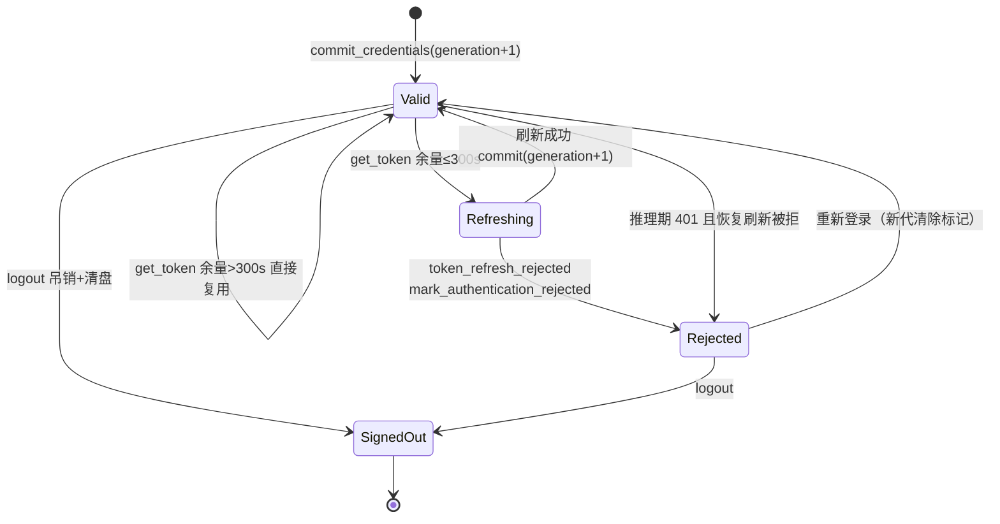

# Codex 凭据生命周期代码导读（guide-codex-auth-2026-10-10）

- 基线：`origin/main @ 6cf793bd8`（v1.6.14）。
- 范围：`deeptutor/services/codex_auth`（8 个文件，约 2.8k 行）——Codex 系供应商凭据的登录、存储、刷新、失效与账号模型目录同步，以及与 `provider_core`、API 路由、多用户归属的接缝。
- 定位（去重）：登录/会话通用轴见 guide-authn；供应商总览轴见 guide-llm-providers / guide-provider-registry；测试横切面见 test-codex-auth-lifecycle。本卡是该模块族首份专述导读，只讲结构与状态机。
- 安全口径：全文只讲文件、函数与行号，不复述任何令牌内容；`CodexCredentials` 三个令牌字段均 `repr=False`（services/codex_auth/contracts.py:50-52），下文引用处一律只给 `path:line`。
- 行号锚均为该基线下的 `path:line`；`services/codex_auth/` 省略 `deeptutor/` 前缀。

## 1. 模块地图

| 文件 | 行数 | 职责 |
| --- | --- | --- |
| services/codex_auth/service.py | 1347 | 编排：登录流程、令牌刷新、目录同步进共享模型目录、登出、多用户归属解析 |
| services/codex_auth/oauth.py | 365 | PKCE、回环回调监听、令牌端点 HTTP（换码/刷新/吊销） |
| services/codex_auth/catalog.py | 343 | 账号级模型目录：拉取、ETag 再验证、新鲜/陈旧缓存分层 |
| services/codex_auth/storage.py | 335 | 凭据与目录缓存的落盘：加锁、原子写、代数（generation）一致性 |
| services/codex_auth/contracts.py | 298 | 冻结数据类与校验：凭据、令牌、模型、目录快照、JWT 最小解码 |
| services/codex_auth/client_version.py | 55 | 只读 npm 元数据取官方 CLI 稳定版本号（不碰 CLI 代码与 OAuth 态） |
| services/codex_auth/constants.py | 30 | 端点、回调端口、超时、缓存窗口等兼容常量（constants.py:12-30） |
| services/codex_auth/__init__.py | 29 | 公开面：错误、契约与服务工厂（__init__.py:3-16） |

依赖方向：`service → {oauth, catalog, storage, contracts}`，`catalog → storage`；模块对外的唯一服务入口是 `get_codex_oauth_service()`（service.py:1280-1297），按属主 secrets 根缓存实例（service.py:1167）。

## 2. 数据契约（contracts.py）

- `CodexAuthError`：OAuth 错误，字符串形态即用户可读文案，带 `code` / `http_status`（contracts.py:28-38）；全模块失败路径统一用它。
- `CodexCredentials`：schema_version + 三令牌 + account_id + expires_at + generation，冻结数据类（contracts.py:47-74）；`from_dict` 逐字段强校验，坏数据报 `credential_corrupt`（contracts.py:76-120）。
- `CodexToken`：对外发布的安全投影，只含 access_token/account_id/expires_at/generation，refresh_token 永不出存储层（contracts.py:57-63, 123-128）。
- `CodexModel` / `CatalogSnapshot`：模型条目与"目录 + 账号哈希 + 代数 + client_version + models_valid"快照（contracts.py:131-210, 213-271）；缓存侧校验（contracts.py:197-210）刻意比 live 侧（catalog.py:100-103）更严——自家写出的坏字段按 `catalog_corrupt` 处理而非静默吞掉。
- `decode_codex_jwt`：TLS 交换之后的最小未验签解码，只取 `exp` 与 ChatGPT account claim（contracts.py:274-298）；失败报 `invalid_token`（contracts.py:284-285）。
- `normalize_codex_reasoning_levels`：live 与缓存两侧共用的推理档位归一契约（contracts.py:17-25）。

## 3. 存储（storage.py）：文件布局 + 代数一致性

存储根 `<属主 secrets 根>/private/openai-codex/`，四个文件（storage.py:109-114）：

| 文件 | 内容 | 写入点 |
| --- | --- | --- |
| credentials.v1.json | 完整凭据 | commit_credentials（storage.py:216-240） |
| state.v1.json | generation、rejected_generation | commit/clear/reject（storage.py:187-193, 238, 250-257） |
| models-cache.v1.json | CatalogSnapshot 缓存 | commit_catalog_cache / invalidate（storage.py:275-330） |
| auth.lock | 进程间文件锁占位 | _locked_file（storage.py:54-82） |

一致性要点：

1. **双锁**：线程锁 + flock（Windows 走 msvcrt），读写全部串行（storage.py:115, 138-143）。
2. **代数（generation）是唯一真相**：每次 commit/clear 自增（storage.py:226-231, 242-257）；`load_credentials` 只认与 state 同代的凭据（storage.py:212-213），旧代数据等于不存在。
3. **rejected_generation 跨重启记忆**：刷新被服务商拒绝后落盘标记，同代请求快速失败，防止轮询打令牌端点（#1454；storage.py:187-199）；下次 commit/clear 自动清除（storage.py:237, 249）。
4. **原子写**：mkstemp + fsync + os.replace，权限 0600（storage.py:85-103）。
5. **路径防御**：父目录与叶子都拒绝符号链接/Windows reparse point（storage.py:23-51）；`assert_safe_location` 专防共享 workspace 子树里的符号链接劫持（storage.py:117-127）。
6. **目录缓存发布的竞态防线**：校验账号哈希 + 凭据代数与登出共用同一把锁，晚到的 200/304 不能复活被登出清掉的缓存（storage.py:275-297）；失效同样保版本史、拒旧代旧账号（storage.py:299-330）。

## 4. OAuth（oauth.py）与客户端版本（client_version.py）

- **PKCE**：64 字节 verifier + S256 challenge（oauth.py:62-66）；authorize URL 带 originator 与简化流标记（oauth.py:69-84）。
- **state 比较**：长度/字符集白名单 + 常数时间比较（oauth.py:41-59）。
- **LoopbackCallback**：一次性 asyncio 监听，只绑 127.0.0.1 与 ::1（oauth.py:87-96, 111-217）；期望端口 1455/1457（constants.py:16），IPv6 绑定失败回退 IPv4（oauth.py:185-201）；等待 300s（constants.py:18, oauth.py:233-260），超时报 `login_timeout` 并提示 SSH 隧道（oauth.py:238-247），取消报 `login_cancelled`（oauth.py:248-257, 262-267）。
- **CodexOAuthClient**：换码（oauth.py:282-298）、刷新（oauth.py:300-309）、吊销优先 refresh_token（oauth.py:311-329）。关键分支：刷新响应 400/401 且 error ∈ {invalid_grant, invalid_token} 时升级为终态 `token_refresh_rejected`（oauth.py:345-358）——这是整条失效链的起点。
- **latest_client_version**：独立 httpx 实例、不跟随重定向、3s 截止、64KB 上限，只认三段式稳定版本（client_version.py:19-55, constants.py:8-11）；仅显式刷新目录时调用（catalog.py:164-165）。

## 5. 模型目录（catalog.py）：四级来源与失败降级

`CatalogSource = live | fresh-cache | revalidated-cache | stale-cache`（contracts.py:14）。`CodexModelCatalog.get`（catalog.py:142-180）决策顺序：

1. 只认同账号哈希的缓存（catalog.py:149-153, 309-325）；跨代缓存里的模型数据作废，但保留该账号上次成功的 client_version（catalog.py:154-163）。
2. 未强制刷新且缓存 ≤300s → `fresh-cache` 直接返回（catalog.py:166-167, constants.py:23）。
3. 拉 live：带 ETag 条件请求（catalog.py:191-197）；304 → `revalidated-cache`（catalog.py:231-240）。
4. 拉取失败且缓存 ≤86400s → `stale-cache`（catalog.py:331-343, constants.py:24）；force 模式不降级（catalog.py:215, 266）。
5. 仅 `catalog_version_unsupported` / `catalog_invalid` 允许用回退版本重试一次，auth/限流/传输错误保持原语义（catalog.py:169-180）。
6. 解析侧安全上限：模型数 ≤512、响应体 ≤8MB、只收 visibility=list（catalog.py:33-93, constants.py:25-26）。

## 6. 编排（service.py）：两台状态机

### 6.1 登录操作状态机（单飞）

`_LoginOperation` 状态：waiting → exchanging → fetching_models → completed；终态集合 completed/cancelled/expired/failed（service.py:62-76, 425, 587-646）。`start_login` 幂等：已有活动操作直接回发同一 payload（service.py:471-496）。推进过程：回调校验（service.py:648-671）→ 换码 → 凭据落盘 + 旧账号托管档案清理（service.py:603-619）→ 强制拉目录 → `sync_codex_catalog` 发布托管档案（service.py:620-632）。

连接态是另一条正交轴，由 `public_status` 推导：authorizing > error（rejected 标记/存储损坏）> connected > disconnected（service.py:948-1000，推导在 961-971）。

### 6.2 凭据刷新/失效状态机

- 入口 `get_token`：无凭据 → `authentication_required`；rejected 标记 → 同码快速失败不再打令牌端点（service.py:711-733，标记分支 720-729）；刷新串行于 `_refresh_lock`（service.py:712）。
- 刷新成功还查账号一致性：换号报 `account_changed` 409（service.py:802-807）。
- 推理期 401 恢复：`recover_after_unauthorized` 在刷新锁内重验代数，旧代请求直接无事返回（service.py:816-833）。
- 登出与推理互斥：`inference_guard` 计数活跃推理，logout 期间新推理被拒、有活跃推理时 logout 被拒（service.py:835-858）；logout 顺序 = 取消登录 → 吊销（失败仅记错误类别与状态码，不落任何凭据材料，service.py:866-876）→ 清存储 → 删托管档案 → 清目录缓存（service.py:851-892）。

### 6.3 托管档案与共享模型目录

- 常量：`MANAGED_BY="openai_codex_oauth"`、`CODEX_PROFILE_ID`（service.py:52-53）；模型 id 由 slug 哈希派生（service.py:132-134）。
- `_managed_profile` 标记 `read_only` 与 `owner_bound`——一个 Codex 令牌只授权一个人的订阅，档案永不通过 grant 共享（service.py:175-200，见 multi_user/model_access.py 引注）。
- `sync_codex_catalog`（service.py:326-401）：重建托管档案，仅按 slug 保留用户的推理档位覆盖与自定义命名；唯一自动激活条件是部署当前没有任何 active LLM（service.py:389-399）。
- `reconcile_codex_catalog_update`（service.py:237-323）：用户写目录时，服务商侧元数据保持权威，只放行同账号的命名/档位编辑；settings 路由在保存目录前调用（api/routers/settings.py:28-31）。
- `validate_runtime_profile`（service.py:744-783）：推理前校验"token 代数 + 账号 + 档案绑定 + 模型成员"；缺 binding 视为历史档案而非换号（service.py:769-775），reasoning_effort 只是每请求旋钮不参与身份（service.py:777-783）。

### 6.4 多用户归属（store 放哪、目录写谁家）

- 凭据库根取属主 secrets 目录 `get_owner_secrets_dir()`（service.py:1189-1210）；旧版把库放在沙箱可见的 user root 下，首次使用时整目录 rename 搬迁、绝不复制，失败保留现场待人工（service.py:1213-1261；搬迁行为测试见 tests/services/codex_auth/test_credential_location.py）。
- 托管档案写属主自己的模型目录，而非共享目录（service.py:1264-1277，#781）。
- 回调路由无会话：浏览器落在回环地址，`deliver_codex_oauth_callback` 用一次性 state 常数时间匹配属主实例（service.py:1300-1332）。
- Docker 下回环监听不可达时，用户粘贴回调地址完成登录：`parse_oauth_callback_url` 严格匹配本登录注册的 redirect_uri、重复参数拒绝（service.py:78-125，#1252）；路由在 api/routers/settings.py:950-967。

## 7. 与 provider_core 的集成

| 接缝 | 位置 | 说明 |
| --- | --- | --- |
| Provider 类 | services/llm/provider_core/openai_codex_provider.py:36-176 | `OpenAICodexProvider(LLMProvider)`，chat/chat_stream 统一走 `_call_codex` |
| 取令牌 | openai_codex_provider.py:43-44 | 每次调用 `get_codex_oauth_service().get_token()`，余量不足自动刷新 |
| 推理互斥 | openai_codex_provider.py:76-80 | `inference_guard()` 包住取令牌 + `validate_runtime_profile` + 请求 |
| 401 自愈 | openai_codex_provider.py:90-106 | `recover_after_unauthorized(token.generation)`，刷新已死则明确要求重登 |
| 错误面 | openai_codex_provider.py:113-135, 239-246 | `CodexAuthError.public_message` 直出；上游响应体只进 operator 日志（:213-219） |
| 工厂装配 | services/llm/provider_factory.py:71-76 | backend `openai_codex` → `OpenAICodexProvider`；惰性导出 provider_core/__init__.py:16, :40 |
| 运行时适配 | runtime/agentic/client.py:63, :315-363 | `openai_codex` 属原生工具后端，adapter 构建取默认模型 |
| 请求端点 | constants.py:22（chatgpt.com Codex Responses） | 消息转换复用 openai_responses 的 SSE 消费（openai_codex_provider.py:19-24, 202-224） |

另外两个次要消费方：multi_user/personal_models.py:37-44, :87 用 `profile_matches_current_account`（service.py:735-742）把过期托管档案从模型列表隐藏；services/github_copilot_storage.py:14-18 复用 storage 的路径断言与原子写原语。

HTTP 入口清单（全部属主作用域校验 `_require_codex_oauth_actor`，api/routers/settings.py:573-597）：start/status/complete/cancel/logout（settings.py:928-985）、models/refresh（settings.py:988-994）、reasoning-effort（settings.py:1021 起）；无会话回调 `/openai-codex/callback` 在 api/routers/auth.py:743-753。

## 8. 失败路径与错误码速查

| 错误码 | 抛出点 | HTTP | 语义/后果 |
| --- | --- | --- | --- |
| authentication_required | service.py:715-719, 819-832 | 401 | 未登录或刷新已死，唯一出路是重登 |
| token_refresh_rejected | oauth.py:354-358 | 401 | 刷新授权被拒 → 落盘 rejected 标记（storage.py:187-193），终态 |
| account_changed | service.py:802-807 | 409 | 刷新返回了另一账号，拒绝提交 |
| authentication_changed | service.py:691-696 | 409 | 刷新模型前凭据代数已变 |
| generation_changed | storage.py:176-181 | 409 | 并发操作踩代数，调用方重读现状 |
| login_timeout / login_cancelled | oauth.py:238-257 | 408/409 | 回调等待超时/被取消，终态 expired/cancelled |
| login_not_active / state_mismatch | oauth.py:219-225, service.py:549-565, 660-665 | 409/400 | 无等待中的登录 / state 不匹配 |
| callback_url_invalid | service.py:98-99 | 400 | 粘贴的回调地址不属于本次登录 |
| callback_unavailable | oauth.py:208-213 | 503 | 回环端口全占用 |
| token_exchange_failed / token_refresh_failed | oauth.py:296, :307 | 502 | 令牌端点传输/5xx，瞬态可重试 |
| token_revoke_failed | oauth.py:325-329 | 502 | 吊销失败不阻断本地登出，仅告警远端令牌可能仍有效 |
| catalog_unauthorized / catalog_forbidden | catalog.py:217-230 | 401/403 | 目录侧失效：只失效缓存模型，保留版本史 |
| catalog_rate_limited | catalog.py:242-247 | 429 | 目录限流，保留缓存语义 |
| catalog_version_unsupported | catalog.py:248-262 | 502 | 服务商拒 client_version，允许一次回退重试 |
| catalog_too_large / catalog_invalid / catalog_invalid_response | catalog.py:36-46, 268-292 | 502 | 响应超限或结构坏 |
| catalog_tls_error / catalog_unavailable | catalog.py:208-213, 339-343 | 502/503 | 传输失败且无陈旧缓存可用 |
| unsafe_storage_path | storage.py:31-36 | 500 | 存储路径出现符号链接/reparse point |
| credential_corrupt / state_corrupt / catalog_corrupt | contracts.py:116-120, storage.py:158-173, contracts.py:266-271 | 500 | 落盘数据损坏，目录缓存损坏时自清（catalog.py:318-322） |
| codex_catalog_unavailable | service.py:137-143 | 409 | 运行时配置已过期，提示刷新模型 |
| reasoning_effort_unsupported / codex_model_not_found | service.py:928-943 | 422/404 | 档位或模型不在当前账号目录内 |
| token_response_invalid / invalid_token | service.py:1124-1151, contracts.py:284-285 | 502/401 | 令牌响应缺关键字段 / JWT 解不开 |

## 9. 测试地图

tests/services/codex_auth/ 共 8 个文件约 153 个用例，两份静态夹具（fixtures/astra-model.json、fixtures/models-response.json）：service 行为 67（test_service.py）、目录解析 23（test_catalog.py）、OAuth 端点 16（test_oauth.py）、存储 15（test_storage.py）、契约 13（test_contracts.py）、存储搬迁 11（test_credential_location.py）、版本探测 7（test_client_version.py）、强制刷新 1（test_catalog_refresh.py）。测试轴横切结论见 test-codex-auth-lifecycle 卡，此处不展开。

## 10. 建议阅读顺序

1. constants.py → contracts.py：先拿到常量口径与五类数据形态。
2. storage.py:109-143：文件布局与双锁，再读代数三函数（storage.py:187-261）。
3. oauth.py:47-135 + service.py:471-685：对照登录状态机走一遍回调链路。
4. service.py:711-892：凭据刷新/失效/登出三段（6.2 节状态机落地处）。
5. catalog.py:142-180：四级来源决策，再回看 storage.py:275-330 的发布竞态防线。
6. services/llm/provider_core/openai_codex_provider.py:36-135：推理侧如何消费这套凭据。
