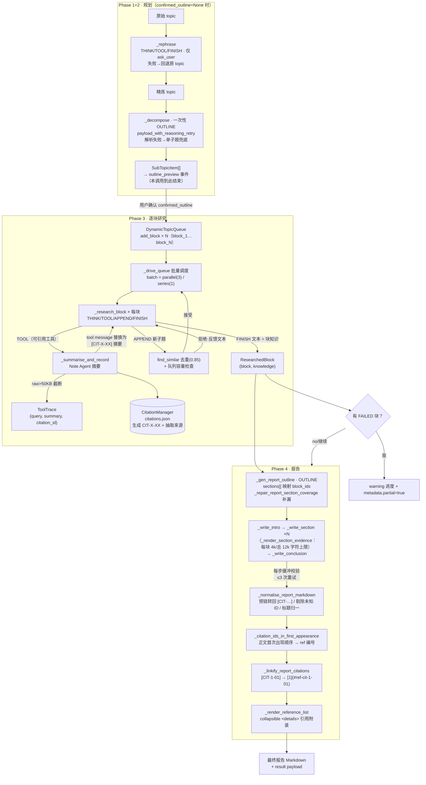

# Deep Research 模块代码导读

> 基线：`origin/main` @ `ef2d9e5c3`（release: v1.6.12），2026-10-03。
> 本文只描述代码现状，不含改动建议；行号对应该基线，后续漂移请以函数名定位。
> 配套证据：`evidence/coverage-2026-10-02/top15-gaps.md`（第 4、7 项直接指向本模块两个文件）。

Deep Research（`deep_research` capability）是一个四阶段 agentic 流水线：把用户的一句话主题，经澄清 → 拆题 → 逐块检索取证 → 分节写报告，产出带锚点引用的 Markdown 报告。两个标志性特性——**动态主题队列**（research 中途可以自我追加子题）和**引用编号体系**（每次可引用的工具调用获得稳定 ID，报告渲染成锚点链接）——贯穿全部四个文件。

## 模块边界

```
deeptutor/agents/research/
├── capability.py        # 薄壳：请求校验 + 大纲预览两段式调度，编排全在 pipeline
├── request_config.py    # 请求参数（mode/depth/manual_subtopics…）→ runtime_config 策略
├── mode_strategy.py     # mode → 迭代数/子题数/输出校验策略（被 request_config 消费）
├── pipeline.py          # ★ 本导读主角：ResearchPipeline 四阶段编排（~3200 行）
├── data_structures.py   # ★ TopicBlock / ToolTrace / DynamicTopicQueue（调度内存态）
├── prompts/             # 各阶段 prompt 模板（pipeline 经 _t() 取用，缺失走内置 default）
└── utils/
    ├── citation_manager.py  # ★ 引用注册表：ID 生成、来源抽取、持久化 citations.json
    ├── json_utils.py        # ★ research 本地 JSON 解析/校验工具（注意：pipeline 实际用的是另一个全局模块，见"常见坑"）
    └── token_tracker.py     # 用量统计

上游依赖：deeptutor/runtime/agentic（run_agentic_loop / run_labeled_step / LabelProtocol）、
         deeptutor.agents._shared.tool_composition（工具编排策略，与 chat 共用）、
         deeptutor/utils/json_parser.py（parse_json_response，pipeline 实际消费的 JSON 容错层）。
下游消费：前端读 stream 事件（stage=rephrasing/decomposing/researching/reporting +
         metadata.outline_preview / research_status_key / trace_kind）与最终 result payload。
```

外部契约只有两个入口：`capability.py:DeepResearchCapability.run`。**两段式调用**是理解一切的前提：

1. 第一次调用（`confirmed_outline=None`）：跑 Phase 1+2，返回 `outline_preview=True` 的 payload 后退出，前端展示大纲编辑器；
2. 第二次调用（带 `confirmed_outline`）：跳过 Phase 1+2（用户已答过澄清问题），直接跑 Phase 3+4。

## 四阶段编排（pipeline.py）

模块 docstring（`pipeline.py:1`）给出权威概述，实际控制流在 `ResearchPipeline.run`（`pipeline.py:524`）→ `_run_inner`（`pipeline.py:561`）：

| 阶段 | 入口函数 | 位置 | Label 协议 | 产物 |
|---|---|---|---|---|
| 1 Rephrase | `_rephrase` | pipeline.py:762 | THINK/TOOL/FINISH（仅 `ask_user` 工具） | 精炼后的 topic（字符串） |
| 2 Decompose | `_decompose` → `_parse_outline` | pipeline.py:848 / :908 | 一次性 `OUTLINE` | `list[SubTopicItem]`（title+overview） |
| 3 Research | `_drive_queue` → `_research_block` | pipeline.py:1164 / :937 | THINK/TOOL/**APPEND**/FINISH | `list[ResearchedBlock]`（block + knowledge） |
| 4 Report | `_write_report`（内部 outline→intro→section×N→conclusion→装配） | pipeline.py:1282 | OUTLINE/INTRO/SECTION/CONCLUSION 各一次性 | 报告 Markdown + 引用列表 |

阶段级默认值（`pipeline.py:246-267`）：rephrase 内层迭代 8、ask_user 上限 3 轮×每轮 3 问；初始子题 5；块级迭代 5；并行块 3（`execution_mode=parallel`，series 时批量=1）；队列上限 8；报告每步最多重试 3 次；工具超时 240s、重试 0。LLM 预算（max_tokens 等）全部在 agents.yaml（`get_capability_params("research")`），代码里只保留运行行为默认值。

关键子组件（两个 LoopHost）：

- **`_RephraseLoopHost`**（pipeline.py:3014）：只放行 `ask_user`，其余工具调用就地回一条 tool message 拒绝；轮次用尽后把 ask_user 的回复替换为"请立即 FINISH"。循环异常或无有效 FINISH 时**回退原 topic**（pipeline.py:838-843）。
- **`_BlockLoopHost`**（pipeline.py:2647）：每块的回调宿主，三个钩子是本模块精华——
  - `dispatch_tools`（pipeline.py:2725）：标准并行分发后进入 `_summarise_and_record`（pipeline.py:2787）——对 `CITABLE_TOOLS`（rag/web_search/paper_search/exec/pageindex_*，pipeline.py:231）逐个：Note Agent 摘要（`_summarise_tool_result`，pipeline.py:1231，失败回退 raw[:600]）→ 生成 `CIT-X-XX` → 建 `ToolTrace`（raw_answer 50KB 截断）→ `add_citation_async` → **把 tool message 内容替换为 `[CIT-X-XX] 摘要`**（pipeline.py:2850），防止长检索结果撑爆上下文；
  - `on_intermediate`（pipeline.py:2899）：解析 `APPEND` 文本（首行=标题，其余=overview），经 `find_similar` 去重 + 容量检查后 `append_child` 入队，拒绝/接受都以文本注入下一轮迭代，模型可自我纠正；
  - `validate_terminal`（pipeline.py:2772）：原生工具模式下，一次工具都没调过就 FINISH 会被拒绝（`finish_without_tool`），把"先取证再总结"变成可执行规则而非纯 prompt 约束。

队列调度 `_drive_queue`：每轮取 pending 批量 `asyncio.gather(return_exceptions=True)`，单块异常 → `mark_failed` + 空 knowledge 继续跑；轮数安全帽 `max(20, queue_max_length*4)` 防死循环（pipeline.py:1177）。**失败的块不终止整体**：`_run_inner` 在 pipeline.py:662-684 统计未完成块，发 warning 进度事件，结果 metadata 带 `partial / failed_block_count / failed_block_titles`（issue #595 语义：宁可出残缺报告，不许假装全量成功）。

报告阶段容错：`_stream_report_step`（pipeline.py:1860）把正文**缓冲到校验通过才上屏**（防半截内容污染流），校验项见 `_report_step_incomplete_reason`（pipeline.py:2375）：label 对不上 / 流 idle 截断 / finish_reason 截断 / 正文 <80 字符 / 缺编号 `## N.` 标题，任一命中即重试（最多 3 次，重试时把上次的半成品 + 修复指令追加进消息）。3 次后仍失败 → `IncompleteReportError`（pipeline.py:306，附缺失部分清单），由 `run` 捕获经 `_emit_visible_failure`（pipeline.py:719）转成用户可见的错误卡片。

## 关键数据流



另一条看不见的数据流是**持久化**：`CitationManager` 每次登记引用都整文件重写 `citations.json`（含 counters），`__init__` 时回读并恢复计数器（`_load_citations` → `_restore_counters_from_citations` 兜底），这使续跑/重入不会撞 ID。`DynamicTopicQueue` 有 `_auto_save` 机制，但 **pipeline 从未调用 `set_state_file`**（全仓 grep 无调用点），运行中队列纯内存、不落盘。

## citation_manager.py：引用编号机制

| 函数 | 位置 | 职责 |
|---|---|---|
| `generate_plan_citation_id` / `generate_research_citation_id` | :94 / :104 | 生成 `PLAN-XX`（规划阶段）/ `CIT-X-XX`（研究块内序号）；block 号从 `block_id` 解析，解析失败归 0 |
| `get_next_citation_id(_async)` | :130 / :880 | 按 stage 分发；async 变体由 `asyncio.Lock` 保护（并行块安全） |
| `_load_citations` / `_save_citations` | :157 / :202 | 读写 `citations.json`（citations + counters）；失败仅打印 ⚠️，内存态继续 |
| `_restore_counters_from_citations` | :179 | counters 缺失时扫描现有 ID 取 max，防重号 |
| `add_citation(_async)` | :278 / :894 | 按 tool_type 路由到 extractor；**整体 try/except → 打印 + return False** |
| `_extract_rag_citation` | :334 | 来源列表：优先 `ToolResult.metadata`（`_rag_source_payload` 认 chunks/documents/sources/context/retrieved_docs），退化为重解析 raw_answer；每条经 `_rag_source_info` 归一，取前 5 条 |
| `_extract_web_citation` | :385 | 优先 metadata 的 citations/results/web_results/search_results/urls；退化解析答案；无 URL 的条目丢弃 |
| `_extract_paper_citation` | :457 | 多论文（≤5 篇），首篇同时提升为顶层 title/authors 字段 |
| `validate_citation_references` / `fix_invalid_citations` | :219 / :256 | 校验/剔除文本中的 `[[ID]]` 引用（当前 pipeline 未调用，供外部/测试用） |
| `_get_citation_dedup_key` | :694 | **只对 paper_search 去重**（title+第一作者），其余类型每个 citation_id 独占编号 |
| `_extract_citation_sort_key` | :735 | 排序键 (stage, block, seq)：PLAN 恒在最前，CIT 按块号→序号 |
| `build_ref_number_map` / `get_ref_number(_map)` | :758 / :828 | 一套"PLAN 优先 + paper 去重"的编号方案（**见下：与报告实际编号并存但未被 pipeline 使用**） |
| `format_citation_for_report` | :570 | 按工具类型渲染引用附录条目（HTML、内部已 escape；paper 走 APA `_format_paper_search_apa` :612） |

**报告侧实际编号链**（在 pipeline.py，不要和上表混淆）：

1. `_normalise_report_markdown`（pipeline.py:1483）先把模型预链接的 `[CIT-…](…)` 还原为裸标记、剔除未知 ID、归一重复标题；
2. `_citation_ids_in_first_appearance`（pipeline.py:2450）按**正文首次出现顺序**取已知 ID；
3. `_write_report`（pipeline.py:1398-1407）用该顺序 enumerate 出 ref 号 → `_linkify_report_citations`（pipeline.py:1456）把 `[CIT-1-01]` 变 `[1](#ref-cit-1-01)`；`_render_reference_list`（pipeline.py:1418）按同一顺序产出 `<details>` 附录；
4. 仅当正文一个标记都没有时才退到 `_sorted_citation_ids`（pipeline.py:2589，即 PLAN 优先排序）。

## 产物契约（data_structures.py / json_utils.py）

### data_structures.py

| 类型 | 位置 | 契约要点 |
|---|---|---|
| `TopicStatus` | :44 | PENDING → RESEARCHING → COMPLETED / FAILED；`is_all_completed` 对空队列返回 False |
| `ToolType` | :53 | 枚举四类；注意 pipeline 实际以**字符串**传 tool_type（`_is_citable_tool` 前缀匹配 pageindex_*），枚举更多是文档性存在 |
| `ToolTrace` | :66 | `__post_init__` 强制 raw_answer ≤ 50KB（`_truncate_raw_answer` :95 先试保 JSON 结构——缩 content/answer/text 等字段、list 砍到 3 条，失败再硬切加标记）；`create_with_size_limit` :145 显式版本 |
| `TopicBlock` | :188 | `block_id` 格式 `block_N`（citation_manager 依赖 `_` 后数字解析块号）；`metadata.parent_block_id` 记 APPEND 血缘；`get_all_summaries` 拼 `[type] summary` 行 |
| `DynamicTopicQueue` | :240 | 调度中枢。`add_block` 满容量**抛 RuntimeError**，而 `append_child` :374 满容量**返回 None**（调用方转成拒绝反馈）——补测时别混用；`find_similar` :344 模糊去重：归一化全等直接命中，否则 max(SequenceMatcher ratio, token jaccard/containment×0.95) ≥ 0.85（停用词表 + 微型英文茎化 ies→y / s→e 删除）；`from_dict` :526 从 max(block_N) 恢复计数器 |

持久化：`save_to_json`/`load_from_json` + `_auto_save`（state_file 未设则空操作；失败打印 ⚠️ 吞掉）。如上所述，pipeline 当前不启用队列落盘。

### json_utils.py

| 函数 | 位置 | 契约要点 |
|---|---|---|
| `extract_json_from_text` | :13 | 三级容错：```json 代码块 → 整段 json.loads → 逐字符找首个 `{`/`[` 用 `raw_decode` 取**第一个**合法 dict/list（后面的忽略，tests/agents/research/test_extract_json_adjacent.py 锁定该行为）；全程不抛错，失败返回 None |
| `ensure_json_dict` / `ensure_json_list` / `ensure_keys` | :57 / :63 / :69 | 严格校验，分别抛 ValueError/ValueError/KeyError——与上面的"永不抛错"风格相反，调用前想清楚 |
| `safe_json_loads` | :76 | 失败返回 default（不抛错） |
| `json_to_text` | :83 | `ensure_ascii=False` 序列化 |

**重要边界**：这个 research 本地模块当前**只被 `utils/__init__.py` 再导出和单测引用**；pipeline.py、citation_manager.py、data_structures.py 的 JSON 容错实际都走全局的 `deeptutor/utils/json_parser.py#parse_json_response`（默认 `fallback={}`，含"最长 JSON 值"解码），外加 pipeline 专属的 `payload_with_reasoning_retry`（对一次性大纲调用做"推理模型烧完预算输出为空"的重试，pipeline.py:903 / :1610）。

## 吞错 / 容错点地图

补测与排障时最值得先看的位置（"静默"指用户与调用方都无感知）：

| 位置 | 行为 | 后果 |
|---|---|---|
| `pipeline.py:838-843` rephrase 循环异常 | warn + 回退原 topic | 澄清环节静默消失，直接拆题 |
| `pipeline.py:517-519` prompt 加载失败 | warn + 空 prompts | 全部走 `_t()` 内置英文 default，多语言丢失 |
| `pipeline.py:1030-1033` `_research_block` 异常 | `mark_failed` + 空 knowledge | 块静默缺席报告（但有 partial 警告链路兜底） |
| `pipeline.py:1269-1271` Note Agent 失败 | 回退 raw[:600] | 摘要变长文，上下文压力升高，不中断 |
| `pipeline.py:2851-2856` `_summarise_and_record` 异常 | logger.exception 后继续 | **该次工具调用无 citation**：tool message 不替换（模型看到原文），报告里标记会被 linkify 剔除 |
| `citation_manager.py:330-332` `add_citation` 异常 | 打印 + return False | 引用静默丢失；ID 已生成但查无此 ID |
| `citation_manager.py:379-381` 等 extractor 内部 | 打印 + 返回基础 info | sources/papers 为空 → 引用条目退化成"仅 query+summary" |
| `citation_manager.py:173-175` `_load_citations` 损坏 | 打印 + 置空 | 计数器从 0 起，**可能重发已存在的 ID**（文件同时被清空重建，故引用列表一致性尚可，但旧报告锚点悬空） |
| `data_structures.py:548-554` `_auto_save` 失败 | 打印 | 队列状态不落盘（当前本就不落盘） |
| `json_utils.py` 整个模块 | None / default，不抛错 | 静默返回空；配合 `ensure_*` 的抛错风格，混用时行为分裂 |
| `json_parser.parse_json_response`（pipeline 实际依赖） | fallback（默认 `{}`） | 解析失败时下游拿到空 dict，靠 `is_usable`/字段检查兜底 |
| 对照组（不吞）：`_stream_report_step` 3 次失败 | 抛 `IncompleteReportError` | 用户可见错误卡片 + 缺失部分清单 |
| 对照组（不吞）：`run` 顶层异常 | `_emit_visible_failure` 后 re-raise | 用户可见错误 + 上层感知失败 |

## 常见坑

1. **PLAN- 引用排序 / 双编号系统**。`CitationManager.build_ref_number_map`（PLAN 恒排最前 + paper 去重共享编号）与报告实际使用的 `_citation_ids_in_first_appearance`（正文首现顺序）是**两套并存方案**；当前 pipeline 只用后者，前者及 `generate_plan_citation_id` 均无调用点（grep 全仓确认），属遗留接口——但 `_REPORT_CITATION_MARKER_RE`、`_citation_sort_key` 仍接受 PLAN- 标记。补测 `ref_number` 相关行为时，测的是哪套要先分清；手工构造带 `PLAN-01` 标记的文本是合法输入路径，不要当 bug 报。
2. **两个 JSON 工具模块**。改"JSON 提取容错"时，`deeptutor/agents/research/utils/json_utils.py`（本导读覆盖的文件）与 `deeptutor/utils/json_parser.py`（pipeline 真正 import 的）名字相近、能力重叠。research 目录内新代码应优先与现状一致（parse_json_response），别只给 json_utils 补了容错就以为修好了 pipeline。
3. **一次性 OUTLINE 调用的空产出**。decompose 和 report outline 都可能被推理模型"烧光预算只输出思考"导致空 payload：decompose 的兜底是把主题本身当唯一子题（研究范围静默缩水，类比 issue #1316 的"单章节书"），代码用 `payload_with_reasoning_retry` + `_outline_payload_is_usable` 缓解；report outline 则由 `_repair_report_section_coverage`（pipeline.py:1674）确定性地把漏掉的块补回章节。
4. **队列容量的两种语义**。`add_block` 抛异常 vs `append_child` 返回 None；`_run_inner` 种子化用前者（confirmed_outline 超上限会直接炸 run），APPEND 路径用后者（转成礼貌拒绝）。写边界测试时两条路径都要覆盖。
5. **tool message 替换的时序**。`tm["content"] = f"[{citation_id}] {summary}"` 在 `add_citation_async` 之后无条件执行；若登记失败，模型上下文里的 `[CIT-x-xx]` 是"幽灵 ID"，报告 linkify 阶段会静默剔除（`_linkify_report_citations` 对未知 ID 返回空串）——表现为"模型明明引用了、报告里却没有"。
6. **块状态是唯一的事实来源**。`ResearchedBlock.knowledge` 为空串既可能表示"真没证据"也可能表示"块失败"；区分只能看 `block.status`。`_drive_queue` 最后按 queue.blocks 顺序重组（保证父块先于 APPEND 子块），任何乱序断言都应基于该顺序。

## 延伸阅读

- 测试（现状与缺口）：`tests/agents/research/` — `test_citation_manager.py`、`test_block_loop_host_append.py`、`test_dynamic_topic_queue.py`、`test_extract_json_adjacent.py`、`test_pipeline_partial_failure.py`、`test_report_stream_formatting.py`、`test_rephrase_loop_host.py`。覆盖率缺口见 `evidence/coverage-2026-10-02/top15-gaps.md` 第 4 项（citation_manager，264 缺失 / 37.0%）与第 7 项（pipeline，408 缺失 / 62.6%，建议卡 `test_pipeline_stage_contract.py`：四阶段顺序与产物字段、检索为空短路、mock LLM）。
- 运行时底座：`deeptutor/runtime/agentic/`（`run_agentic_loop` / `run_labeled_step` / `LabelProtocol` / `DispatchOutcome`）——所有 Label 协议语义（terminal/intermediate/final）在这里落地。
- 工具编排：`deeptutor/agents/_shared/tool_composition.py`（`compose_enabled_tools`、`RESEARCH_BLOCK_TOOL_ALLOWLIST` 的来源）与 `pipeline.py:2079 _block_tool_names`（块级工具白名单 + Obsidian 只读 / PageIndex 上下文注入，`_augment_tool_kwargs` pipeline.py:2150 注入 `_vault_path`）。
- 两段式入口与前端契约：`deeptutor/agents/research/capability.py`（outline_preview 的 metadata 扁平层级注释值得读）与 `request_config.py`（mode/depth → `_build_mode_policy` 经 `mode_strategy.get_strategy` 落到 runtime_config 的 planning/researching/reporting/queue 四个子策略，pipeline `__init__` 逐一 `_read_int` 消化）。
- 部分失败语义的来历：issue #595（partial 报告必须显式标注）与 #1316（一次性大纲空产出的教训），对应上文容错点两处关键注释。
