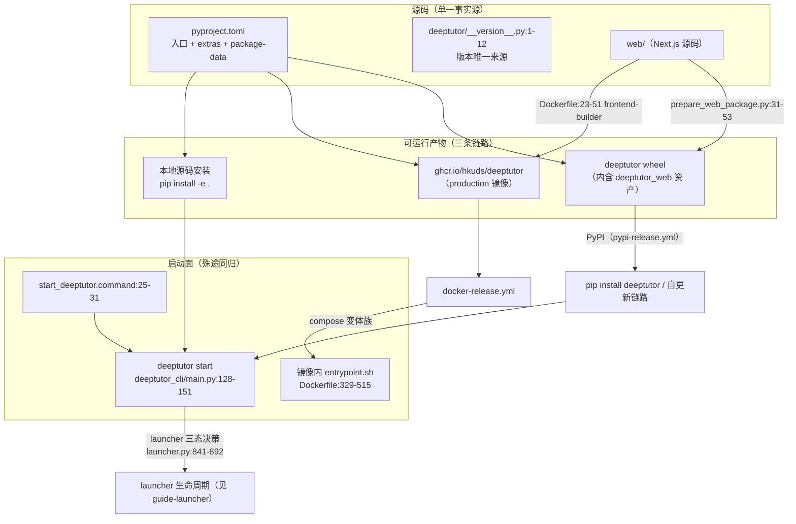

# 本地打包与启动面导读（packaging / Docker / compose / pyproject 入口）

- 基线：origin/main `f07029cfc`（v1.6.13，2026-10-07 读取，worktree 分支 `docs/agen-1026-packaging-guide`）。所有 `path:line` 均基于该基线，行号会随演进漂移，以符号名为准。
- 范围：本地打包与启动相关的 6 类入口 —— `packaging/` 目录、`Dockerfile`/`Dockerfile.runner`、各 compose 变体、`MANIFEST.in`、`start_deeptutor.command`、pyproject 入口 —— 的职责、相互关系，以及「本地运行 / 打包 / 发版」的推荐路径。
- 本文只读导读，不改任何产品代码；不含镜像构建步骤实录，只描述链路与锚点。

## 0. 去重与相关产出（先读）

| 产出 | 位置 | 关系 | 处理 |
| --- | --- | --- | --- |
| launcher 生命周期导读 | 分支 `docs/guides/launcher`（`docs/guides/launcher.md`，同基线 `f07029cfc`） | 已深读 `deeptutor start` 时序、端口治理、前端三态决策（packaged / source-production / source-dev）与构建指纹 | 本文在 §3、§7 只引用其结论做链路衔接，不重复启动器细节 |
| 自更新链路导读 | 分支 `guide/app-update-20261005`（`evidence/app-update-guide-2026-10-05/report.md`，同基线） | 已深读版本检查 → 下载 → 交接 → 重启 → 版本展示 | 本文 §8 只覆盖「产物如何产出与发布」，不覆盖「已装用户如何更新到新产物」 |
| runtime 更新链路导读 | 分支 `docs/guides/runtime-update-chain`（`evidence/guide-runtime-2026-10-04/guide.md`） | job store / update_worker 失败模式 | 不重复 |
| 部署轴（guide-deploy） | 截至 2026-10-07 未见对应分支/文档落地；库内用户手册为 `docs-for-user/CONTAINERIZATION.md` | 远端部署形态（systemd、反代、NAS）属部署轴 | 本文 §5 只给 compose 变体的职责定位，不展开部署运维 |

## 1. 全景：6 类入口与相互关系

| # | 入口 | 文件 | 一句话职责 |
| --- | --- | --- | --- |
| 1 | CLI-only 发行版 | `packaging/deeptutor-cli/pyproject.toml`、`packaging/deeptutor-cli/README.md` | 独立的 `deeptutor-cli` wheel 定义：只装终端工作流所需模块，不带打包 Web 资产与服务端依赖；不发布 PyPI，仅本地 editable 安装 |
| 2 | 容器镜像 | `Dockerfile`、`Dockerfile.runner`、`.dockerignore` | 四阶段多平台生产镜像（前后端一体，supervisord 托管）+ 最小化沙箱 runner sidecar 镜像 |
| 3 | 编排变体 | `docker-compose.yml`、`docker-compose.dev.yml`、`docker-compose.ghcr.yml`、`compose.yaml`、`compose.codex-oauth.yaml`、`.env.example`、`scripts/docker_compose.py` | 同一套镜像的五种编排形态（源码构建 / dev 覆盖 / 预构建 / rootless Podman / OAuth 临时 overlay）+ 端口渲染包装器 |
| 4 | Web 资产打包 | `MANIFEST.in`、`deeptutor_web/`、`scripts/prepare_web_package.py`、`web/next.config.js` | 把 Next.js standalone 产物装进 Python 包，使 `pip install deeptutor` 后无需 Node 构建 |
| 5 | macOS 双击启动 | `start_deeptutor.command` | Finder 双击入口：探测 Python → 三层降级拉起 `deeptutor start --home <checkout>` |
| 6 | Python 包入口 | `pyproject.toml`（根） | 包名/版本/依赖单一事实源；`deeptutor` 与 `deeptutor-export-frontend-contracts` 两个 console script；阅读扩展 entry-points；extras 矩阵；wheel 内含资产的 package-data 规则 |



## 2. pyproject 入口（根 `pyproject.toml` 与 `packaging/deeptutor-cli`）

### 2.1 根包（`deeptutor`）

- 构建后端：`pyproject.toml:4-6`（setuptools>=61 + `setuptools.build_meta`）。
- 包身份：`pyproject.toml:8-16` —— `name = "deeptutor"`（:9）、`dynamic = ["version"]`（:10）、`requires-python = ">=3.11,<3.15"`（:16）。版本来自 `deeptutor/__version__.__version__`（动态 attr 映射 `pyproject.toml:302-303`；单一事实源文件 `deeptutor/__version__.py:1-12`）。
- console scripts：`pyproject.toml:95-97`
  - `deeptutor = "deeptutor_cli.main:main"` —— Typer CLI 总入口（`deeptutor_cli/main.py:222-224`），`deeptutor start` 命令转调启动器（`deeptutor_cli/main.py:128-151` → `deeptutor/runtime/launcher.py:1278` `start()`）。
  - `deeptutor-export-frontend-contracts = "deeptutor.api.contracts.export:main"` —— 前端契约导出（`deeptutor/api/contracts/export.py:79` `write_contracts`）。
- 阅读扩展 entry-points：`pyproject.toml:99-105`，组名 `deeptutor.reading_extensions`，注册 read_aloud / guided_learning / vocabulary / quiz / translation 五个扩展类（实现于 `deeptutor/reading/`，用户侧说明见库内 `docs-for-user/READING_EXTENSIONS.md`）。
- extras 矩阵：`pyproject.toml:106` 起 —— `cli` / `server` / `partners` / `matrix`(+`-e2e`) / `math-animator` / `parse-*` / `graphrag` / `rag-lightrag` / `rag-rerank` / `dev` / `all`，`tutorbot` 为 `partners` 的单版本兼容别名。核心依赖全量内置（`pyproject.toml:19-93`），公共安装就是 `pip install deeptutor` 全家桶。
- 打包配置：`pyproject.toml:299-330`
  - `include-package-data = true`（:300）+ `MANIFEST.in`（§4）共同决定 sdist/wheel 内的非代码资产。
  - `packages.find`（:305-308）只收 `deeptutor*` 与 `deeptutor_cli*`。
  - `package-data`（:309-330）显式声明 wheel 必须携带 `deeptutor/**/*.{yaml,yml,md,json,sh,j2,jinja}`（agent prompt 与内置 SKILL.md 资产，缺失会导致能力首用即失败）与 `deeptutor_web/**/*`（§4）。
- 发布形态：wheel-only。CI 用 `python -m build --wheel`（`.github/workflows/pypi-release.yml:146-156`），不产 sdist —— 避免在 sdist 里复制大体积 Web 资产或要求前端构建。

### 2.2 CLI-only 发行版（`packaging/deeptutor-cli/`)

- `packaging/deeptutor-cli/pyproject.toml:6` 包名 `deeptutor-cli`；依赖是根包 `cli` extra 的同款清单（`dependencies` :14 起，注释与根 `pyproject.toml` `cli` extra 互为镜像，注意同步）。
- 复用源码树而非复制代码：`package-dir = {"" = "../.."}`（:74）+ `packages.find where = ["../.."]`（:80-83），收 `deeptutor*`/`deeptutor_cli*` 但 **exclude `deeptutor_web*`** —— 这是「CLI 版不带 Web 资产」的实现点。
- 同样暴露 `deeptutor` 命令（`[project.scripts]` :70-71），指向同一个 `deeptutor_cli.main:main`。
- 不发布 PyPI：`.github/workflows/pypi-release.yml:7-8` 注释明确只发完整包；本地安装走 editable（`packaging/deeptutor-cli/README.md:9-17`：`python -m pip install -e ./packaging/deeptutor-cli`，需保留 checkout 原位）。
- 与根包同名命令的取舍：两者都提供 `deeptutor`，但 CLI 版缺 FastAPI/uvicorn 等 server 依赖，`deeptutor start` 在该环境不可用 —— 只跑终端工作流时才选它。

## 3. MANIFEST.in 与 `deeptutor_web`（Web 资产打包轴）

- `MANIFEST.in:1-2` 只有两行：`recursive-include deeptutor_web *`、`recursive-include deeptutor_web/.next *` —— 它服务 sdist 场景；wheel 侧由 `package-data`（`pyproject.toml:309-330` 的 `deeptutor_web` 条目）兜底。
- `deeptutor_web/__init__.py:1-11`：源码检出里这是个空壳包（只有 `__init__.py`）；发布构建时由脚本填充 Next.js standalone 产物（`server.js`、`.next/static`、`public` 与最小 Node 运行时文件）。
- 填充器：`scripts/prepare_web_package.py:31-53` —— `npm run build`（`web/package.json:10`，实际入口 `scripts/build.mjs`）→ 校验 `web/.next/standalone/server.js` 存在 → 清空并拷入 `deeptutor_web/`，追加 `.next/static` 与 `public/`，写 `BUILD_INFO` 标记（:48-50）。`--skip-build` 允许复用已有构建（:56-62）。
- standalone 输出开关：`web/next.config.js:116` `output: "standalone"`；dist 目录名可被 `DEEPTUTOR_NEXT_DIST_DIR` 覆盖（:98），源码生产构建走 `.next-deeptutor`（与 `--dev` 的 `.next` 互不覆盖，见 guide-launcher §3）。
- 运行时消费：安装形态下 `deeptutor start` 检测 `deeptutor_web` 可导入且有 `server.js` 即进入 **packaged** 前端模式，把资产拷进可写缓存 `<home>/data/user/runtime/web/` 并替换 `__NEXT_PUBLIC_API_BASE_PLACEHOLDER__`（`deeptutor/runtime/launcher.py:613-653` `_copy_packaged_web_if_needed`）；三态决策入口 `_resolve_frontend`（`deeptutor/runtime/launcher.py:841-892`）。细节归 guide-launcher。

## 4. Dockerfile 与 Dockerfile.runner

### 4.1 `Dockerfile`（前后端一体生产镜像）

四阶段流水线：

| 阶段 | 基础镜像 | 行 | 职责 |
| --- | --- | --- | --- |
| frontend-builder | `node:22-slim`（钉 `--platform=$BUILDPLATFORM`） | `Dockerfile:23-51` | `npm ci --legacy-peer-deps`（:31-33）→ 拷 `web/` 与版本单一源 `deeptutor/__version__.py`（:36-40）→ 写 `.env.local`（仅 `NEXT_PUBLIC_APP_VERSION`，:47）→ `npm run build` 产 standalone（:51）。URL 不烘进 bundle，运行时由 `web/proxy.ts` 按 `DEEPTUTOR_API_BASE_URL` 重写（:42-46 注释） |
| node-runtime | `node:22-slim`（目标平台） | `Dockerfile:59` | 为目标架构（amd64/arm64）提供正确的 node 二进制（:53-58 注释） |
| python-base | `python:3.11-slim` | `Dockerfile:64-99` | 系统依赖 + Rust（tiktoken 源编译兜底，:76-93）→ `pip install -r requirements.txt`（:96-99） |
| production | `python:3.11-slim` | `Dockerfile:104-542` | 最终镜像（下详） |
| development | 继承 production | `Dockerfile:547-614` | dev 覆盖（下详） |

production 阶段要点：

- 系统依赖含 `supervisor` 与 LibreOffice 三件套 + CJK/Liberation 字体（:138-154，Office 预览转 PDF）。
- 从各阶段拼装：node 二进制（:157-161）、Python site-packages（:164-165）、前端 standalone 三件套（:170-172）、应用源码与 `pyproject.toml`/`requirements/`（:175-180）。
- 预建数据目录树与非 root `deeptutor` 用户（UID 1000）（:183-210）；supervisord 两段式配置：daemon 级 `supervisord.conf`（:228-237，无 `user=`，兼容 rootful/rootless-keep-id）+ programs 级 `programs.conf`（:244-269，backend/frontend 均降权到 `deeptutor`）。
- 内嵌三个启动脚本：`start-backend.sh`（:274-306，uvicorn，`--ws-max-size`/`--timeout-keep-alive` 从配置推导）、`start-frontend.sh`（:313-326，`node /app/web/server.js`）、`entrypoint.sh`（:329-515）。
- `entrypoint.sh` 是容器内启动面核心（JSON 驱动）：unset 全部运行时 env（:342-367，Compose/宿主机残留不生效）→ PUID/PGID 重映射非 root 用户（:373-401）→ `init_user_directories` + 数据卷可写探测（:406-430）→ 可选 `DEEPTUTOR_APT_PACKAGES`/`DEEPTUTOR_EXTRAS` 幂等补装（:449-470，实现 `scripts/install_extras.py`）→ 从 `data/user/settings/*.json` 重导出环境（:473-480，`export_runtime_settings_to_env`）→ `exec supervisord`（:512）。
- 健康检查读 `system.json` 的 `backend_port` 再探 `/health/ready`（`healthcheck.py` :517-531，HEALTHCHECK :538-539）；`EXPOSE 8001 3782`（:534）；`ENTRYPOINT ["/app/entrypoint.sh"]`（:542）。
- development 阶段：整树 `web/` 覆盖拷入（:558，production 的 `./web` 是无源码的 standalone bundle，dev 需要完整源码，#906）→ programs.conf 换成 `uvicorn --reload` + `node scripts/dev.mjs`（:584-609）。

### 4.2 `Dockerfile.runner`（沙箱 runner sidecar）

- 定位：只跑不可信 shell 命令的最小镜像，不含 deeptutor 包（头注 :1-17）；主应用经 `DEEPTUTOR_SANDBOX_RUNNER_URL` → `RunnerSidecarBackend`（`deeptutor/services/sandbox/backends.py`）调用。
- 组成：常用 CLI 工具带（apt :26-35，nodejs 只装运行时不装 npm 的理由在 :37-42）+ pip 数据/办公栈（:63-75，与内置 office SKILL.md 承诺的库保持同步）；可选 LibreOffice 默认不装（:77-83）。
- 仅拷一个文件：`deeptutor/services/sandbox/runner/server.py` → `/app/server.py`（:94-98，直接文件执行，模块路径不依赖包）。
- 非 root `runner` 用户（:90, :107），`CMD ["python", "/app/server.py"]`（:109），端口 8900（:103-105）。
- 消费方：`docker-compose.yml:155-196` 的 `sandbox-runner` 服务（build :156-158；工作区只读挂载 + 仅 `outputs/` 可写 :165-170；cap_drop/read_only/tmpfs 加固 :180-193）。CLI 应用的安装方是主容器（`services/cli_apps`，写 `./data/cli-apps`），runner 只读执行（:171-174 注释）——安装与执行分离。

### 4.3 `.dockerignore`

- 剔除 `.git`、`*.md`（保留 README）、`docs/`、数据目录等（:7-20 起），控制构建上下文体积并避免文档/本地数据进入镜像层。

## 5. Compose 变体族

| 文件 | 形态 | 关键锚点与差异 |
| --- | --- | --- |
| `docker-compose.yml` | 源码构建（默认编排） | `deeptutor` 服务 `build.target: production`（:77-81）；三个 sidecar：redis（:30-46）、pocketbase（:50-74）、sandbox-runner（:155-196，构建自 `Dockerfile.runner`）；`DEEPTUTOR_SANDBOX_RUNNER_URL` 指向 runner（:107）；数据单树 `./data:/app/data`（:88-97） |
| `docker-compose.dev.yml` | dev overlay（配合上一行） | `target: development`（:19）；前后端源码目录只读挂载做热更（:22-38，未列出的目录仍走镜像内文件）；数据目录可写挂载（:41-44）。用法：`python scripts/docker_compose.py -f docker-compose.yml -f docker-compose.dev.yml up`（:3） |
| `docker-compose.ghcr.yml` | 预构建镜像 | `image: ghcr.io/hkuds/deeptutor:latest` + `pull_policy: always`（:60-61），无 build 段；无 sandbox-runner；`./data` 全树挂载的迁移说明（:71-75）指向 `docs-for-user/CONTAINERIZATION.md`「One-time migration」 |
| `compose.yaml` | Podman rootless 变体 | 头注即设计说明（:1-60）：全服务 `read_only: true` + tmpfs 白名单、`userns_mode: keep-id` + `:U` 挂载、loopback 端口（:102-105, :161-163）、无 runner sidecar（回退 bwrap/受限子进程，:38-44）；API base 不用 compose env，entrypoint 每次从 JSON 导出（:49-59） |
| `compose.codex-oauth.yaml` | 临时 OAuth overlay | 仅登录期间叠加，暴露 1455/1457 回调端口（:8-11），用完应基于基础文件重建服务归还端口（:2-4） |
| `.env.example` | Podman 变体的主机侧配置模板 | `HOST_PORT_BACKEND/FRONTEND/POCKETBASE`（:20-22）+ `TZ`（:25）；明确 API base 不是 compose env（:11-17） |

包装器 `scripts/docker_compose.py`（源码构建与 ghcr 变体都应经它启动）：

- `render_docker_env`（:46-68）：把 `data/user/settings/system.json` 的 `backend_port`/`frontend_port` 与 `integrations.json` 的 `pocketbase_port` 渲染成 `data/user/settings/docker.env`，供 `docker compose --env-file` 插值 —— Compose 无法直接读 JSON，这是「改端口只改 system.json」的机制点（头注 :1-8）。
- `ensure_workspace_host`（:81-95）：以调用用户身份预建工作区与 `outputs/` 子目录，避免 Compose 以 root 创建 bind 源。
- `main`（:98-131）：默认 `up -d`；剥离宿主机进程的 `BACKEND_PORT`/`AUTH_ENABLED`/`NEXT_PUBLIC_API_BASE` 等 env（:116-126），保证容器内 JSON 单一事实源不被进程环境覆盖；不读项目根 `.env`（docstring :5-6）。

镜像内启动面（entrypoint → supervisord）见 §4.1；它与 `deeptutor start` 共用同一套 JSON 导出函数 `export_runtime_settings_to_env`，两条启动路径的配置语义保持一致（`Dockerfile:485-490` 注释）。

## 6. `start_deeptutor.command` 与 scripts/ 启动辅助

### 6.1 `start_deeptutor.command`（macOS 双击入口，全文 44 行）

1. 定位 checkout 根并 `cd`（:9-10）；Finder 启动不继承 Homebrew PATH，补 `/opt/homebrew/bin:/usr/local/bin`（:12-13）。
2. Python 探测：优先 checkout 内 `.venv/bin/python`，否则 PATH 上的 `python3`（:15-20）。
3. 三层降级拉起（均带 `--home "$PROJECT_DIR"`，即 runtime home 锚定在 checkout 目录）：
   - `.venv`/`python3` 能 `import deeptutor_cli.main` → `exec python -m deeptutor_cli.main start --home …`（:25-27）；
   - PATH 上有 `deeptutor` 命令（PyPI 安装形态）→ `exec deeptutor start --home …`（:29-31）；
   - 依赖缺失 → 报错并给出一次性修复命令：`pip install -e <checkout>` + `cd web && npm ci --legacy-peer-deps`（:33-38）；连 Python 都没有则指向 README（:41-43）。
4. 之后进入 `deeptutor start` 的统一生命周期（guide-launcher §2）。头注 :3-5 说明为何要保持终端窗口：Ctrl+C 同时停掉 launcher 托管的前后端。

### 6.2 `scripts/` 内的启动/打包辅助

| 脚本 | 职责 | 锚点 |
| --- | --- | --- |
| `scripts/start_web.py` | `deeptutor start` 的兼容包装（argparse 版） | `scripts/start_web.py:14`, `:33-35` |
| `scripts/start_tour.py` | 仅配置 `data/user/settings` 的 init 向导包装，不装依赖不启动 | 头注 `scripts/start_tour.py:1-8` → `deeptutor_cli/init_cmd.py:412` `run_init` |
| `scripts/update.py` | 源码 checkout 的保守快进更新（fetch → 展示差距 → 确认 → ff-only pull） | 头注 :1-6，`main` :419 |
| `scripts/pb_setup.py` | PocketBase collections 一次性引导（可重跑） | 头注 :1-11 |
| `scripts/install_extras.py` | 容器 `DEEPTUTOR_EXTRAS` 的幂等 extras 补装（entrypoint :462-470 调用） | 头注 :1-13 |
| `scripts/prepare_web_package.py` | Web 资产打包（§3） | `:31-53` |
| `scripts/start-backend.bat` / `start-frontend.bat` | Windows 开发辅助启动 | 独立于 macOS `.command` |
| `scripts/docker_compose.py` | Compose 端口渲染包装（§5） | `:46-68`, `:81-95` |

## 7. 从源码到可运行产物：三条链路

### 链路 A：本机源码 → 可运行应用（无镜像、无 wheel）

```
pip install -e .                      # 根目录（依赖 = requirements.txt 镜像 pyproject）
                                      # requirements.txt:9-19「Preferred installs」清单
deeptutor start                       # 或双击 start_deeptutor.command
  → deeptutor_cli/main.py:128-151     # start 命令
  → launcher._resolve_frontend:841-892
      deeptutor_web 空壳 → 走 source 路径
      非 --dev：npm 补依赖 + 构建到 web/.next-deeptutor（_ensure_source_production_build:765-816）
      --dev：next dev（.next）
  → uvicorn 后端 + Next 前端就绪
```

要点：源码检出下 `deeptutor_web` 是空壳（§3），前端构建产物落在 checkout 内（`.next-deeptutor`/`.next`），不污染 site-packages；构建指纹与复用判据见 guide-launcher §3。

### 链路 B：源码 → PyPI wheel → `pip install deeptutor`（发版主链，§8 展开）

```
bump deeptutor/__version__.py:1-12 → commit → tag vX.Y.Z（tag 须在 main 上）
GitHub Release published
  → pypi-release.yml: tag/版本一致性校验（:34-55, :100-135）
  → scripts/prepare_web_package.py:31-53 填充 deeptutor_web（:140-143）
  → python -m build --wheel（:146-156；wheel-only）
  → twine check + Trusted Publishing（:158-178）
用户侧：pip install deeptutor
  → deeptutor start → _resolve_frontend 命中 packaged 模式
      _copy_packaged_web_if_needed:613-653 拷 standalone 到 <home>/data/user/runtime/web/
  → 安装形态识别 detect_installation（deeptutor/services/app_update.py:219-285）
      → 后续自更新链路属 guide-app-update 轴，本文不展开
```

### 链路 C：源码 → Docker 镜像 → compose 栈

```
docker build --target production -t deeptutor:local .        # Dockerfile:104-542
   （等价：python scripts/docker_compose.py build，走 docker-compose.yml:77-81）
python scripts/docker_compose.py up -d                       # 端口从 system.json 渲染
  → render_docker_env:46-68 → docker compose --env-file
  → entrypoint.sh:329-515（JSON 驱动 + PUID/PGID + 可选 extras）
  → supervisord → start-backend.sh:274-306 + start-frontend.sh:313-326
```

（本卡按验收要求未实际构建镜像；以上为静态链路核对。）

## 8. 发版路径（产物如何产出与发布）

单一事实源：`deeptutor/__version__.py:1-12` —— 「bump → commit → tag `v<version>`」，CI 强制 tag 与该值一致（`pypi-release.yml:100-135`）且 tag 必须是 main 祖先（:71-81）。

| 通道 | 触发 | 产物 | 工作流锚点 |
| --- | --- | --- | --- |
| PyPI | GitHub Release published | `deeptutor` wheel（含 `deeptutor_web` 资产）；**不含** `deeptutor-cli` | `.github/workflows/pypi-release.yml:15`（触发）、`:34-55`（tag 格式）、`:140-143`（Web 资产）、`:146-156`（wheel 构建）、`:178`（publish） |
| GHCR | GitHub Release published | `ghcr.io/hkuds/deeptutor:<version>`；稳定版另打 `latest`（prerelease 不动 latest） | `.github/workflows/docker-release.yml:15`（触发）、`:90-98`（tags）、`:100-112`（amd64+arm64、target production、GHA 层缓存） |

版本号进前端 bundle 的路径：`Dockerfile:38-40`（镜像构建）与 `pypi-release.yml` 的 prepare 步骤都会让 `next.config.js` 在 build 期读到 `__version__`；运行期 About 展示与自更新检查见 guide-app-update §7。

`deeptutor-cli` 的发版方式就是「不发」：需要时从 checkout 本地 editable 安装（§2.2）。

## 9. 推荐路径速查

| 目的 | 推荐路径 |
| --- | --- |
| 本机最快跑起来（macOS） | 首次 `pip install -e .` + `cd web && npm ci --legacy-peer-deps`，之后双击 `start_deeptutor.command`（§6.1） |
| 前后端日常开发 | `pip install -e ".[dev]"` → `deeptutor start --dev`（source-dev 模式；生命周期见 guide-launcher）；或容器内热更：`docker-compose.yml` + `docker-compose.dev.yml` overlay（§5） |
| 只要 CLI 不跑 Web | `pip install -e ./packaging/deeptutor-cli`（§2.2） |
| 本机容器化验证（本地构建） | `python scripts/docker_compose.py up -d`（源码构建 production，含 runner sidecar） |
| 本机容器化验证（预构建镜像） | `python scripts/docker_compose.py -f docker-compose.ghcr.yml up -d` |
| rootless / 只读 rootfs 环境 | `compose.yaml`（Podman + keep-id + tmpfs 白名单，§5） |
| 临时 Codex OAuth 登录 | 叠加 `compose.codex-oauth.yaml`，登录完重建归还端口（§5） |
| 出正式产物（发版） | §8：bump `__version__.py` → tag → GitHub Release（CI 自动出 PyPI wheel + GHCR 多平台镜像） |
| 给已装用户升级 | 自更新链路属 guide-app-update 轴；本文只保证「新产物可被该链路消费」（wheel 内含 packaged Web 资产是前提，§3） |
