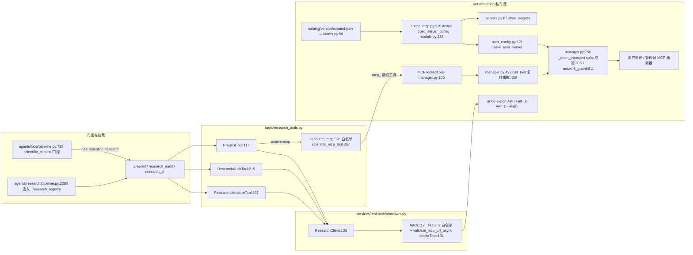

# 研究原语与 MCP 私有源边界导读（#1629 新面）

- 基线：origin/main @ `6cf793bd8`（v1.6.14）。锚点均为 `path:line`，相对仓库根。
- 范围：`deeptutor/services/research/primitives.py`（一手证据原语）、`deeptutor/tools/research_tools.py`（上下文门控工具面）、`deeptutor/services/mcp/` 私有源边界（scoped origins 网络护栏 / curated 目录与安装链）。
- 去重：工具注册链见 `docs/guides/tools-surface.md`；agents/research 深研编排见 guide-research（独立导读卡）；MCP 连接/OAuth/会话总览见 guide-mcp（独立导读卡）。重叠处本文只给衔接引用，不展开。用法说明见 `docs/SCIENTIFIC_RESEARCH.md`。

## 1. 一图看懂数据流

两条互斥证据通道：**一手直读**（arXiv/GitHub，primitives 直连，行为等同自服务严格姿态）与 **私有源转发**（已授权 MCP 工具，manager 守卫）。两者都不会执行抓回来的代码。

## 2. `services/research/primitives.py`：有界一手证据层

模块自述边界：只读论文与钉住的仓库快照，不运行仓库、不推断复现（`deeptutor/services/research/primitives.py:1`）。所有硬限制集中在这里，上层不重复实现。

**边界清单**

- 主机白名单 `_HOSTS`（`:28`）：仅 arXiv / export.arxiv / GitHub API / raw。`fetch()` 逐跳校验 scheme、hostname、userinfo，手动跟重定向且预算 4 跳（`:120-153`），总时限 45s（`:118`）。
- 复用 MCP 网络护栏的严格姿态：`validate_mcp_url_async(url, strict=True)`（`:131`；见 §4.1）。研究下载与用户自建服务器同等对待。
- arXiv 礼貌限速：进程级单调时钟排队 `ARXIV_INTERVAL=3s`（`:29-31`、`_pace_arxiv:93`）。
- 输入净化：`arxiv_id():38`（仅 arXiv/alphaXiv 规范 URL 或 ID，版本号保留）、`repository():61`（仅 `https://github.com/owner/repo`，owner/name 正则约束）、`source_path():86`（拒绝绝对路径、`..`、反斜杠、>300 字符）。
- 体量预算：feed/PDF/树/单文件分别 2 MiB / 32 MiB / 2 MiB / 128 KiB；PDF ≤500 页、每 pass ≤20 页、全文 ≤36,000 字符、单页 ≤4,000（`read_pdf:311`）；单文件文本截 24,000 字符、≤8 个文件（`code():241-243`）。
- 解析防护：Atom feed 拒绝 DOCTYPE/ENTITY 后用 defusedxml 解析，≤8 条（`parse_feed:280`）；PDF 必须 `%PDF-` 魔数，SHA-256 摘要随证据返回，缓存走临时文件+原子 rename，失败下载不落可复用 PDF（`read_paper:200-213`）。
- 静态审计诚实性：`audit_checks():409` 要求论断两侧引文都真实出现在抓取文本中，数值用 `Decimal` 精确比较，只有三种诚实结论：`candidate_discrepancy` / `values_match` / `requires_semantic_review`，并附"静态比对不等于复现"的解释；仓库快照返回 `execution: not_run`（`:275`）。

**函数级入口表（primitives.py）**

| 入口 | 锚 | 职责 | 关键约束 |
|---|---|---|---|
| `arxiv_id` | `deeptutor/services/research/primitives.py:38` | ID/URL 归一 | 版本化 ID；拒绝 query/fragment/userinfo |
| `repository` | `deeptutor/services/research/primitives.py:61` | GitHub 仓库校验 | 仅 github.com，两段路径 |
| `source_path` | `deeptutor/services/research/primitives.py:86` | 仓库内相对路径 | 有界相对路径 |
| `ResearchClient.fetch` | `deeptutor/services/research/primitives.py:117` | 唯一网络出口 | 白名单+strict URL 校验+字节/跳数预算 |
| `ResearchClient.search` | `deeptutor/services/research/primitives.py:155` | arXiv 检索 | query ≤1000 字符，limit 1–8 |
| `ResearchClient.paper` | `deeptutor/services/research/primitives.py:170` | 取单篇元数据 | 版本必须与请求一致（`:184-185`） |
| `ResearchClient.read_paper` | `deeptutor/services/research/primitives.py:188` | PDF 全文+页图 | ≤20 页；缓存原子落盘 |
| `ResearchClient.code` | `deeptutor/services/research/primitives.py:222` | 钉 commit 静态读码 | ref→40 位 sha（`:231`）；跳过符号链接（`:239`）；≤8 文件 |
| `parse_feed` | `deeptutor/services/research/primitives.py:280` | Atom 解析 | defusedxml；拒 DOCTYPE |
| `read_pdf` | `deeptutor/services/research/primitives.py:311` | 页文本+页渲染 | 图注候选页发现（`:329`）；图 ≤2 张 ≤5 MiB |
| `choose_files` | `deeptutor/services/research/primitives.py:384` | 默认选 6 文件 | README 优先，扩展名白名单 |
| `audit_checks` | `deeptutor/services/research/primitives.py:409` | 引文数值比对 | ≤12 checks；双侧引文必须命中 |
| `literature` | `deeptutor/services/research/primitives.py:461` | 文献矩阵 | ≤3 个 followup；摘要级不做共识结论 |

## 3. `tools/research_tools.py`：上下文门控工具面

三个工具注册于 `deeptutor/tools/builtin_specs.py:83`（`preprint` / `research_audit` / `research_lit`，`SCIENTIFIC_TOOL_NAMES:21`）。注册链与 ToolResult 契约见 `docs/guides/tools-surface.md` §1。

- **门控**：`scientific_context():24` — `deep_research` 能力、`paper_search` 在已启用工具集、或消息命中 arXiv/文献综述/复现 正则，三选一即挂载。挂载点在 chat 环 `_compose_enabled_tools`（`deeptutor/agents/loop/pipeline.py:735`）；深研编排侧消费点见 guide-research（本文仅锚注：`deeptutor/agents/research/pipeline.py:2102`）。
- **客户端构造** `_client():38` — 缓存根 `parse_cache/research`；GitHub token 只在"无用户上下文或 admin 回合"注入（`:44`），普通账户回合绝不借用部署 token，只能走其自建 MCP 通道。
- **证据包装** `_result():65` — `sources` 汇论文+已读代码文件；`metadata.research=True`、`experimental_reproduction=not_run`；视觉页图经 `model_message` 只进本轮模型上下文，不进持久元数据（`:68-82`）。
- **失败语义** `_error():110` — fail-closed：明确告知"证据不可用≠空结果≠已验证"。
- **`preprint`** `PreprintTool:117` — `read`/`figures` 走 `read_paper`，附 `source_page_links`（`:196`）；`discussion` 抓 alphaXiv 社区页并标注为未验证的 community_page 层（`:164-190`）；`mcp` 转发私有源工具（下条）。
- **MCP 转发白名单** `_research_mcp():335` + `scientific_mcp_tool():367` — 仅接受服务端注入的 `_research_registry`（`deeptutor/agents/loop/pipeline.py:1361`、`deeptutor/agents/research/pipeline.py:2203`，模型不可自填）、名字必须 `mcp_` 前缀且 `provider_kind == "mcp"`；工具名限闭集（discover_papers/get_paper_content/…）与 `feynman.*`、标注抓取正则（`:371-390`）；`get_paper_content` 默认强制 `fullText=True`（`:349-350`）；参数 ≤64 KiB（`:351`）；返回标注 source_layer：community_annotation / provider_generated_summary / provider_output（`:354-363`）。
- **`research_audit`** `ResearchAuditTool:219` — 论文+钉 commit 代码+引文比对组装，report_contract 规定"claim → 页/引文 → commit/file 证据 → 候选差异或 unverified"的报告顺序（`:282`）。
- **`research_lit`** `ResearchLiteratureTool:297` — 转 `literature()`。

**函数级入口表（research_tools.py）**

| 入口 | 锚 | 职责 | 备注 |
|---|---|---|---|
| `scientific_context` | `deeptutor/tools/research_tools.py:24` | 挂载门控 | 能力/工具集/正则三选一 |
| `_client` | `deeptutor/tools/research_tools.py:38` | 构造 ResearchClient | token 仅 admin/本地回合 |
| `_result` / `_error` | `deeptutor/tools/research_tools.py:65` / `:110` | 成功/失败包装 | 证据分层元数据 |
| `PreprintTool` | `deeptutor/tools/research_tools.py:117` | 读/图/社区页/MCP 四动作 | action 枚举 `:132` |
| `ResearchAuditTool` | `deeptutor/tools/research_tools.py:219` | 静态审计 | 不执行代码 |
| `ResearchLiteratureTool` | `deeptutor/tools/research_tools.py:297` | 文献发现 | followups ≤3 |
| `_research_mcp` | `deeptutor/tools/research_tools.py:335` | 私有源转发 | 注册表须服务端注入 |
| `scientific_mcp_tool` | `deeptutor/tools/research_tools.py:367` | 工具名白名单 | 闭集+正则 |

## 4. `services/mcp` 私有源边界：scoped origins 与 curated 目录

同一 `MCPServerConfig`（`deeptutor/services/mcp/config.py:31`）承载两个存储：部署全局 `settings/mcp.json`（仅管理员写，`deeptutor/services/mcp/config.py:121`）与用户自建 `deeptutor/services/mcp/user_config.py:80`（每账户一份，坏条目进 `RejectedServer` 不炸整表）。MCP 总体架构见 guide-mcp，本节只覆盖私有源边界。

### 4.1 网络护栏（`services/mcp/network.py`）：双姿态 + 可撤销 origin 授权

- **部署姿态**（管理员 `mcp.json`）：只拦事故性危险目标——0.0.0.0/8、169.254/16（云元数据）、fe80::/10 等（`deeptutor/services/mcp/network.py:34-41`）；自托管部署本就可访问内网。
- **自服务姿态**（用户自建，`strict=True`）：额外封 loopback、RFC1918、CGNAT 100.64/10、fc00::/7（`:45-53`）。理由：请求由持有全部 provider key 的应用进程发出，用户给的 URL 不得把进程指向内网（模块 docstring `:14-25`）。
- **scoped origins**：`mcp_origin():154` 把信任归一为 `scheme://host:port`；`approved_private_origin():172` 只在管理员注册表里存在同源、声明 `allow_private_network` 且为远程传输的服务器时放行，且例外仅限 RFC1918（`:116`、`_RFC1918:149`），元数据/loopback 永不放开。管理员删除该服务器即自动吊销。
- **校验时机**：DNS 全地址解析 + IPv4-mapped 归一（`:56-63`）后逐地址判定；连接时校验（`deeptutor/services/mcp/manager.py:805`）只是起点，`network_guard`（`deeptutor/services/mcp/manager.py:811`）对每个请求/重定向复检并复核审批是否被吊销（`deeptutor/services/mcp/manager.py:818-819`）；自服务一律禁重定向（`deeptutor/services/mcp/manager.py:834`）。同步版 `validate_mcp_url():75` 供保存路径使用（`deeptutor/api/routers/mcp_settings.py:50,130`），异步版 `:129` 供事件循环内调用。
- **调用前复核**：`call_tool()` 在真正执行前再查 `tool_allowed`（`deeptutor/services/mcp/config.py:94`）与私网审批是否吊销（`deeptutor/services/mcp/manager.py:437-443`）。

### 4.2 curated 目录（`services/mcp/catalog/`）：模板商店，非第二配置存储

- 数据源是包内 vendored `vendor/curated.json`（`deeptutor/services/mcp/catalog/loader.py:38`；当前 46 条，tier=curated/registry，stdio 条目全部 non-self-service）。请求路径零网络：`load_catalog():56` 用 `lru_cache` 解析一次为冻结 dataclass；坏条目跳过并告警（`:70-83`）。
- 检索/分页语义在 loader 层而非路由层（CLI 与 API 同语义）：`search_catalog():127`、`category_counts():100`（同一过滤器集，防 chip 数与网格不一致）；顺序确定（tier 序+字母序，`:85-87`），游标是偏移量，垃圾游标回落首页（`_decode_cursor:171`）。
- 模型不变量（`deeptutor/services/mcp/catalog/models.py:142` `__post_init__:163`）：
  1. **密文不进配置**——secret 字段在持久化配置中只留 `${secret:<entry>/<field>}` 引用（`build_server_config:238`），连接时由 `deeptutor/services/mcp/secrets.py:96` 内存解析；装饰（如 `Bearer {value}`）在入库时经 `value_template` 渲染（`CredentialField.render:133`），保证引用始终是"整值"可匹配。
  2. **stdio 永不自服务**——command 即以应用用户身份在主机执行（`deeptutor/services/mcp/catalog/models.py:196-200`；用户侧硬拒绝 `deeptutor/services/mcp/user_config.py:178-182`；连接侧 `deeptutor/services/mcp/manager.py:780-781`）。
  3. **字段目标必须匹配传输**——远程条目只许 header/url_param，stdio 只许 env/arg（`deeptutor/services/mcp/catalog/models.py:202-212`）。
  4. entry id 同时作服务器名与密钥文件名，正则取交集（`ENTRY_ID_RE:69`）；logo 自托管防第三方 CDN 收集安装列表（`:156-159`）。

### 4.3 安装链与连接期复核

`POST /catalog/{entry_id}/install`（`deeptutor/api/routers/space_mcp.py:319`）→ `get_entry` + `build_server_config`（产出 `BuiltServer`：配置+已装饰 secret 值，`deeptutor/services/mcp/catalog/models.py:224`）→ `secrets.store_secrets`（`deeptutor/services/mcp/secrets.py:67`）+ `save_user_server`（`deeptutor/services/mcp/user_config.py:121`，保存路径也会做 strict URL 校验，`deeptutor/services/mcp/user_config.py:192-194`）→ 用户首次使用时 `manager._open_transport`（`deeptutor/services/mcp/manager.py:756`）按 §4.1 校验连接，OAuth 走非交互式刷新（`deeptutor/services/mcp/manager.py:841-849`，交互授权入口在 `deeptutor/api/routers/space_mcp.py:169`）。

**函数级入口表（services/mcp 私有源）**

| 入口 | 锚 | 职责 | 备注 |
|---|---|---|---|
| `validate_mcp_url` / `_async` | `deeptutor/services/mcp/network.py:75` / `:129` | URL+DNS 判定 | strict=自服务姿态 |
| `mcp_origin` | `deeptutor/services/mcp/network.py:154` | origin 归一 | scheme://host:port |
| `approved_private_origin` | `deeptutor/services/mcp/network.py:172` | 私网例外仲裁 | 仅管理员注册表同源 |
| `MCPServerConfig.resolved_type` | `deeptutor/services/mcp/config.py:74` | 传输类型推断 | command→stdio；/sse→sse |
| `load_mcp_config` / `save_mcp_config` | `deeptutor/services/mcp/config.py:121` / `:135` | 部署存储 | 原子写，坏 JSON 回落空表 |
| `load_user_mcp_config` | `deeptutor/services/mcp/user_config.py:80` | 用户存储读取 | 坏条目进 RejectedServer |
| `_assert_self_service_allowed` | `deeptutor/services/mcp/user_config.py:164` | 用户侧准入 | stdio/私网审批/strict URL |
| `load_catalog` / `search_catalog` | `deeptutor/services/mcp/catalog/loader.py:56` / `:127` | 目录解析与检索 | 零网络、确定性顺序 |
| `McpCatalogEntry.__post_init__` | `deeptutor/services/mcp/catalog/models.py:163` | 四不变量校验 | 手改 JSON 也拦 |
| `build_server_config` | `deeptutor/services/mcp/catalog/models.py:238` | 模板实例化 | secret 走引用不进配置 |
| `store_secrets` / `resolve_references` | `deeptutor/services/mcp/secrets.py:67` / `:96` | 密钥存取与连接期解析 | 仅内存 |
| `_open_transport` / `network_guard` | `deeptutor/services/mcp/manager.py:756` / `:811` | 连接与每请求复检 | 自服务禁重定向 |
| `MCPToolAdapter` / `call_tool` | `deeptutor/services/mcp/manager.py:105` / `:423` | 工具适配与调用 | deferred；调用前复核 |

## 5. 测试覆盖对照（补测卡定位用）

| 被测面 | 测试文件 |
|---|---|
| primitives 原语与边界 | `tests/services/research/test_primitives.py` |
| research↔MCP 转发边界 | `tests/services/research/test_mcp_boundaries.py` |
| 网络护栏/origin | `tests/services/mcp/test_manager_scopes.py`（姿态与审批）、`tests/api/test_mcp_settings_auth.py` |
| curated 目录与模型 | `tests/services/mcp/test_catalog.py` |
| 配置两存储 | `tests/services/mcp/test_mcp_config.py`、`tests/services/mcp/test_user_config.py` |
| 安装/密钥/调用失败/OAuth | `tests/api/test_space_mcp.py`、`tests/services/mcp/test_secrets.py`、`test_call_failures.py`、`test_oauth.py` |

## 6. 衔接索引（只引用不展开）

- 工具协议/注册/每轮组合：`docs/guides/tools-surface.md` §1–§2。
- agents/research 深研编排与 `preprint` 消费：guide-research（独立卡）；本文仅锚 `deeptutor/agents/research/pipeline.py:2084`、`:2203`。
- MCP 连接生命周期、OAuth、会话状态：guide-mcp（独立卡）；本文仅覆盖私有源边界。
- 用户侧用法与证据分层说明：`docs/SCIENTIFIC_RESEARCH.md`。
