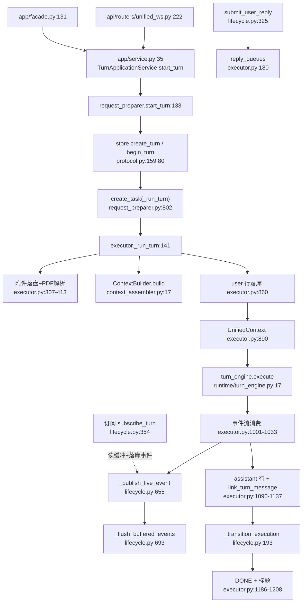

# 会话 turns 子系统导读

> 面向 turns 类修复/补测卡的中文导读。基线：origin/main @ f07029cfc（v1.6.13）。
> 所有结论附 `path:line`（相对仓库根，均在 `deeptutor/` 包内）；本文只读，不改行为。

## 范围与去重边界

- 本文：`services/session/turns/` 六个切片 + 组合门面 + `ask_user` 痕迹回放，覆盖一次 turn 从请求准入到执行落库的完整链路。
- 不覆盖（另轴）：历史/内存持久化（ContextBuilder 预算/摘要、sqlite/pocketbase 行存储）→ guide-session 轴；事件跨进程广播（stream bus / coordinator 细节）→ guide-events 轴；turn 级测试用例 → test-turn-executor / test-request-preparer 等测试卡，本文只给测试入口。

## 调用链总览

组合方式：`TurnRuntimeManager` 是六个切片的 Mixin 门面（`services/session/turn_runtime.py:26-33`），进程级按 store 缓存单例（`turn_runtime.py:43-52`）；`app/facade.py:131` 与 `unified_ws.py:222` 是传输层入口，`app/service.py:35` 是应用服务层（含 ActiveTurnConflict 回收重试 `app/service.py:53-59`）。

## 关键文件表

| 文件 | 职责 | 关键锚点 |
|---|---|---|
| turns/request_preparer.py | 准入：校验、偏好解析、能力路由、租约、turn 行创建、任务编排 | `start_turn` request_preparer.py:133 |
| turns/context_assembler.py | ContextBuilder 注入缝隙（测试替换点，20 行薄壳） | context_assembler.py:17 |
| turns/executor.py | 单 turn 全量执行：附件→上下文→引擎→事件→落库 | `_run_turn` executor.py:141 |
| turns/lifecycle.py | 进程内生命周期：订阅/取消/回复/事件缓冲落库/更新冻结 | lifecycle.py:33 |
| turns/learning_adapter.py | mastery 路径租约与卡片判定/提交 | learning_adapter.py:22 |
| turns/title_service.py | 首轮后的会话标题生成 | title_service.py:34 |
| turns/resource_reuse.py | 持久资源偏好子集裁剪 | resource_reuse.py:6 |
| turns/__init__.py | 切片导出面 | __init__.py:3-16 |
| session/turn_runtime.py | 兼容门面 + 单例 | turn_runtime.py:26,43 |
| session/_turn_runtime_shared.py | 纯函数层与 `_TurnExecution` 数据类 | _turn_runtime_shared.py:1554-1574 |
| session/ask_user_trace.py | 已解决 ask_user 问答回放进模型上下文 | ask_user_trace.py:37,58 |
| session/protocol.py | store 契约（begin/transition/append/link） | protocol.py:80,100,112,159,175 |

## 请求准备：request_preparer.start_turn

顺序（全部在 `@workspace_writer` 内，request_preparer.py:132-829）：

1. 准入门禁：`_ensure_accepting_turns`（lifecycle.py:175-180）+ 归档 workspace 拒绝（request_preparer.py:140-144）；`TurnRequest.model_validate` 归一化（request_preparer.py:147-149）；缺省语言回填（151-156）。
2. 资源复用参数先从 config 摘出（157-159），auto_route 优先 per-turn、缺省读系统设置（160-168）。
3. 会话归属与 workspace 绑定：会话必须存在（169-174）；`reply_language_override` 会话级覆盖请求（180-186）；workspace 连接/会话双校验（196-210）；内容 workspace 绑定解析（206-229）。
4. 课程默认值应用（231-254）。
5. 能力与模式：`workspace_mode` 先于路由解析（256-266）；`route_explicit_quiz_request` 显式 quiz 路由（267-275）；`apply_learning_policy` 学习者策略（276-281）；watching 媒体在 owner store 内解析（283-292）；`validate_capability_config` 按能力裁 config（293-324）。
6. Reading/Mastery 绑定：reading workspace/材料校验并 attach（325-368）；mastery path 绑定 + 会话主题校验 + `mastery_lease_managed` 判定（372-397）；`mastery_session_mode` 解析（399-425）。
7. persona/skills/mcp/llm_selection：显式键优先、缺键沿用会话偏好（431-446）；llm_selection 校验目录，非管理员无授权直接终错（447-509）。
8. 工具面：未显式给 `tools` 时回填设置项（516-524）；grant v2 白名单过滤（529-536）；路由能力按 manifest 过滤（537-550）。
9. 租约与 turn 行：`coordinator.acquire_turn` 失败即"已有活动 turn"（552-561）；preference_update 组装（562-585）；选区辅导上下文与父会话校验（587-635）；`apply_resource_reuse`（645-647）；偏好持久化（676-677）。
10. `create_turn`（无租约）/`begin_turn`（带 fencing_token，678-693）；`_TurnExecution` 注册进 `_executions`（694-708），更新冻结期拒绝并落 failed（709-717）。
11. mastery 租约获取 + 卡片答案先提交（718-749），turn 已被取消则不启动（750-765）。
12. 发 SESSION 元数据事件（766-788）；regenerate 时先删旧 assistant 行（794-796）；`create_task(_run_turn)` + 协调任务（797-810）；任何失败回滚注册、释放租约、turn 落 failed（811-828）。

`regenerate_last_turn`（831-1067）：读最后 user 行与其 request_snapshot（874-881），`persist_user_message=False` + `regenerated_from_message_id`（1032-1034）；Resend 用 `_REPLAY_SNAPSHOT_FIELDS` 整帧回放（48-79, 1041-1052）；完整 `TurnRequest.model_validate` 通过后才删旧答案（1054-1062）。

## 执行：executor._run_turn

`@workspace_writer`（executor.py:140-141）。关键阶段：

1. 回复队列在编排器启动前创建并注册（176-181）；`_wait_for_user_reply` 先 CAS 到 `waiting_input`，醒来后还原 `running`（183-217）。
2. `turn_resource_selection` 收窄本轮 skills/mcp（223-231）；材料授权在提示构建前重查（233-239）。
3. 附件：记录规范化（307-316）、原始字节先入附件存储（318-358）、内建抽取后 PDF 强制走配置解析器（360-413）、immersive_reading 视口图片注入（426-432）、落库副本无条件去 base64（481-487）、历史图片重挂（496-519）。
4. 上下文：`activate_llm_selection`（547）→ `ContextBuilder.build`（548-561）→ 记忆（562-563）→ persona/learner 画像（565-594）→ skills manifest（596-598）。chat 走 source_inventory manifest 路径（605-644）；其他能力走 legacy 拼接路径（645-764）；mastery 主题材料独立索引（784-790）；卡片答案/跳过在导师启动前裁定（796-812）；独立管线补 workspace 快照（818-844）。
5. user 行落库（852-888，带 request_snapshot 与 turn_id）；`UnifiedContext` 组装（890-998，`wait_for_user_reply` 注入 912）。
6. 引擎循环（1000-1033）：SESSION 事件丢弃（1002-1003）、DONE 暂存（1004-1014）、其余事件打 `content_offset` 后缓存（1016-1023）、答案段捕获与撤回轮标记（1024-1029）、生成物附件去重（1030-1033）。
7. 落库：`provider_response_state` 归一化（1035-1047）；mastery 路径/模式变化广播（1054-1068）；`fill_preview_text`（1074）；持久答案 = 未撤回段拼接 + CJK 修复（1076-1083）；assistant 行四分支挂 parent（1090-1136）；`link_turn_message`（1137）。
8. 收尾：`_resolve_turn_outcome/_resolve_turn_failure_metadata`（1138-1142）；持久行 id 塞进 DONE 供前端对账（1158-1170）；flush → 终态 CAS → 发 DONE → 再 flush（1171-1188）；非 regenerate 成功时生成标题（1189-1208）；最终 flush（1209-1219）。

## 生命周期与订阅：lifecycle.py

- `_transition_execution` 终态 CAS 同时接受 `running`/`waiting_input` 两个前驱（193-226，#1297/#1359）。
- `_coordinate_execution`：续租、消费 cancel / submit_user_reply / user_input 命令（228-303）；续租失败置 `lease_lost` 并取消任务（284-293）；异常即停协程交由 leader 恢复（297-303）。
- `cancel_turn`（305-323）：本进程有任务则 cancel 并等待收尾；无租约模式下直接改库。
- `submit_user_reply`（325-352）：队列不在即 False，不堆积到已死 turn。
- `subscribe_turn`（354-517）：先回放落库事件（359-381），再挂实时订阅者补增量（383-410）；无执行体且终态时合成 DONE/ERROR（412-437）；5s 轮询兜底对账落库事件（442-480）；哨兵排空后仍未见过 DONE 则按终态合成（489-517）。合成事件形态见 `_synthesize_done_event`（520-561）与 `_synthesize_error_event`（564-590）。
- `_publish_live_event`（655-691）：DONE 默认补 status；seq 由 coordinator 或本地分配并写入内存缓冲（665-682）；DONE 对本地订阅者可见前必须先 flush（683-687）。
- `_flush_buffered_events`（693-765）：批量 `append_events`（709-736）或逐条 `append_turn_event`（739-757）；turn 已删容忍降级（719-732, 742-756）；非批量后端缓存已提交前缀防重复（758-762）。
- 更新冻结：`reserve_managed_update`（130-149）、`close`（71-106）、冻结失效自动解冻（167-173）。

## 学习（mastery）适配：learning_adapter.py

- `_acquire_mastery_path_lease`（307-339）：bind_session → 释放被顶替租约 → `acquire_path_lease`，冲突报 `mastery_path_busy`。
- `_release_superseded_lease`（41-72）：只有本进程确知 `awaiting_user_reply` 才取消停放 turn（36-39），busy 一律不抢。
- 卡片答案：`_commit_mastery_card_answer`（74-115）准入期先落，`_grade_submitted_card_answer`（117-210）执行期开跑前毫秒级裁定并以 tool_result 形态广播；`_skip_card_question`（212-305）按卡面 question_id 丢弃。
- `_validate_mastery_session_topic`（342-371）：会话与 path 一对一，URL 错配报 `mastery_session_topic_mismatch`。

## 标题：title_service.py

`_maybe_generate_session_title`（34-161）：仅当标题仍是 `New conversation` 哨兵（55-57）；取首轮 user/assistant（59-74）；任务模型 scope 内 20s 截止（117-122）；错误 payload/超时降级为首条 user 截断 50 字（123-136）；落库失败仅 warning（141-150）；成功后发 `session_meta`（152-161）。

## ask_user 痕迹回放：session/ask_user_trace.py

卡片式回答随 assistant 行事件持久化，不是独立 user 行（模块 docstring 1-7）。`_RESOLVED_MARKER` 廉价探测（17, 48-55）；`filter_ask_user_events`（37-45）；`extract_ask_user_clarification_blocks`（58-119）按 `assistant_content_offset` 还原 `assistant→user→assistant` 时序；`extract_ask_user_clarifications`（122-125）渲染为上下文文本。

## 失败与降级路径

- 准入拒绝全部转 RuntimeError 给传输层（unified_ws.py:223-232 以 `start_turn_rejected` 终态回包），turn 行能建则标 failed（request_preparer.py:709-717, 739-749, 811-828）。
- `_run_turn` CancelledError：`lease_lost` 直接上抛不写任何事件（executor.py:1220-1225，leader 恢复负责 worker_lost）；shutdown 请求落 `failed/server_shutdown`，普通取消落 `cancelled`（1226-1248）；尽力持久化半程答案/事件（1258-1289），再终态 CAS + 合成 DONE（1290-1314）。
- 普通异常：未发过 DONE 时 ERROR+DONE 双发并落 failed（1316-1378）；已发过 DONE 则只 flush+终态，防二次终态（1322-1341）。
- 订阅兜底：见上 `subscribe_turn` 合成 DONE/ERROR；前端 `isStreaming` 不依赖心跳超时（489-517）。
- 标题失败不影响 turn 终态（executor.py:1195-1208 双层 warning）。
- 事件落库容忍"turn 已删"（lifecycle.py:719-732）；mastery 租约释放按 turn_id 而非起始 path（executor.py:1387-1397）。

## 已知坑

1. ask_user 停放的 turn 被取消时，waiter 的 shield 还原与终态 CAS 竞速——终态必须同时接受 `waiting_input`，否则会话永久"已有活动 turn"（lifecycle.py:202-226）。
2. `mastery_session_mode` 用 `or` 而非键存在性：null 不能读成"客户端说没有"（request_preparer.py:399-419）。
3. persona/skills/mcp/llm_selection 的显式键（含显式空）才覆盖持久偏好，缺键沿用旧值（request_preparer.py:426-446, 636-644）。
4. regenerate 的附件必须投影到 wire 契约字段，否则 WS 静默挂起（#1484，request_preparer.py:964-969）。
5. PocketBase 字符串 id 不能走 `parent_message_id` 请求字段，regenerate 用 `regenerated_from_message_id`（executor.py:1112-1126）。
6. DONE 顺序不变式：非终态事件+终态行先落库，DONE 才可订阅可见；标题等 post-DONE 事件后还要最终 flush，否则重连客户端拿不到 DONE、丢失对账（executor.py:1171-1219；lifecycle.py:683-687）。
7. 所有权标记先于跨租约恢复注册（701-708），否则第二个 start_turn 会把健康 turn 误判为重启孤儿。
8. reply 队列先于订阅者通知弹出（executor.py:1383-1386），保证迟到的 submit_user_reply 得到 False。
9. 撤回轮（retracted round）内容只留在 trace，不进持久答案（executor.py:154-166, 1024-1029, 1076-1083）。
10. 事件 seq 在 coordinator 发布与本地分配双轨下取 max 合并（lifecycle.py:665-682），勿在切片外自增。

## 测试入口（转测试轴卡，不在本文展开）

- 切片级：`tests/services/session/test_turn_runtime.py`、`test_turn_runtime_subscribe.py`、`test_turn_runtime_title.py`、`test_regenerate.py`、`test_resource_reuse.py`、`test_turn_event_flush.py`、`test_turn_repository.py`、`test_context_builder.py`。
- 应用/传输级：`tests/app/test_turn_application_service.py`、`test_turn_parked_on_ask_user_is_reclaimable.py`、`test_waiting_turn_recovery.py`、`test_multiworker_turn_application.py`；`tests/api/test_unified_ws_turn_runtime.py`。
