# Usage Statistics 数据链路代码导读（guide-usage-stats）

- 基线：`origin/main @ 6cf793bd8`（v1.6.14）。
- 范围：Usage Statistics 面板（设置 → Usage）背后的统计聚合 API 与前端面板；写侧（LLM 调用如何被记账）只讲到能读懂数据来源为止。
- 背景：HKUDS/DeepTutor#1907 —— 面板自该功能存在起始终显示 "Unable to load usage statistics. Retry."，点 Retry 无效（open，暂无关联 PR）。
- 行号锚均为该基线下的 `path:line`，相对仓库根目录。

## 1. 入口

| 入口 | 位置 |
| --- | --- |
| 设置页导航项 | `web/features/settings/navigation/settings-pages.ts:80-84`（`key: 'usage'`，`href: '/settings/usage'`） |
| 页面组件（动态加载） | `web/components/settings/SettingsPageContent.tsx:26` → `web/features/settings/sections/UsageSettingsSection.tsx:11` |
| 数据获取 helper | `web/lib/usage-statistics.ts:7-16`（`fetchUsageStatistics`） |
| 后端路由 | `GET /api/settings/usage`，`deeptutor/api/routers/settings.py:2415-2453`；挂载前缀 `/api/settings`（`deeptutor/api/main.py:695`） |
| OpenAPI 契约 | `web/contracts/schema/openapi.json:54346`；类型 `web/contracts/generated/api.ts:16779` |

路由带认证依赖 `_auth`（`deeptutor/api/main.py:593`，`require_learning_surface`，见 `deeptutor/api/routers/auth.py:702-718`；其内部再走 `require_auth`）。`AUTH_ENABLED=false` 时使用本地合成 admin 身份（`deeptutor/api/routers/auth.py:721-727`）。

## 2. 数据流

### 2.1 写侧：一次 LLM 调用如何被记账（两条独立通道）

通道 A —— 会话事件快照（随会话存储，可恢复历史归因）：

1. 每个回合开始时，orchestrator 绑定一个 `TurnUsage` 收集器到 ContextVar：`deeptutor/runtime/orchestrator.py:134-137`。
2. 每次 LLM 传输层调用经 `CallMeasurement` 计量：入口 `measure_provider_call`（`deeptutor/services/llm/metrics.py:183-211`）、流式 `MeasuredStream`（`metrics.py:214-256`）、工厂 `instrument_client`（`metrics.py:258-279`）。`measurement_active` ContextVar 防止嵌套计量重复计数（`metrics.py:71`）。
3. 调用结束时 `CallMeasurement.finish` 生成单次调用记录（`metrics.py:120-180`）：API 未报 usage 时按字符数估算（`metrics.py:127-140`，约 `chars/3.5`）。
4. 回合收尾时 DONE 事件携带 `usage_summary`（`orchestrator.py:169-179`，`usage_summary` 在 `orchestrator.py:176`）；executor 把含 `usage_summary` 的 DONE 事件并入助手消息事件（`deeptutor/services/session/turns/executor.py:1020-1030`，`usage_summary` 判定在 `executor.py:1022-1023`），再由 turn 生命周期持久化到 `turn_events`（`deeptutor/services/session/turns/lifecycle.py:738-741`）。当前运行时 `add_message(events=[])`，即消息本体 `events_json` 通常为空（`executor.py:1112`），旧数据里消息内嵌事件仍可读（见 §3 sqlite 回退）。
5. capability 结果的 metadata 也可能带 `usage_summary`（`deeptutor/agents/_shared/capability_result.py:43-47`）。

通道 B —— 账本 SQLite（按账号持久、独立于会话）：

- `finish` 同时调用 `record_call` 写入 `<user_root>/usage.sqlite3`（`metrics.py:167-178`；表结构 `deeptutor/services/llm/usage_ledger.py:58-62`，`INSERT OR IGNORE` 幂等在 `usage_ledger.py:63-73`）。
- 账本只存标识符、时间戳和数值，不含提示词/响应/凭据（模块声明 `usage_ledger.py:1-5`；字段白名单 `_CALL_FIELDS` 在 `usage_ledger.py:15-34`）。
- 写失败只记日志、不影响主流程（`metrics.py:179-180`）→ 账本可能有洞，属数据缺口而非报错来源。

### 2.2 读侧：面板请求 → 聚合响应

```mermaid
flowchart LR
    UI["UsageSettingsSection<br/>UsageSettingsSection.tsx:27-38"] -->|"fetchUsageStatistics<br/>usage-statistics.ts:7-16"| API["GET /api/settings/usage?year&amp;timezone<br/>settings.py:2415"]
    API --> VAL["timezone/year 校验<br/>settings.py:2417-2431"]
    VAL --> WS["遍历 workspace，收集会话记录<br/>settings.py:2437-2449"]
    WS --> STORE["get_session_store().usage_records<br/>session/__init__.py:15-38<br/>sqlite_store.py:2665 / pocketbase_store.py:1026"]
    STORE --> COMB["combined_usage_records<br/>账本+历史按 call_id 去重合并<br/>usage_ledger.py:141-172"]
    COMB --> AGG["aggregate_usage<br/>usage_statistics.py:160-238"]
    AGG --> RESP["UsageStatistics JSON<br/>usage_statistics.py:43-53"]
```

要点：

- **存储后端选择**：配置了 PocketBase 用 `PocketBaseSessionStore`，否则本地 SQLite（`deeptutor/services/session/__init__.py:15-38`）。
- **历史记录提取**：sqlite 按助手消息 LEFT JOIN turns/turn_events 读 `result`/`done` 事件及含 `model` 的事件（SQL 在 `deeptutor/services/session/sqlite_store.py:2671-2683`）；消息内嵌旧 `events_json` 作回退（`sqlite_store.py:2694-2697`），规范 turn_events 结果存在时覆盖（`sqlite_store.py:2708-2711`）。`imported_` 会话排除（`sqlite_store.py:2680`）。PocketBase 侧按 owner 会话分页拉 messages→turns→turn_events（`deeptutor/services/session/pocketbase_store.py:1045-1057`、`:1059-1071`、`:1086-1128`）。
- **事件→summary**：`summaries_from_events`（`deeptutor/services/session/usage_statistics.py:56-88`）语义是 "RESULT 是快照，DONE 替换之，同一回合不叠加"（`usage_statistics.py:59`，实现 `:72-85`），防止重复计数。
- **账本合并去重**：`combined_usage_records` 用 call_id 集合判断哪些历史调用已入账本，`merge_records` 只保留历史独有调用再加账本记录（`usage_ledger.py:110-138`）；跨年调用保留账本原始日期（`usage_ledger.py:146-156`、`:162-171`）。
- **年度聚合**：`aggregate_usage`（`usage_statistics.py:160-238`）在指定时区下按日分桶、按 (provider, model) 归因，输出 `UsageStatistics`（`usage_statistics.py:43-53`）。所有数值经 `_number` 过滤非有限/非正值（`usage_statistics.py:91-96`）。
- **历史模型归因恢复**：summary 无模型细节时，`recover_summary` 从事件证据（`deeptutor/services/session/usage_recovery.py:10-39`，排除搜索工具模型 `:22-27`）、账号根目录内的历史 cost 报告（`:49-95`，根目录约束 `:57-65`）或唯一模型证据（`:96-103`）恢复。
- **前端渲染**：`UsageSettingsSection.tsx:27-38` 发请求（year 来自 URL，`usageYear` 夹取 `usage-statistics.ts:18-21`）；`visible = data?.year === year` 丢弃过期年份响应（`UsageSettingsSection.tsx:46`）；请求失败或非 2xx 抛错（`usage-statistics.ts:14`），catch 后置 `error: true`（`UsageSettingsSection.tsx:33-36`）；错误横幅 + Retry 按钮在 `UsageSettingsSection.tsx:88-102`（Retry 通过 `revision+1` 重发，`:82`、`:96`）。请求 URL 带浏览器 IANA 时区（`usage-statistics.ts:11-12`）并经 `scopedUrl` 附加 `dt_workspace`（`web/lib/workspace-scope.ts:21-23`）。热力图 `UsageActivity.tsx:27`（日历 `activityCalendar`，`usage-statistics.ts:24-46`），模型表 `UsageSettingsSection.tsx:130-215`。

## 3. 关键文件表

| 层 | 文件 | 职责 | 关键行 |
| --- | --- | --- | --- |
| 计量 | `deeptutor/services/llm/metrics.py` | 单调用计量、回合收集器、账本写入 | `:120` finish、`:165-178` 持久化 |
| 账本 | `deeptutor/services/llm/usage_ledger.py` | usage.sqlite3 读写与合并 | `:43` record_call、`:76` usage_records、`:141` combined |
| 会话存储 | `deeptutor/services/session/sqlite_store.py` | 从消息/turn 事件恢复历史 summary | `:2665-2714` |
| 会话存储 | `deeptutor/services/session/pocketbase_store.py` | PB 版同上（owner 作用域） | `:1026-1136` |
| 恢复 | `deeptutor/services/session/usage_recovery.py` | 历史模型归因恢复 | `:42` recover_summary |
| 聚合 | `deeptutor/services/session/usage_statistics.py` | Pydantic 模型 + 年度聚合 | `:56`、`:160` |
| API | `deeptutor/api/routers/settings.py` | `GET /usage` 端点 | `:2415-2453` |
| 前端数据 | `web/lib/usage-statistics.ts` | fetch + 日历工具 | `:7`、`:24` |
| 前端面板 | `web/features/settings/sections/UsageSettingsSection.tsx` | 年度统计页（含错误/Retry） | `:27-38`、`:88-102` |
| 前端组件 | `web/features/settings/components/UsageActivity.tsx` | 活动热力图 | `:93-147` |

## 4. 现有测试与覆盖空白

现有测试（本基线全部通过；命令见文末）：

| 文件 | 用例（行号） | 覆盖 |
| --- | --- | --- |
| `tests/services/session/test_usage_statistics.py` | `:46` 聚合去重/加权、`:68` 时区日历+闰年、`:83` 旧数据无模型归因、`:99` sqlite 双来源读取、`:134` PB owner 隔离与分页、`:197` 端点时区校验+store 选择、`:215` trace 恢复不认搜索模型、`:243` context_budget/cost 报告恢复 | 聚合、存储读取、恢复 |
| `tests/services/llm/test_usage_ledger.py` | `:25` 后台完成/流式、`:46` 账本+turn 合并去重、`:82` owner 捕获/嵌套单计、`:119` 中断调用入账、`:134` Perplexity 搜索、`:155` 跨年日期、`:180` 豆包搜索 | 写侧与账本合并 |
| `web/tests/usage-statistics.spec.tsx` | `:16` 闰年日历、`:25` 键盘导航、`:33` 年度加载、`:41` 失败→Retry 恢复、`:49` 过期响应丢弃、`:60` 历史无模型桶 | 面板交互 |

覆盖空白（与 #1907 排查直接相关）：

1. **无经过 FastAPI 应用的端到端 API 测试**：`:197` 只直调 `get_usage_statistics` 并 mock store；`settings.py:2437-2449` 的 workspace 遍历、`_catalog()`（`settings.py:2441`）与多 workspace 合并完全没有测试。
2. **无时区/时区库缺失的失败路径测试**：服务器侧 `ZoneInfo` 两处实例化（`settings.py:2426-2429` 校验、`usage_statistics.py:161` 聚合）在宿主缺 tz 数据库时的 400/500 行为无覆盖。
3. **账本读失败未覆盖**：`usage_records`/`combined_usage_records` 打开只读连接（`usage_ledger.py:84-92`、`:159-171`），usage.sqlite3 损坏/锁定时异常直接冒泡成 500，无测试。
4. **前端 spec mock 了 `fetchUsageStatistics`**（`web/tests/usage-statistics.spec.tsx:8`），真实 URL/时区参数构造（`usage-statistics.ts:11-13`）与 401 处理（`web/shared/api/client.ts:38-46`）在该链路无覆盖。
5. **非 2xx → Retry 横幅**的映射只有组件级测试（`:41`），无后端真实错误码（400/401/403/500）驱动的前端行为测试。

## 5. 与 #1907 症状相关的可疑分支（按嫌疑排序）

症状 "始终 Retry、点 Retry 无效" 意味着 `GET /api/settings/usage` 对该用户持续非 2xx（`usage-statistics.ts:14` + `UsageSettingsSection.tsx:88-102`）。可疑点：

1. **时区解析 400（首要嫌疑）**：前端固定发送浏览器 IANA 时区（`usage-statistics.ts:11-12`），服务端 `ZoneInfo(timezone)` 失败即 400（`settings.py:2426-2429`），聚合函数里还会再实例化一次（`usage_statistics.py:161`）。项目依赖里没有 `tzdata`（`pyproject.toml` 与 `requirements.txt` 均无）；在无系统时区数据库的环境（典型：Windows 未装 pip `tzdata`，或精简容器），任何非 UTC 时区都永久 400 —— 与 "自最早版本起始终失败" 及 Retry 无效吻合。用户时区恰为 UTC 时应能加载，可作为与报告者的区分问题。
2. **workspace 目录遍历未包裹异常**：`get_content_workspace_service()._catalog()` 在 try 之外（`settings.py:2441`），只有 `WorkspaceError` 被吞（`settings.py:2448-2449`）；catalog 其他异常 → 500。
3. **PocketBase 读路径无兜底**：`pocketbase_store.usage_records` 内部无 try（`pocketbase_store.py:1032-1136`），PB 不可达/collection 缺失 → 500（多用户/PB 部署）。
4. **账本 SQLite 只读失败**：usage.sqlite3 损坏或被锁 → `usage_ledger.py:84-92`/`:159-171` 抛错 → 500。
5. **401 不跳登录只显示 Retry**：`apiFetch` 的 401 → 登录重定向依赖 `runtimeAuthEnabled` 标志，该标志由 `fetchAuthStatus` 引导（`web/shared/api/client.ts:38-46`、`web/lib/auth.ts:61`）；引导未完成/失败时，401 落到 `error` 横幅而非登录页。
6. **Retry 语义是原样重发**（`UsageSettingsSection.tsx:82`、`:96`），服务器侧原因（上述 1-5）永远修不好，与症状一致；排查时应先看该请求的状态码。

## 6. 扩展点

- **新增统计维度**：扩展 `UsageTotals`/`ModelUsage`/`DailyUsage`（`usage_statistics.py:14-42`）与 `_Totals.add` 键列表（`:104-122`）；再 `npm run contracts:generate`（`web/package.json` scripts）刷新 `web/contracts`，前端类型自动跟随（`usage-statistics.ts:4-5`）。
- **新增调用来源/后台任务**：账本带 `source` 列（`usage_ledger.py:60`），`TurnUsage(source=...)`（`metrics.py:20-24`，orchestrator 传入 cap 名 `orchestrator.py:136`）；新后台任务只要在 ContextVar 作用域内发起 LLM 调用即自动入账。
- **新的模型归因证据**：在 `usage_recovery.model_evidence` 增加事件模式（`usage_recovery.py:10-39`）；注意排除搜索/工具模型（`:22-27`）。
- **新面板组件**：放在 `web/features/settings/components/`，数据一律走 `web/lib/usage-statistics.ts` 风格的 helper；页面注册在 `settings-pages.ts` 与 `SettingsPageContent.tsx`。

## 7. 已知坑

- **快照 vs 替换**：旧数据一条消息可能同时有内嵌事件与 turn_events，两处都读时规范来源覆盖、 DONE 只认一次（`usage_statistics.py:59`、`sqlite_store.py:2708-2711`；测试 `test_usage_statistics.py:118-128`）。
- **估算 token 不精确**：无 usage 响应按 `chars/3.5` 估算（`metrics.py:127-140`），中文场景偏差更大；`estimated_calls` 计数可识别（`usage_statistics.py:156`、前端未单独展示）。
- **账本写失败静默**：`record_call` 抛错仅日志（`metrics.py:179-180`），且 `allow_nan=False`（`usage_ledger.py:71`）遇 NaN 会整条拒写 → 面板数字可能偏小，不是报错。
- **无模型历史桶**：恢复不出模型的旧 summary 归入 `model == ''`，前端单独一行显示（`UsageSettingsSection.tsx:48-49`、`:209-214`），不计入模型表。
- **导入会话不计**：`imported_` 前缀会话被排除（`sqlite_store.py:2680`、`pocketbase_store.py:1056`）。
- **隐私边界**：账本与恢复逻辑都只碰标识符/数值；恢复历史报告限定账号根目录内（`usage_recovery.py:57-65`）。

## 复核命令（本基线实测）

- 后端：`python -m pytest -q -p no:cacheprovider tests/services/session/test_usage_statistics.py tests/services/llm/test_usage_ledger.py` → 15 passed。
- 前端：`cd web && npx vitest run tests/usage-statistics.spec.tsx` → 6 passed。
