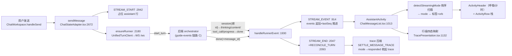

# web/ Activity/状态展示面导读（统一 Activity 组件 · turn 事件→状态映射 · 订阅生命周期 · 空态/错误态）

- 基线: origin/main @ `f07029cfc`（release v1.6.13）。所有 `path:line` 均在该 commit 逐一核对存在，相对仓库根目录。
- 定位: 讲清"一次 turn 的事件如何变成用户看到的活动状态"。供前端修复与补测卡快速定位改动面。
- 去重声明（只引用不展开）: 状态组织/持久化/错误信封的读写路径见 guide-web-state（`docs/guides/web-state.md`，myfork `guide/web-state-20261007`）；目录与页面分层见 guide-frontend；后端事件总线/进度链见 guide-events（`docs/guides/events-and-progress-chain.md`，myfork `guide/events-20261004-v2`）。本文只写展示面这一轴。

## 0. 一分钟总览

`StreamEvent`（v2 turn 协议，`web/contracts/generated/turn-protocol.ts:172` 的 15 种 `StreamEventType`）→ `ChatStateAdapter` reducer 追加进 `MessageItem.events`（`web/features/chat/ChatStateAdapter.tsx:914`）→ 展示层纯函数把事件数组映射成两种状态词汇：**turn 级 `StreamingMode`**（8 相位，`web/features/chat/trace/model.ts:94`）与 **行级 `ActivityState`**（四态 running/awaiting/error/done，`web/shared/ui/activity-state.ts:10`）→ 统一 Activity 组件渲染。

"统一 Activity 组件"替代了旧 chat/turn 各自为政的状态面：原先 chat trace、书编译、co-writer、侧栏各养一套 spinner/图标（`web/components/activity/StatusDot.tsx:9` 记载替代了 13 个手绘 glyph；`web/features/co-writer/components/CoWriterWorkspace.tsx:2229` 记载 co-writer 曾有第二套 trace 实现）。现在所有表面只组合 `web/components/activity/` 一套词汇。

## 一、统一 Activity 组件清单

契约是两层：一层=不动手的读者看到的每动作一行；二层=其余全部，除"读者该盯着看"的活儿外不自动展开（`web/components/activity/index.ts:16-19`）。

| 组件 | 职责 | 定义锚 |
|---|---|---|
| `ActivityHeader` | orb + 正在做什么 + 已多久；兼折叠开关，`aria-live` | `web/components/activity/ActivityHeader.tsx:23` |
| `ActivityStack` / `ActivityDivider` | 行堆栈（`alignUnderOrb` 对齐 orb 列）/ 带标签的分隔（"Step n"） | `web/components/activity/ActivityStack.tsx:16` / `:52` |
| `ActivityRow` | 一行动作：状态点+标题+尾随 detail，二层折叠、live 跟随展开（`followOpen`）、粘底滚动 | `web/components/activity/ActivityRow.tsx:66` |
| `ActivityFold` / `FoldCaret` | 二层内容容器（共享曲线）/ 折叠箭头 | `web/components/activity/ActivityFold.tsx:44` / `:25` |
| `ActivityDetailGrid` | 二层 label/value 网格；`argumentRows` 把工具参数转行、`isPlumbingArg` 过滤管道参数 | `web/components/activity/ActivityDetailGrid.tsx:26` / `:78` / `:69` |
| `ActivityOrb` | 思考球，全表面统一尺寸/分辨率/墨色（brand=主色, live=蓝）与 picker 打开冻结 | `web/components/activity/ActivityOrb.tsx:73` |
| `StatusDot` | 行首 15px 状态点：蓝=running（脉冲）、琥珀=awaiting、红=error、灰=done | `web/components/activity/StatusDot.tsx:20`（色调 `:35-42`） |
| `ActivityMark` | 无 header orb 的列表行标记 | `web/components/activity/ActivityMark.tsx:100` |

`ActivityState` 类型本身放 `shared/ui/activity-state.ts:10` 而非组件旁，因为推导它的纯逻辑（`lib/book-activity.ts` 等）不得 import `components/`——四态是两层间的契约，全库仅此一份（`web/components/activity/types.ts:1-11`）。

## 二、turn 事件 → 活动状态映射

### 2.1 turn 级：StreamingMode（聊天相位 → 状态行）

`detectStreamingMode`（`web/features/chat/trace/selectors.ts:242`）从**最新事件倒序扫描**，先到先得；非流式恒为 `responded`（`:247`）。规则表：

| 命中（倒序首个满足） | mode | 标签（`TracePresentation.tsx:1584-1597`） | orb（`MODE_TO_ORB`，`web/features/chat/trace/ActivityOrb.tsx:22`） |
|---|---|---|---|
| `tool_call` 且 stage=exploring / quizzing / 其他 | exploring / quizzing / tool_using | "… Exploring…/Quizzing…/Tool Calling…" | working / solving / searching |
| `agent_loop_round`：content / 其他 | responding / exploring | "… Exploring…"（responding 故意沿用 Exploring 标签，`:1587-1592`） | solving / working |
| `quiz_question_emitted` / `tool_result_reflection` | quizzing / reflecting | "… Quizzing…/Reflecting…" | solving / weaving |
| content 且 `llm_final_response`（stage=exploring 时除外） | responding | 同上 | solving |
| `llm_planning` / `thinking`+`llm_reasoning` | planning / reasoning(exploring/quizzing 变体) | "… Planning…/Reasoning…" | shaping / working |
| 兜底 | reasoning（有正文则 responding） | | working |
| 非流式 | responded | "DeepTutor responded."（settled：`ActivityHeader` 停止呼吸+降透明，`ActivityHeader.tsx:59-62`） | breathing，速度 0.5（`MODE_SPEED`，`ActivityOrb.tsx:40`） |

标签优先级（`TracePresentation.tsx:1599-1603`）：`getExploreContextStatusLabel`（explore 预扫，`:1466`）> `getDeepResearchStatusLabel`（deep_research 阶段行，`:1406`）> `getReasoningProgressStatusLabel`（久推不动的"Still reasoning…", `:1496`）> 上表 modeLabel。

折叠相位：`isFinalAnswerPhase`（`TracePresentation.tsx:1717`）——非流式、或最新完成轮 `call_role=finish`（`hasSettledFinalRound`，`selectors.ts:182`）时进入终答，`AssistantActivity` 据此自动收起 trace（`:1833-1847`）。

### 2.2 行级：四态 ActivityState

| 表面 | 映射 | 锚 |
|---|---|---|
| chat trace 行 | error 事件>0 → error；`ask_user` → awaiting；该行是最新且 pending（`isTracePending`：有 running 无 complete/error，`selectors.ts:88`）→ running；否则 done | `web/features/chat/trace/TracePresentation.tsx:1132-1140` |
| 书章/准备行 | `PAGE_STATE`：ready→done，partial/error→error，planning/generating→running，pending→done；流超前于 manifest 时 live 优先（仅 error 例外） | `web/lib/book-activity.ts:129-136`、`:304-309` |
| 书整册相位 BookPhase | 六 StageId + paused/interrupted/done；`backendWorking`（`generation.working`）优先于本地推断；interrupted="说编译但进程已死" | `web/lib/book-activity.ts:43-48`、`:399-418` |
| 书 orb | `PHASE_ORB`：ideation→shaping、exploration→searching、synthesis→weaving、critique→solving、overview→connecting、compilation→composing、paused/interrupted/done→breathing（0.5 速） | `web/lib/book-activity.ts:114-127` |
| co-writer 工具行 | `tool_result` 且 success=false → error；tool_result → done；否则 running | `web/features/co-writer/components/CoWriterWorkspace.tsx:2262-2267` |
| 侧栏会话标记 SessionMark | live 集/`status==="running"`→running；failed/rejected→failed；cancelled→idle（用户自己停的不算故障）；未读→unread | `web/components/sidebar/SessionAvatar.tsx:118-135` |
| mastery 活动流 | 连接态 connecting/live/offline + 事件批合并 | `web/hooks/useMasteryPathActivity.ts:11`、`:138` |

事件分组：行由 `call_id` 聚组（`groupTraceEvents`，`selectors.ts:99`），再经 `selectTraceDisplayItems`（`:192`）过滤纯 final-response 组与 `absorbed_into_final` 组、react_round 按 `step_id` 聚成 Step 分隔（渲染于 `TracePresentation.tsx:1235-1273`）；"有没有可渲染内容"由 `groupHasTraceSubstance`（`:137`）判定。

### 2.3 渲染装配（聊天消息）

`ChatMessageList` 每条 assistant 行渲染 `AssistantActivity`（`web/features/chat/messages/ChatMessageList.tsx:1013`）= `StreamingStatus` 头（`TracePresentation.tsx:1519`，倒计时秒表 `:1559-1566`，`ActivityHeader` 装配 `:1622-1634`）+ `ActivityFold` 内 `NestedTraceFlow`/`CallTracePanel` 行栈（`:1200`、`:1680`）；无流、无正文、不可展开时整体返回 null（`:1576`、`:1851`）。会话侧栏的会话内动作折叠面板走纯函数 `buildSessionActivity`（`web/lib/session-activity.ts:73`）→ `SessionActivityPanel`（`web/components/chat/home/SessionActivityPanel.tsx:196`）。书页装配在 `BookGenerationActivity`（`web/app/(workspace)/learning/books/components/BookGenerationActivity.tsx:76`，空则 `:148` 返回 null）。

## 三、订阅建立与清理

一条会话一个 `UnifiedTurnClient`（v2 运行时的过渡门面，`web/features/chat/transport/UnifiedTurnClient.ts:93`），包装 `TurnRuntimeClient`（连接状态机 idle/connecting/connected/recovering/stopped，`web/features/chat/transport/TurnRuntimeClient.ts:24-29`）。Provider 挂载与单运行时约束见 `web/features/chat/ChatRuntimeProvider.tsx:9-15`（嵌套 dev 抛错）。

**建立路径（三条）**

1. 发消息：`sendMessage`（`ChatStateAdapter.tsx:2672`）→ `STREAM_START`（`web/features/chat/ChatStateAdapter.tsx:2942`，reducer `:852` 建占位 assistant 行、`activeTurnId=null`、`lastSeq=0`）→ `ensureRunner`（`:2180`，已有 runner 则仅续 cursor+connect）→ `start_turn`。
2. 打开已有会话：`loadSession`（`:2423`）读回 `status=running` 且有活跃 turn → 发 `subscribe_turn`（after_seq=0，`:2554-2565`）。存档 `running` 先过新鲜度窗（`resolveLoadedRunStatus`，`web/lib/chat-idle-recovery.ts:64`），过期降级 idle，防"重启后永远转圈"。
3. 断线重连：`TurnRuntimeClient.handleClose`（`TurnRuntimeClient.ts:404`）→ `scheduleReconnect`（`:413`）：有活跃 turn 永远重试，空闲最多 5 次；指数退避 250ms→8s±20% 抖动（`web/features/chat/transport/reconnect-policy.ts:5-15`）。重连 open 即发 `resume_from`（turnId+lastSeq，`TurnRuntimeClient.ts:300-304`）。

**事件接收的秩序保障**：`acceptStreamEvent`（`TurnRuntimeClient.ts:350`）按 `seq` 单调发放；小空洞（≤32）缓冲+5s replay 探针，大空洞直接请求重放（`requestReplay` `:461`）；`done` 落地后停探针（`emitInOrder` `:390-402`）。`setResumeCursor` 只进不退（`:186`），防 React 陈旧快照回卷重放已消费事件。协议错 `protocol_error` 统一翻译成 `error` 事件给 reducer，准入类失败带 `turn_terminal`（`UnifiedTurnClient.ts:40-66`）。

**reducer 侧**：事件经 `handleRunnerEvent`（`ChatStateAdapter.tsx:1930`）——`session` 绑定服务端 id 并迁移 runner key（`:1939-1983`）；`session_meta` 是 turn 后补写（标题/mastery 模式，`:1984-2028`）；普通事件入 `STREAM_EVENT`（去重 `isSameTurnEvent` 按 seq，`:936-942`； retract 标记重算正文 `:947-952`）；终态 error 带 `turn_terminal` → `STREAM_END`（`status=failed/rejected/cancelled`，reducer `:994` 会补写终态 error 事件供行级变红 `:1055-1067`）。

**清理路径（三条）**

1. 正常收尾：`done` 后**不立即断**——留 15s 让 turn 后 `session_meta` 标题落地，5s 后再刷一次侧栏（`POST_DONE_DISCONNECT_DELAY_MS`/`POST_DONE_TITLE_REFRESH_MS`，`ChatStateAdapter.tsx:1469-1490`、`:2062-2072`）。
2. 组件卸载：unmount effect `runtimeGeneration+1`、全部 runner disconnect、重试定时器与在途 trace 请求清空（`:1852-1863`）。
3. 用户停止：`cancelStreamingTurn` 发 `cancel_turn` 后立即 disconnect 删 runner（`:3085-3100`）。

**安静看门狗**：每 10s 巡检流式会话，静默超窗（Settings>Network，默认 180s）且有 turn id → 从 lastSeq 重订阅；无 turn id 只标记待 reconcile（`decideIdleTurnRecovery`，`web/lib/chat-idle-recovery.ts:27`；effect 在 `ChatStateAdapter.tsx:2632-2670`）。前提：`ask_user` 卡片挂起时不重订阅（`:2642-2645`）。

## 四、空态/错误态呈现

- **空会话/空行**：hydrate 时过滤无文本无附件无事件的行（中断 turn 的空壳），避免"既无正文又无空态卡"（`ChatStateAdapter.tsx:1874-1887`）；空会话给 `StarterSuggestions`（`web/features/chat/components/ChatWorkspace.tsx:2867`）。书面板无活可显示直接不渲染（`BookGenerationActivity.tsx:148`）。trace 面板过滤后无组则整块 null，不再画空框（`TracePresentation.tsx:1220-1225`）。
- **发送失败（服务端没收到）**：`STREAM_END(submissionFailed)` 丢弃空占位、把乐观用户行打 `failedSubmission` 标记（`ChatStateAdapter.tsx:996-1039`）；composer 上方红条+Resend（`ChatWorkspace.tsx:2704-2737`）；失败提交本地留存、跨重试恢复（`web/lib/failed-submissions.ts`，细节见 guide-web-state §2）。
- **连接丢失（turn 进行中）**：onClose 分支 `STREAM_END(failed)` + error toast"Connection lost…"（`ChatStateAdapter.tsx:2210-2227`）；该错误经 reducer 补写为 `turn_terminal` error 事件 → 状态行变红。
- **ask_user 挂起（awaiting）**：琥珀点；卡片可跨后端重启存活，`submitUserReply` 用 ACK 判定是否送达（`TurnRuntimeClient.sendAwaitingAck`，`TurnRuntimeClient.ts:217-240`），超时拒答不代替用户发送（`:227-235`）。
- **协议不匹配**：`ProtocolMismatchNotice` 红色 InlineAlert+Reload（`web/features/chat/components/turn/ProtocolMismatchNotice.tsx:14`）。
- **持久 trace 拉取中**：头已展开但行未到时给 `TraceLoadingRow`（`TracePresentation.tsx:1751-1759`），读作 loading 而非 broken；`hasStoredTrace` 让"只有预览也有得点"（`:1801-1811`）。
- **书中断**：`generation.interrupted` → "Generation stopped unexpectedly" 相位（`book-activity.ts:46-47`、`:413-414`）。

## 五、端到端数据流（一次聊天 turn）

文字版时序（对应验收点 1）：发送后 header 立即以兜底 "…Reasoning…" 起步（事件未到，`selectors.ts:273`）→ 首个 `thinking` 事件把它切成 "…Exploring…" → `tool_call`（联网搜索）出现，trace 栈新增一行蓝点 running，detail 跟 `progress` 事件滚动 → `tool_result` 后该行点变灰 done，最新行接管 pending → `agent_loop_round` 的 `content` 流出时 header 显示 "…Exploring…"（呼应 `:1587-1592`）→ 该轮 `call_role=finish` 的 call_status 落地，`hasSettledFinalRound` 命中 → `done` 事件：`STREAM_END(completed)`、15s 后断连、5s 后侧栏刷新；header 定格 "DeepTutor responded. · Ns"，trace 自动折叠，行点全灰。

## 六、常见排查点

1. **状态行永远转圈**：先查是否 stale `running` —— `resolveLoadedRunStatus` 窗口（`chat-idle-recovery.ts:64`）与看门狗是否被 `ask_user` 挂起挡住（`ChatStateAdapter.tsx:2642`）；再看 replay 探针是否被 `terminalObserved` 短路（`TurnRuntimeClient.ts:453`）。
2. **done 后标题不更新**：15s 宽限窗口内 WS 是否被提前断开；兜底是 5s 后 `BUMP_SIDEBAR_REFRESH`（`ChatStateAdapter.tsx:1474-1490`）。
3. **事件重复/回卷**：`isSameTurnEvent` 按 seq 去重（`ChatStateAdapter.tsx:936`）；`setResumeCursor` 回卷保护（`TurnRuntimeClient.ts:186`）；revalidate 在本地 turn 存活时整个丢弃（`:2435-2443`）。
4. **trace 打开是空的**：`selectTraceDisplayItems` 过滤了 final-response/absorbed 组（`selectors.ts:206-218`）——是有意过滤还是 `call_id` 缺失导致没分组，先看 `groupTraceEvents` 输入。
5. **标签闪烁**：倒序扫描对"最新信号"敏感；`responding` 故意显示 Exploring（`TracePresentation.tsx:1587`），quiz/reflect 靠 `call_kind` 而非 stage。
6. **行点颜色不对**：error 行需要 `type:"error"` 事件落在该 `call_id` 组内；turn 级失败补写的 error 在 STREAM_END reducer（`ChatStateAdapter.tsx:1055-1067`），无 `call_id`，只影响 header 不影响行。
7. **书进度百分比缺失是设计**：无诚实分母，只报相位/章数/耗时（`book-activity.ts:22-30`）。
8. **改状态映射先跑**：`web/tests/*activity*.test.ts`、`web/tests/turn-lifecycle-characterization.test.ts`；命令一律加时限（`timeout 900`）。
