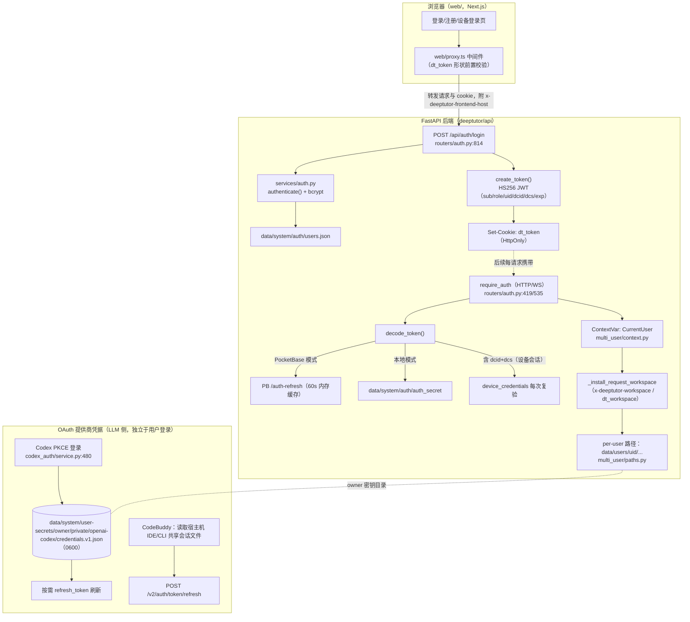

# 认证与会话导读（登录 → token → 多用户切换）

- 基线：`origin/main` @ `f07029cfc`（release: v1.6.13），工作分支 `guide/authn-20261004`
- 性质：纯导读文档，未改任何代码；所有引用为仓库相对路径 `path:line`（以该 commit 为准）
- 边界：只描述结构与文件名，不含任何密钥内容；隔离风险只列位置，不含利用方式
- 上游相关 PR 检查：无同题 PR；相近但有别的是 #1572（角色白名单）与 #1565（partner 会话漫游，属会话交接链路，本导读在"会话交接"节覆盖其机制）

## 1. 链路图



两条正交的链路：**用户会话链**（浏览器 ↔ DeepTutor，dt_token）与 **LLM 提供商凭据链**（DeepTutor ↔ Codex/CodeBuddy 等云端，OAuth access/refresh token）。多用户切换隔离的是前者与数据工作区；后者按"账号属主（owner）"分目录存放。

## 2. 配置与总开关

| 位置 | 说明 |
| --- | --- |
| `deeptutor/services/auth.py:40-53` | 导入时读一次设置：`enabled`/`username`/`password_hash`/`token_expire_hours`；`pocketbase_url` 非空且 auth 开启时进入 PocketBase 模式（`POCKETBASE_ENABLED`） |
| `deeptutor/services/config/runtime_settings.py:81-89` | 默认值：`enabled=False`、`username="admin"`、`password_hash=""`、`token_expire_hours=24`、`cookie_secure=False`、`private_login_hosts=[]` |
| `deeptutor/services/config/runtime_settings.py:504-507,524-532` | `load_auth()` 读写 `data/user/settings/auth.json`（`loader.py:23-26` 定 settings 目录；`runtime_settings.py:1360-1366` 按账号解析） |
| `deeptutor/runtime/home.py:28-49` | 运行根 = 显式参数 > 环境变量 `DEEPTUTOR_HOME` > 当前工作目录；数据根 `<runtime-home>/data` |
| `deeptutor/api/main.py:93-96` | auth 关闭时 CORS 为 permissive 正则；开启后要求显式 `CORS_ORIGIN(S)` |
| `deeptutor/api/routers/auth.py:106-126,162-176` | `private_login_hosts`：登录/注册仅允许来自私有前端 Host（经由可信代理转发的 `x-deeptutor-frontend-host` 断言） |

## 3. 本地登录与注册

| 环节 | 位置 | 说明 |
| --- | --- | --- |
| 登录 | `deeptutor/api/routers/auth.py:814-861` | 标准模式：`authenticate()`（`services/auth.py:415-443`）bcrypt 校验（`services/auth.py:85-99`）；PocketBase 模式走 `authenticate_pb`（`services/auth.py:353-383`） |
| 登录成功 | `deeptutor/api/routers/auth.py:851-852` | 签发 JWT 并 `Set-Cookie: dt_token`；cookie 属性 `HttpOnly`、`SameSite=Lax`（`cookie_secure=False` 时）或 `SameSite=None; Secure`（`routers/auth.py:36-37,129-144`），max-age = `token_expire_hours*3600`（`routers/auth.py:100`） |
| 注册 | `deeptutor/api/routers/auth.py:1123-1197` | 仅引导期开放：用户库为空时首个注册者自动成为 admin（`multi_user/identity.py:242-243`）；之后由 admin 经 `POST /api/auth/users` 建号（`routers/auth.py:1665-1676`，CSV 批量导入 `1679-1797`） |
| 引导管理员 | `deeptutor/multi_user/identity.py:137-160,215-218` | `auth.json` 里的 `username+password_hash` 作为内存态引导管理员合并进用户表，不落盘到 `users.json` |
| 登出 | `deeptutor/api/routers/auth.py:1112-1120` | 仅删除 cookie；标准模式无服务端吊销（PocketBase 模式 token 由 PB 侧校验，见 §4） |
| 设备登录 | `deeptutor/api/routers/auth.py:877-905` + `services/auth.py:446-463` | 学习者设备凭据换正式 cookie；仅 learner 预置账号可用（`multi_user/device_credentials.py:154-163`） |
| 状态查询 | `deeptutor/api/routers/auth.py:759-811` | `GET /api/auth/status` 返回 enabled/authenticated/角色/预置/学习策略 |

Web 前端只依赖 cookie：cookie 名常量在 `web/lib/proxy-policy.ts:11`；状态与登录封装在 `web/lib/auth.ts:49-110,177-187`；API 客户端 `credentials:"include"` + 401 全局重定向在 `web/shared/api/client.ts:36-46`；前端不存在 localStorage/sessionStorage 存 token、也无 `document.cookie` 读写（扫描结论，见 §7 验收）。Next 中间件对 dt_token 做非验证性的形状/过期前置检查（`web/proxy.ts:86-89`，`web/lib/proxy-policy.ts:70-90`），真正校验在后端每个 API 上。

## 4. Token 生命周期

| 阶段 | 位置 | 说明 |
| --- | --- | --- |
| 签发 | `deeptutor/services/auth.py:260-283` | HS256 JWT，claims：`sub/role/uid/dcid/dcs/exp/iat`；`exp = now + token_expire_hours`（默认 24h） |
| 签名密钥 | `deeptutor/multi_user/identity.py:496-513` | `data/system/auth/auth_secret`，不存在则生成 `secrets.token_hex(32)`；经 `write_secret_text` 以 0600 落盘（`deeptutor/utils/secret_files.py:29-49`，O_EXCL 创建） |
| 携带 | `deeptutor/api/routers/auth.py:371-390,419-469` | HTTP：`Authorization: Bearer` 或 `dt_token` cookie 二选一；每个受保护路由经 `require_auth` 依赖注入 |
| 校验（本地模式） | `deeptutor/services/auth.py:311-345` | 内存 `jwt.decode`；无刷新端点——过期即重新登录；含 `dcid` 时逐请求复验设备会话 nonce（`services/auth.py:328-336`） |
| 校验（PocketBase 模式） | `deeptutor/services/auth.py:299-309` + `deeptutor/services/pocketbase_client.py:111-161` | cookie 里存的是 PB 原始 token；校验 = 调 PB `/api/collections/users/auth-refresh`，60s 内存缓存（`pocketbase_client.py:38-39`）——吊销最迟 60s 生效 |
| WebSocket | `deeptutor/api/routers/auth.py:535-570` | `?token=` 查询参数或同名 cookie；accept 前完成鉴权 |
| 上下文安装 | `deeptutor/api/routers/auth.py:398-416` | `_install_current_user` 把 payload 转成 `CurrentUser` 写入 ContextVar（`multi_user/context.py:11-27,30-43`）；WS 在 finally 中 reset |
| 设备会话 | `deeptutor/multi_user/device_credentials.py` | 存储 `data/system/auth/device_credentials.json`（:19）；pairing code SHA-256、PIN bcrypt（:233-240）；登录轮换 session nonce（:312-313）；heartbeat 5 分钟租约 + 日用量限额（:20,173-188,344-388）；PIN 错 5 次锁 15 分钟（:21-22,297-305）；吊销即时失效（:391-426） |
| 会话交接（私→公网设备） | `deeptutor/multi_user/session_handoff.py` | 一次性 pairing code（300s）→ 一次性 JWE（A256GCM）ticket（120s）→ 正式 cookie；密钥由 auth_secret 派生（:150-168）；SQLite 只存 code/ticket 的 SHA-256 指纹，库文件 0600/目录 0700（:182-227）；端点 `deeptutor/api/routers/auth.py:908-1077`（ticket 与公网 Host 绑定 :1040） |

生命周期小结：dt_token 是**短生命周期、无刷新**的自包含凭据（默认 24h，到期重登）；设备会话是**带心跳租约的可吊销**凭据；PB 模式把吊销语义交给 PocketBase；交接票据是**一次性、Host 绑定**的短时凭据。

## 5. 多用户切换与会话隔离

### 5.1 数据隔离布局

| 位置 | 说明 |
| --- | --- |
| `deeptutor/multi_user/paths.py:35-40` | 一棵树：`data/user`（管理员工作区）、`data/users/<uid>`（普通用户）、`data/partners/<id>`（合成用户）、`data/system`（账号/授权/审计/密钥，沙箱永不挂载） |
| `deeptutor/multi_user/paths.py:102-125` | `scope_for_user` + `ensure_scope_workspace` 建立每用户目录树 |
| `deeptutor/multi_user/context.py:11-43` | 每请求 ContextVar 携带 `CurrentUser`（id/角色/scope） |
| `deeptutor/services/workspace/context.py:21-45,65-87,104-159` | workspace scope 安装；`account_workspace_context` 在账号切换时丢弃继承的 scope；`scoped_path_service` 把数据根定到 `<content_root>/.deeptutor/data`（拒符号链接） |
| `deeptutor/api/routers/auth.py:472-525` | 请求级装订：`x-deeptutor-workspace` 头或 `dt_workspace` 查询参数（冲突返回 400）；管理路径（/api/settings、/api/auth、/api/multi-user）强制无 workspace scope；archived scope 拒写 |
| `deeptutor/services/session/sqlite_store.py:251-259` + `deeptutor/services/path_service.py:85-90,134-135` | 会话库按账号定位：`<账号工作区>/user/chat_history.db`，目录/文件 `ensure_private_*`；记录含 `owner_id` 列（`sqlite_store.py:330`），进程内 store 实例按 `backend:resource:owner_id` 缓存隔离（`deeptutor/services/session/scope.py:10-56`） |
| `deeptutor/multi_user/audit.py:18-108` | 审计追加写 `data/system/audit/usage.jsonl`（用户访问管理员资源、管理员操作、监护动作） |
| `deeptutor/multi_user/identity.py:367-386` + `multi_user/guardians.py` | 删除用户时撤销监护关系；`multi_user/grants.py` 存管理员授予的learner 资源授权 |
| 前端 | 切换账号 = 登出→登录（`web/components/auth/LogoutButton.tsx:21-24`），无原地切换器；workspace 用 `dt_workspace` 查询参数（`web/lib/workspace-scope.ts:2-54`） |

### 5.2 隔离机制要点

1. 令牌→用户→scope 全链每请求重建：`require_auth` → `_install_current_user` → `_install_request_workspace`（`deeptutor/api/routers/auth.py:419-525`），任何环节缺失都会回落（见风险 R2）。
2. 密钥与工作区分层：owner 专属密钥放 `data/system/user-secrets/<owner_id>/`（0700，`deeptutor/multi_user/paths.py:217-235`），该分支不挂载进沙箱；partner（合成用户）的 owner-keyed 资产解析到其人类属主（`paths.py:170-197,238-251`）。
3. OAuth 凭据按 owner 独立：`deeptutor/services/codex_auth/service.py:1173-1212` 每个账号各自登录/各自的 ChatGPT 订阅，store 目录 = 属主密钥目录下的 `private/openai-codex/`；发布模型 profile 也按 owner 隔离（`service.py:1266-1279`）。

## 6. OAuth 凭据（LLM 提供商侧）

### 6.1 OpenAI Codex

| 环节 | 位置 | 说明 |
| --- | --- | --- |
| 登录 | `deeptutor/services/codex_auth/service.py:480-526` | PKCE（`oauth.py:62-66`）+ 随机 state；浏览器回环回调监听 `oauth.py:87-260` |
| 回调（远端部署） | `deeptutor/api/routers/auth.py:730-756` + `service.py:1302-1334` | `/api/auth/openai-codex/callback` 无会话可达，用 state 常量时间比对路由到对应 owner 的登录实例 |
| 存储 | `deeptutor/services/codex_auth/storage.py:106-136` | `data/system/user-secrets/<owner_id>/private/openai-codex/` 下 `credentials.v1.json`/`state.v1.json`/`models-cache.v1.json`/`auth.lock`；文件 0600、目录 0700（:100,135-136）；拒绝符号链接/reparse point（:39-51,117-127）；`generation` 计数保证并发一致（:183-245） |
| 刷新 | `service.py:795-830` + `oauth.py:300-309` | refresh_lock 串行；`grant_type=refresh_token`；provider 拒绝（invalid_grant/invalid_token）→ 终态，需重新登录 |
| 登出 | `service.py:856-877` + `oauth.py:311-329` | 先远端 revoke，再本地清文件并递增 generation |
| 旧位置迁移 | `service.py:1215-1263` | 从沙箱可见的用户工作区整体 rename 到密钥目录（绝不复制）；目标已存在时旧副本保留并告警，由人工删除 |
| CLI | `deeptutor_cli/provider_cmd.py:16-22` | `deeptutor login`（openai-codex / github-copilot 校验 / codebuddy 校验） |

### 6.2 CodeBuddy

| 环节 | 位置 | 说明 |
| --- | --- | --- |
| 凭据来源 | `deeptutor/services/codebuddy_credentials.py:26-27,80-112` | 读取宿主机 CodeBuddy IDE/CLI 共享会话文件 `Tencent-Cloud.coding-copilot.info`（macOS 在 `~/Library/Application Support/CodeBuddyExtension/Data/Public/auth/`；env 可覆盖路径）；结构含 `auth.accessToken/refreshToken/expiresAt/refreshExpiresAt`（仅字段名） |
| 刷新 | `deeptutor/services/codebuddy_credentials.py:271-314` | POST `<endpoint>/v2/auth/token/refresh`；endpoint 限定可信域名白名单（:225-248） |
| 登录/登出协调 | `deeptutor/services/codebuddy_auth.py:39-123` | SDK 浏览器登录流；logout 只解绑 DeepTutor 客户端缓存，不结束外部会话（会话属 IDE/CLI 所有） |

### 6.3 其他凭据存放

| 位置 | 说明 |
| --- | --- |
| `deeptutor/services/config/model_catalog.py:30,182-187,296-316` | 提供商 API key 存 `data/user/settings/model_catalog.json`（明文 JSON）；API 返回经 `***` 掩码（:32-75），写回 `***` 表示保留旧值（:99-132） |
| `deeptutor/services/config/runtime_settings.py:707-747,887-899` | auth/集成设置支持环境变量覆盖与导出 |
| `deeptutor/services/keypool.py:9-60` | 多 key 轮换为纯内存（429 冷却），不落盘 |
| `deeptutor/services/settings/provider_probe.py` / `provider_edit.py` / `registry_edit.py` | 凭据编辑合并层：凭据永不作为普通模型字段回显 |

## 7. 隔离风险清单（只列位置，不含利用方式）

| # | 位置 | 风险点（中性描述） |
| --- | --- | --- |
| R1 | `deeptutor/services/auth.py:422-423`；`deeptutor/api/main.py:93-96` | `auth.enabled=false` 时所有请求按本地管理员处理、CORS 进入 permissive 模式；暴露面完全取决于部署绑定方式 |
| R2 | `deeptutor/multi_user/context.py:22-23`；`deeptutor/api/routers/auth.py:411-414` | ContextVar 未安装时回落本地管理员作用域；任何绕过 `_install_current_user` 的新入口都会静默落在管理员工作区（历史缺陷 #481 的根因模式） |
| R3 | `deeptutor/api/routers/auth.py:558` | WebSocket 接受 `?token=` 查询参数鉴权；令牌可能进入代理/访问日志（cookie 为首选通道） |
| R4 | `deeptutor/services/config/runtime_settings.py:81-89`；`deeptutor/api/routers/auth.py:36-37,129-144` | `cookie_secure` 默认 False：HTTP 部署下会话 cookie 明文传输且 SameSite=Lax |
| R5 | `deeptutor/multi_user/identity.py:39,496-513`；`deeptutor/multi_user/session_handoff.py:150-154` | JWT 签名密钥与会话交接 JWE 密钥同源于 `data/system/auth/auth_secret`；该文件读写权限为 0600，但两类凭据共用一份材料，轮换会同时使全部会话与在途交接失效 |
| R6 | `deeptutor/services/file_io.py`（`atomic_write_json` 默认权限）；`deeptutor/services/config/model_catalog.py:296-316` | `data/user/settings/` 下 `auth.json`（bcrypt 哈希）、`integrations.json`（PB 管理凭据）、`model_catalog.json`（提供商 API key）为明文 JSON 且未强制 0600（对比 codex 存储/密钥目录的 0600/0700） |
| R7 | `deeptutor/multi_user/paths.py:186-189`；`multi_user/context.py:23` | 无请求作用域（CLI/后台任务）一律按 `LOCAL_ADMIN_ID` 解析：owner 密钥目录与工作区都落到部署属主 |
| R8 | `deeptutor/multi_user/paths.py:190-193`；`deeptutor/services/codex_auth/service.py:1176-1181` | partner（合成用户）的 owner-keyed 资产解析到部署属主：属主的 OAuth 登录可供 partner 会话使用（#711 的既定语义，共享订阅方需知晓） |
| R9 | `deeptutor/services/codex_auth/service.py:1243-1250` | Codex 凭据迁移时若目标位置已存在，沙箱可见的旧副本原样保留，依赖日志告警与人工删除 |
| R10 | `deeptutor/multi_user/identity.py:30-35` | `users.json` 首个记录按存储顺序视为 admin；单进程写锁覆盖不了多 worker 部署的并发注册（代码注释建议外部用户存储） |
| R11 | `deeptutor/services/codebuddy_credentials.py:80-112` | CodeBuddy 凭据复用宿主机外部应用共享文件：其轮换/吊销不受 DeepTutor 控制，endpoint 由信任域白名单约束（:225-248） |

## 8. 验收对照

1. 每项附 path:line：✅（全文引用基于 commit `f07029cfc`）
2. 不出现任何真实凭据或可复用令牌：✅（只出现文件名/字段名/端点名；未读取任何运行时 `data/` 目录内容）
3. 不改任何代码：✅（本分支仅新增 `evidence/authn-guide-20261004/` 下文档与校验和）

## 9. 复现与校验命令

```bash
git -C /Users/Shared/DeepTutor fetch --multiple origin myfork
git -C /Users/Shared/DeepTutor worktree add -b guide/authn-20261004 \
  /Users/Shared/DeepTutor-worktrees/agen574-authn-guide origin/main
cd /Users/Shared/DeepTutor-worktrees/agen574-authn-guide && shasum -a 256 -c \
  evidence/authn-guide-20261004/SHA256SUMS
```
