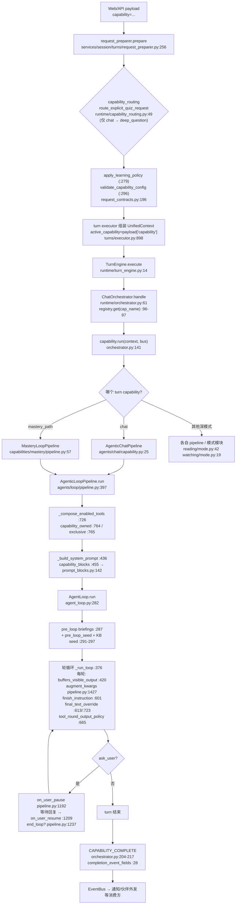

# capabilities 框架导读：registry / protocol / binding / capability / mode / loop 全链路

基线：`origin/main` @ `f07029cfc`（v1.6.13，2026-10-05 fetch 后新 worktree）。全程只读，未修改任何产品代码；所有行号以该 commit 为准。

去重声明：本导读只讲**框架公共层**（注册、协议、装配生命周期、prompts 组织、turns/partners 衔接）。mastery 与 ima 两条单能力线的内部实现已有独立导读（guide-mastery、guide-ima-pipeline），本文在引用其文件时只到"框架接触面"为止，不重复其内部逻辑。

---

## 1. 两层能力模型：先分清 turn capability 与 loop capability

DeepTutor 的 "capability" 有两个执行层级，共用一个 `CapabilityCatalog`（`deeptutor/runtime/capability_catalog.py:33`），但协议与装配方式完全不同：

| | **turn capability（Level 2 深模式）** | **loop capability（chat 循环扩展）** |
|---|---|---|
| 协议基类 | `TurnCapability` ABC（`deeptutor/core/capability_protocol.py:42`），必须提供 `manifest` + `run(context, stream)` | `LoopExtension` Protocol（`deeptutor/capabilities/protocol.py:38`），结构面：`name` / `owned_tools` / `is_active` / `system_block` / `augment_kwargs` / `pre_loop_seed`（`protocol.py:100-127`） |
| 语义 | 整个 turn 由它执行（如 `deep_solve`、`deep_research`、`mastery_path`） | 挂在 chat agent loop 上的可选扩展：活跃时追加自有工具 + 系统提示块（如 `setup`、`subagent`、`partner_authoring`） |
| 注册表 | `BUILTIN_CAPABILITY_SPECS`（`deeptutor/runtime/bootstrap/builtin_capabilities.py:51`）→ `CapabilityRegistry`（`deeptutor/runtime/registry/capability_registry.py:57`） | `BUILTIN_LOOP_CAPABILITY_SPECS`（`deeptutor/capabilities/registry.py:49`）→ 同一 catalog 的 `kind="loop_extension"` 槽位 |
| 分发者 | `ChatOrchestrator.handle`（`deeptutor/runtime/orchestrator.py:61`） | `AgenticLoopPipeline` 每轮读取 `active_loop_capabilities`（`deeptutor/agents/loop/pipeline.py:798`） |
| API 暴露 | `/api/capabilities/registered`（`deeptutor/api/routers/capabilities.py:22`） | 设置页工具分组：`capability_tool_owners`（`deeptutor/api/routers/tools.py:219-231`） |

关键点：**一个 turn capability 的 `run()` 内部通常就是跑一个 loop pipeline**，而 loop pipeline 又会装配 loop capabilities。例如 `mastery_path` turn capability 的 `run()`（`deeptutor/capabilities/mastery/capability.py:69`）执行 `MasteryLoopPipeline`；用户在纯 chat 里时，`AskQuestionsLoopCapability` / `SetupCapability` 等 loop capability 由 chat pipeline 自己挂载。两层不是二选一，是叠加。

### 1.1 模块地图

```
deeptutor/
├── core/
│   ├── capability_protocol.py        # TurnCapability ABC + CapabilityManifest（turn 层协议）
│   ├── context.py                    # UnifiedContext：active_capability / interaction.end_loop / capability_output
│   └── entry_points.py               # load_entry_point_group（插件发现底座, :27）
├── capabilities/                     # 【本导读主角】
│   ├── __init__.py                   # 懒转发 registry 导出（:17-31）
│   ├── protocol.py                   # LoopExtension / KnowledgeCapability / PromptBlock / 遗留完成键
│   ├── registry.py                   # loop capability 注册与发现
│   ├── prompts/{en,zh}/              # 共享提示包（audio_overview.yaml）
│   └── <name>/                       # 每个能力一个子包，典型结构：
│       ├── capability.py             #   TurnCapability（深模式入口）或 LoopExtension 实现
│       ├── loop.py                   #   LoopExtension 钩子实现（mastery/solve/ask_questions）
│       ├── mode.py                   #   会话模式状态机（mastery outline/study/review；reading/watching 放 TurnCapability）
│       ├── binding.py                #   激活/换绑决策（setup 激活信号；mastery 路径换绑）
│       ├── tools.py                  #   自有工具（TOOL_NAMES + Tool 类）
│       ├── pipeline.py               #   自有 loop pipeline（复用 AgenticLoopPipeline 换提示包）
│       └── prompts/{en,zh}/          #   能力私有提示包
├── runtime/
│   ├── capability_catalog.py         # 两层共用的工厂目录（register/get/create）
│   ├── capability_routing.py         # turn 创建前的规则路由（quiz 意图 → deep_question）
│   ├── registry/capability_registry.py # turn capability 注册外观 + 插件发现
│   ├── bootstrap/builtin_capabilities.py # 内置 turn capability 描述符（免 import）
│   ├── orchestrator.py               # ChatOrchestrator：分发 turn capability + CAPABILITY_COMPLETE
│   ├── turn_engine.py                # TurnEngine：所有适配器共用的执行入口
│   └── request_contracts.py          # 每能力 config schema（CAPABILITY_CONFIG_MODELS, :154）
├── agents/
│   ├── chat/capability.py            # ChatCapability（默认深模式）→ AgenticChatPipeline
│   └── loop/
│       ├── pipeline.py               # AgenticLoopPipeline：loop capability 的装配宿主
│       ├── agent_loop.py             # AgentLoop：轮循环，钩子时序在这里
│       └── prompt_blocks.py          # LoopPromptAssembler：capability_blocks 折入系统提示
├── services/
│   ├── prompt/manager.py             # PromptManager：提示包加载（MODULES/NON_AGENT_MODULES）
│   ├── prompt/lookup.py              # prompt_text：嵌套 YAML 取串
│   ├── session/turns/                # Web turn 运行时（request_preparer / executor / lifecycle）
│   └── partners/                     # Partner 运行时（runtime.py PartnerRunner / manager.py 外发）
└── tools/builtin_specs.py            # 全部内置工具（含能力自有工具）的免 import 目录
```

---

## 2. 注册层：registry.py 与 catalog

### 2.1 loop capability 注册（`deeptutor/capabilities/registry.py`）

- 描述符：`LoopCapabilitySpec(name, class_path)`（`registry.py:27-46`）——免 import 的 `"module:Class"` 字符串，`create()` 时才 import，并校验实例 `name` 与描述符一致（漂移即 RuntimeError，`registry.py:38-42`）。
- 内置清单：`BUILTIN_LOOP_CAPABILITY_SPECS`（`registry.py:49-95`），15 个：`ask_questions`、`mastery`、`solve`、`obsidian`、`marginnote4`、`subagent`、`ima`、`immersive_reading`、`course_study`、`immersive_watching`、`explore_context`、`setup`、`partner_authoring`、`partner_group`、`visualization_generation`。
- 每轮实例化：`all_loop_capabilities()`（`registry.py:196-207`）把内置 + 外部插件的工厂逐一 `_register_loop_entry`（`registry.py:184-193`，写进 catalog 的 `kind="loop_extension"` 槽位）后，从 catalog 逐个 `create()` 出**全新实例**——实例不跨 turn 复用，状态只能放 `context.extension(name)`。
- 插件发现：`discover_external_loop_capabilities()`（`registry.py:152-181`，`@cache`）经 `load_entry_point_group`（`deeptutor/core/entry_points.py:27`）读取 entry-point 组 `deeptutor.extensions`（现行，`registry.py:21`）与 `deeptutor.loop_capabilities`（遗留，`registry.py:22`，会发 DeprecationWarning）；`_coerce_loop_factory`（`registry.py:123-149`）接受类/工厂/实例三种形态，校验 `name`/`owned_tools`/`is_active`；重名一律让位给内置（`registry.py:164-169`）。
- 便捷查询：`active_loop_capabilities(context)`（`registry.py:210`，逐个过 `is_active`）、`any_exclusive_capability_active`（`registry.py:214`）、`capability_tool_owners`（`registry.py:221`）。

### 2.2 turn capability 注册（runtime 侧）

- `BUILTIN_CAPABILITY_CLASSES` + `BUILTIN_CAPABILITY_SPECS`（`deeptutor/runtime/bootstrap/builtin_capabilities.py:35-48, 51-257`）：每个条目 = class_path + `CapabilityManifest`（name/description/stages/tools_used/cli_aliases/config_defaults）。
- `CapabilityRegistry`（`deeptutor/runtime/registry/capability_registry.py:57`）：`load_builtins`（:84）按描述符懒注册进 catalog 的 `kind="turn"` 槽位；`load_plugins`（:102）同样走 `deeptutor.extensions` 组；`get(name)` 每次 `catalog.create("turn", name)` 新建实例（:140-142）。单例入口 `get_capability_registry()`（:170-176）在首次调用时完成 builtin+plugin 装载。
- 每能力请求配置模型：`CAPABILITY_CONFIG_MODELS`（`deeptutor/runtime/request_contracts.py:154`），由 `validate_capability_config`（:196）在 turn 创建前校验、`get_capability_request_schema`（:208）生成 API schema。

两层最终都落在同一个 `CapabilityCatalog`（`capability_catalog.py:39` register / :68 create / :72 entries），`(kind, name)` 二元组做键——这就是"registry.py/protocol.py 注册与协议"的全部骨架。

---

## 3. 协议层：LoopExtension 必选面与可选钩子

`protocol.py` 定义两类角色：

- **plain LoopExtension**：复用 chat 全量工具面，活跃时在自己的 `owned_tools` 之上做**增量**（协议 docstring `protocol.py:44-51` 明确"augment, don't suppress"不变量）。
- **KnowledgeCapability**（`protocol.py:130-156`）：子类化即 `exclusive_tools = True`（`protocol.py:145`）——活跃时**替换**工具面（只剩 `owned_tools` + `ask_user` 底座），并用 `owned_kbs`（:147）把自己消费的 KB 从 `rag` 面排除。`obsidian` / `marginnote4` 是这条线的例子。

必选结构面（`protocol.py:100-127`）：`name`、`owned_tools`、`is_active(context)`、`system_block(context, *, language, prompts)`、`augment_kwargs(tool_name, kwargs, context)`、`pre_loop_seed(context)`。

可选钩子（全部以 `getattr` 缺省读取，缺失即无此行为）及其**唯一调用点**：

| 钩子 | 声明处 | 调用点 |
|---|---|---|
| `pre_loop(context, stream, *, usage)` → PromptBlock | `protocol.py:53-73` | `pipeline._capability_pre_loop_briefings`（`pipeline.py:981-1010`）← `AgentLoop.run`（`agent_loop.py:287`），在首轮 LLM 调用前一次性执行，产物折进 user-message seed |
| `rebinding_tools: tuple[str, ...]` | `protocol.py:81-85` | `pipeline._capability_rebinding_tools`（`pipeline.py:818-828`）→ 工具分发参数（`pipeline.py:1140`），换绑类工具先于本轮其他调用执行 |
| `on_user_pause / on_user_resume` | `protocol.py:75-79` | `_notify_pause_hooks`（`pipeline.py:1155-1182`）← ask_user 等待两侧（`pipeline.py:1192, 1209-1217`） |
| `finish_instruction(context, final_text)` | `protocol.py:87-91` | `pipeline._capability_finish_instruction`（`pipeline.py:874-897`）← `agent_loop.py:601, 821`：无工具轮要收尾时给一次"再干一轮"的协议指令 |
| `tool_round_output_policy` → "publish"/"discard" | `protocol.py:93-97` | `pipeline._capability_tool_round_output_policy`（`pipeline.py:899-921`）← `agent_loop.py:665`；discard 时 `_discard_deferred_output`（`agent_loop.py:605-618, 670-671, 974`）撤回已流出的轮文本 |
| `final_text_override(context, final_text)` | `protocol.py:93-97` | `pipeline._capability_final_text_override`（`pipeline.py:923-944`）← `agent_loop.py:613, 723`：能力自持最终可见答案（如 mastery 的"提问即收尾"） |
| `skip_kb_seed(context)` | — | `pipeline._capability_skips_kb_seed`（`pipeline.py:851-872`）← KB seed 装载前（`pipeline.py:1484`） |
| `buffers_visible_output: bool` | — | `pipeline._capability_buffers_visible_output`（`pipeline.py:953-979`）← `agent_loop.py:420`：整轮缓冲后再决定发布（可视化类载荷用） |

完成通道：`InteractionState.end_loop`（`deeptutor/core/context.py:69-72`）与遗留键 `END_LOOP`（`protocol.py:19`）在 ask_user 解决后短路后续 LLM 轮（`pipeline.py:1237`）；`capability_output.agent_output / event_metadata`（`context.py:77`，新）与遗留键 `AGENT_OUTPUT` / `EVENT_METADATA`（`protocol.py:23-27`）由 `completion_event_fields`（`orchestrator.py:28-48`）统一读出，构成 turn 结束时 `CAPABILITY_COMPLETE` 事件的载荷（`orchestrator.py:204-217`）。

---

## 4. 装配生命周期：一次 turn 的完整数据流



五个装配阶段对应任务标题的链路：

1. **binding（入口侧）**：`request_preparer.py:256-322` 把 payload 里的 capability 解析为最终执行能力——先 `route_explicit_quiz_request` 做规则改道（仅当用户没选能力且不在 workspace 中，`capability_routing.py:69-73`），再过学习策略与 config 校验，最终 `executor.py:898` 写进 `UnifiedContext.active_capability`。
2. **capability（分发侧）**：`ChatOrchestrator` 按 `active_capability or "chat"`（`orchestrator.py:96`）从 catalog 取 turn capability 并执行；未知能力名直接报错流（`orchestrator.py:99-117`）。
3. **loop（装配侧）**：turn capability 内部的 `AgenticLoopPipeline` 每次都重新调用 `active_loop_capabilities(context)`（`pipeline.py:798-799`），把 15 个内置 + 插件 loop capability 逐一 `is_active` 过滤，然后五处消费（工具面、系统提示、seed、kwargs 注入、finish/pause 钩子）。
4. **mode（会话内态）**：活跃的能力可以再持有"会话模式"，见 §6。
5. **完成事件**：`CAPABILITY_COMPLETE` 是框架对外的唯一完成信号，turn 侧与 partner 外发侧（`services/partners/manager.py:862-879`）都发同一事件类型。

工具面细节：`_compose_enabled_tools`（`pipeline.py:726`）把 `capability_owned`（活跃能力自有工具，`pipeline.py:811-816`）与 `exclusive`（知识型能力替换整个面，`pipeline.py:802-809`）交给 `compose_enabled_tools`；能力自有工具的**实现注册**在 `tools/builtin_specs.py`（如 mastery 全套 :99-112、solve :118+），实现类住在 `capabilities/<name>/tools.py`，`deeptutor/tools/solve_tool.py:1-16` 这类兼容壳只为旧 import 路径保留。

---

## 5. binding：两个含义，一个原则

框架里 "binding" 出现在两处，方向相反：

1. **激活绑定**（外部信号 → 能力是否参与本轮）：典型是 `capabilities/setup/binding.py`——`setup_gaps`（:65-138）从与工具同一份 spec 读出安装缺口；`message_signals_setup`（:178-184）要求"动作词 + 配置对象"同时命中才认意图；`setup_activation`（:211-239）按 explicit（用户点名 `context.active_capability`）→ intent → intro（仅一次的首跑offer）顺序给出激活原因；`is_setup_turn`（:242-244）是 `SetupCapability.is_active` 的唯一后端（`setup/capability.py:45-46`）。设计原则写在模块 docstring：**隐式挂载的能力绝不能靠模型"觉得相关"激活**。
2. **换绑**（能力内工具 → 改变本轮作用对象）：`capabilities/mastery/binding.py:42` `rebind_active_path` 把 live turn、session 偏好、路径租约三处状态一次改齐（顺序：先释放后获取再持久化）；它由 `rebinding_tools` 声明（`mastery/loop.py` 的 `_PATH_BINDING_TOOLS`，`mastery/loop.py:38-40`）并经 `pipeline.py:1140` 注入分发器，保证同一轮里"切换 + 写入"不会落到不同目标。

---

## 6. mode：三个同名概念辨析

1. **能力会话模式**：`capabilities/mastery/mode.py` 是范式——`MODES`（outline/study/review，:52）、`TOOL_MODES`（:71-80，哪些工具属于哪些模式）、`normalize_mode` vs `enforced_mode`（:83-109，展示值与执行值刻意分离：历史会话无模式不得追溯禁止）、`tool_is_allowed`（:112-118）。要点（`mode.py:20-32`）：模式可被 `mastery_mode` 工具**轮内**切换，而工具面/系统提示在轮前已装配，所以排他性放在**工具调用时**检查而非挂载时——这是 binding→capability→mode/loop 装配顺序的直接推论。
2. **workspace 模式**：`services/session/workspace_preferences.py:12-16` 的 `immersive_reading / mastery_path / immersive_watching` 三常量，是"会话长期致力于某能力"的持久偏好；`_workspace_mode`（`_turn_runtime_shared.py:450`）在 request_preparer 阶段解析（`request_preparer.py:261-265`），并参与路由豁免（workspace 内不自动改道，`capability_routing.py:72-73`）。reading/watching 的 `mode.py` 文件名里放的是 TurnCapability 入口（`reading/mode.py:42`、`watching/mode.py:19`），两者都直接复用 `AgenticChatPipeline`（`watching/mode.py:31-34`）。
3. **RunMode（CLI/server）**：`runtime/mode.py:13`——与能力体系无关，只是进程运行形态开关，导读列入仅为防混淆。

---

## 7. loop pipeline 装配：复用引擎、替换协议

`AgenticLoopPipeline`（`agents/loop/pipeline.py`）是能力无关的循环引擎。能力要"拥有整个 loop"时不写新引擎，而是子类化并换掉提示包：

- `MasteryPromptAssembler(LoopPromptAssembler)`（`capabilities/mastery/pipeline.py:26-55`）覆写 `foundation_blocks`（:45-54），把 tutor 身份、会话模式块、loop 协议、playbook 作为**地基**放在最前；基类 `foundation_blocks`（`agents/loop/prompt_blocks.py:187`）提供 chat 默认地基。
- `MasteryLoopPipeline(AgenticLoopPipeline)`（`mastery/pipeline.py:57`）只换 assembler，其余（工具面、预算、分发、钩子）原样继承。
- 与之相对，普通 loop capability（如 `MasteryLoopCapability`，`mastery/loop.py:174`）不改地基，只通过钩子追加：`finish_instruction`（:299）拦截"没出题就收尾"，`final_text_override`（:376）把 posed question 变成轮终点，`pre_loop_seed`（:409）。地基块通过 `NATIVE_LOOP_FLAG`（`mastery/loop.py:47-49`）协调，避免 playbook 出现两份。

这条"engine 不动、prompt 分层"的设计是理解任何新 loop capability 的钥匙。

---

## 8. prompts/ 目录组织

提示包有三级落位，全部 YAML、按 `{en, zh}` 分目录：

1. **agents 提示包**：`PromptManager.MODULES`（`services/prompt/manager.py:40-49`）列出的模块，包在 `deeptutor/agents/<module>/prompts/{en,zh}/`。
2. **能力私有包**：`NON_AGENT_MODULES`（`manager.py:43-51`）把 `capabilities → capabilities/`、`mastery → capabilities/mastery` 显式映射（注释言明：拥有整条 loop 的能力，提示包放在代码旁，"pack 和它描述的 tools 一起读审"）。例：`capabilities/mastery/prompts/en/mastery_loop.yaml`。
3. **capabilities 共享包**：`deeptutor/capabilities/prompts/{en,zh}/audio_overview.yaml`——不属于任何单一子包的跨能力文案。

读取约定：

- 统一经 `PromptManager.load_prompts`（`manager.py:56`，含语言回退链 zh→cn→en，`manager.py:22-26`）加载成嵌套 dict。
- 取值一律走 `prompt_text(prompts, path, default)`（`services/prompt/lookup.py:14`）——嵌套路径取串，映射/空串/缺路径统一回落 default。
- 小型能力可以不用 PromptManager：`SetupCapability` 直接 `importlib.resources` 读自身包内 `prompts/{lang}/system.md`（`setup/capability.py:102-105`）。
- **运行时注入**：`LoopExtension.system_block` 收到的 `prompts` 参数即当轮已加载包；返回的 `PromptBlock`（`protocol.py:30-35`）被 `_capability_system_blocks`（`pipeline.py:831-841`）收集，经 `LoopPromptAssembler.blocks`（`prompt_blocks.py:118`）在 :142 追加到地基块之后——这就是能力文案进入系统提示的唯一常规通道。

---

## 9. 与 turns / partners 的调用衔接

**turns（Web 会话运行时）**：`services/session/turns/` 是 Web 侧 turn 的编排层——`request_preparer.py` 做请求预备（§4 阶段1），`executor.py` 组装 `UnifiedContext`（含 `active_capability` :898），lifecycle/learning_adapter 管暂停与 mastery 租约的跨 turn 状态（`learning_adapter.py:47-70` 的等待回答/租约释放）。组装完成后统一交给 `TurnEngine`（`turn_engine.py:14`）→ orchestrator。CLI/SDK 直连同一 TurnEngine，入口差异止于 UnifiedContext 的组装方。

**partners（伙伴实例）**：伙伴轮次不挑深模式——`PartnerRunner` 组装上下文时硬编码 `active_capability="chat"`（`services/partners/runtime.py:827`），workspace 运行时同样 `capability="chat"`（:715），伙伴身份靠 `persona_context`/ Soul 与渠道 metadata 表达（:828-833）。因此 chat 循环上的 loop capabilities（setup、ask_questions、partner_authoring、partner_group…）在伙伴轮里照常激活；`_compose_enabled_tools` 还为伙伴轮做了特例（问题库挂载阈值，`pipeline.py:750-753`）。伙伴的外发消息在投递后补发一条 `CAPABILITY_COMPLETE`（`services/partners/manager.py:862-879`，metadata 带 `source: partner`），让事件消费方对 turn 与 proactive 消息一视同仁。伙伴专属能力 `partner_authoring` / `partner_group` 本身就是普通 loop capability，无独立执行通道。

---

## 10. 关键函数清单（速查）

| 函数/类 | 位置 | 作用 |
|---|---|---|
| `LoopCapabilitySpec` / `BUILTIN_LOOP_CAPABILITY_SPECS` | `capabilities/registry.py:27,49` | loop 能力免 import 注册 |
| `all_loop_capabilities` / `active_loop_capabilities` | `capabilities/registry.py:196,210` | 每轮实例化与过滤 |
| `discover_external_loop_capabilities` | `capabilities/registry.py:152` | entry-point 插件发现 |
| `LoopExtension` / `KnowledgeCapability` | `capabilities/protocol.py:38,130` | loop 协议与知识型基类 |
| `TurnCapability` / `CapabilityManifest` | `core/capability_protocol.py:42,29` | turn 层协议 |
| `CapabilityCatalog.register/create` | `runtime/capability_catalog.py:39,68` | 两层共用工厂目录 |
| `CapabilityRegistry.load_builtins/get` | `runtime/registry/capability_registry.py:84,140` | turn 能力装载/取用 |
| `BUILTIN_CAPABILITY_SPECS` | `runtime/bootstrap/builtin_capabilities.py:51` | 内置深模式描述符 |
| `route_explicit_quiz_request` | `runtime/capability_routing.py:49` | 入口规则路由 |
| `ChatOrchestrator.handle / completion_event_fields` | `runtime/orchestrator.py:61,28` | turn 分发与完成事件 |
| `AgenticLoopPipeline.run / _compose_enabled_tools / _capability_*` | `agents/loop/pipeline.py:397,726,798-1010` | loop 装配与钩子消费 |
| `AgentLoop.run / _run_loop` | `agents/loop/agent_loop.py:282,376` | 轮循环与钩子时序 |
| `LoopPromptAssembler.blocks / foundation_blocks` | `agents/loop/prompt_blocks.py:118,187` | 系统提示装配 |
| `PromptManager.load_prompts / prompt_text` | `services/prompt/manager.py:56` / `services/prompt/lookup.py:14` | 提示包加载/取值 |
| `setup_activation / is_setup_turn` | `capabilities/setup/binding.py:211,242` | 激活绑定范式 |
| `rebind_active_path` | `capabilities/mastery/binding.py:42` | 换绑范式 |
| `MasteryPathCapability.run` | `capabilities/mastery/capability.py:69` | 深模式复用 loop 引擎范式 |
| `MasteryLoopPipeline / MasteryPromptAssembler` | `capabilities/mastery/pipeline.py:57,26` | 换协议不换引擎范式 |
| `validate_capability_config / CAPABILITY_CONFIG_MODELS` | `runtime/request_contracts.py:196,154` | 每能力请求配置 |

---

## 11. 新增一个 capability 需要触达的全部位置

### A. 新增 loop capability（chat 循环扩展，推荐路径）

1. **建子包** `deeptutor/capabilities/<name>/`：至少 `capability.py`（实现 `LoopExtension` 六个必选成员；知识型则子类 `KnowledgeCapability`）；工具多时加 `tools.py`（`TOOL_NAMES` 元组 + Tool 类）；激活逻辑复杂时加 `binding.py`；文案加 `prompts/{en,zh}/`。
2. **注册描述符**：`capabilities/registry.py:49` `BUILTIN_LOOP_CAPABILITY_SPECS` 追加一条 `LoopCapabilitySpec("<name>", "deeptutor.capabilities.<name>.capability:<Class>")`——描述符 `name` 必须与类属性 `name` 一字不差（`registry.py:38-42` 会校验）。
3. **工具目录**：若有自有工具，`tools/builtin_specs.py` 对应分组追加 `(tool_name, "ToolClass")` 懒加载条目（参考 mastery :99-112）；`deeptutor/tools/<name>_tool.py` 兼容壳可选。
4. **请求配置**（可选）：能力要在 API 上收 config 时，`runtime/request_contracts.py` 的 `CAPABILITY_CONFIG_MODELS`（:154）加 Pydantic 模型。
5. **无需手动做**：设置页工具归属分组（`api/routers/tools.py:219` 自动读 `capability_tool_owners`）、turn 内激活过滤（`active_loop_capabilities` 自动发现）、插件化分发（外部包改用 entry-point 组 `deeptutor.extensions`，零内置改动）。

### B. 新增 turn capability（深模式）

1. **实现** `deeptutor/capabilities/<name>/capability.py`（或 agents 下）：`TurnCapability` 子类，提供 `manifest = CapabilityManifest(...)` 与 `async run(context, stream)`；整轮教学/研究型建议复用 `AgenticLoopPipeline`（参考 `mastery/pipeline.py:57`），一次性生成型可直接写 pipeline。
2. **注册描述符**：`runtime/bootstrap/builtin_capabilities.py` 的 `BUILTIN_CAPABILITY_CLASSES`（:35）与 `BUILTIN_CAPABILITY_SPECS`（:51）各加一条（name、stages、tools_used、cli_aliases、config_defaults）。
3. **请求配置**（可选）：同 A4。
4. **前端/API 无需注册**：`/api/capabilities/registered`（`api/routers/capabilities.py:22`）与 `get_manifests`（`capability_registry.py:147`）自动暴露；frontend 按 manifest 渲染入口。
5. **若该能力还要作为 chat 内挂载的扩展**：再按 A 注册一份 LoopCapabilitySpec（`ask_questions` / `mastery` / `solve` 都是"双层注册"的现成例子）。

### C. 新增能力私有提示包

包内建 `prompts/{en,zh}/<pack>.yaml`；要在 `PromptManager` 体系内加载时，若是 agents 外的新落位，在 `NON_AGENT_MODULES`（`services/prompt/manager.py:43`）补映射；取值用 `prompt_text`。共享跨能力文案放 `deeptutor/capabilities/prompts/{en,zh}/`。

---

## 12. 与既有导读的边界

- guide-mastery（mastery 路径/门控/间隔复习内部）与 guide-ima-pipeline（IMA 知识库管线）覆盖的是**单个能力包的内部实现**；本文只引用它们的框架接触面（`mastery/capability.py:69`、`mastery/pipeline.py:26-57`、`mastery/mode.py:52-80`），两者的引擎细节、存储与断点分析不在本文范围。
