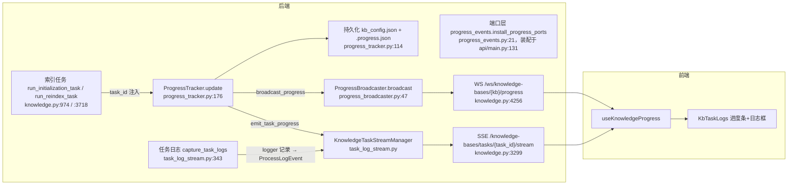

# 日志与进度观测面导读（guide-logging-2026-10-05）

- 基线：`origin/main @ f07029cfcf2c8dfccdb671cdfc343db8334f5741`（release: v1.6.13）。文内 `path:line` 均为该提交下的实测行号（相对仓库根目录）。
- 性质：只读导读，未修改任何产品代码，产物只进本证据目录。
- 目标：为后续"吞错收口"系列卡提供统一参照——logging 约定、进度上报链路速览、常见吞错模式分型、2026-10 已修批次索引、遗留热点 Top10。
- 输入对照（均已去重引用，不重复展开）：
  - `evidence/broad-except-scan-2026-10-04/report.md`（AGEN-370 宽泛 except 三型分型，基线 ef2d9e5c v1.6.12）；
  - `evidence/scan-error-msg-20261004/report.md`（AGEN-519 用户可见错误消息扫描，基线同为本卡 f07029cfc）；
  - `docs/guides/events-and-progress-chain.md`（guide-events，PR #1717 分支 `guide/events-20261004-v2`，基线 fe003ddce）——进度链路细节以它为权威，本卡只做速览与日志侧补充；
  - `evidence/ts-catch-scan-2026-10-04/report.md`（AGEN-421 web 空 catch 分型）；
  - AGEN-134/135/136 等已修卡与对应开放 PR（见 §4）。
- 本卡在 v1.6.13 重跑了 AGEN-370 的扫描脚本（`scan_broad_except.py`，只读）：1817 个文件、1504 处宽泛 `except Exception/BaseException`，其中**处理体仅 pass/continue 的静默处理器 122 处**（v1.6.12 为 121 处；净增 1 处为 `deeptutor/services/rag/pipelines/llamaindex/document_loader.py:459`，已被开放 PR #1758 覆盖）。knowledge.py / settings.py / manager.py / launcher.py 等处仅行号平移，站点一一对应（如 knowledge.py:3952→:3988、manager.py:567→:615、launcher.py:1252→:1256）。

## 1. Logging 约定（级别 / logger 命名 / 去向）

### 1.1 初始化与去向

| 去向 | 装配点 | 说明 |
| --- | --- | --- |
| 进程级一次性配置 | `deeptutor/logging/configure.py:36` `configure_logging()` | 入口三处各调一次：`deeptutor/api/main.py:22`、`deeptutor/api/run_server.py:46`、`deeptutor_cli/main.py:29`；`_CONFIGURED` 幂等，`force=True` 才重装 |
| 控制台 stdout | `configure.py:54-57` | `ConsoleFormatter`，级别取 main.yaml `logging.level`（默认 **INFO**，`deeptutor/logging/config.py:11`） |
| 文件 JSONL | `configure.py:60-80` | `data/user/logs/deeptutor.jsonl`（或 path_service 的 user_log_dir），`RotatingFileHandler` 10MB×5，`JsonlFormatter` |
| SSE 任务流 | `deeptutor/api/utils/task_log_stream.py:343` `capture_task_logs(task_id)` | 任务执行期把 INFO+ 日志转成 `ProcessLogEvent` 进任务 SSE（`/knowledge-bases/tasks/{task_id}/stream`，knowledge.py:3299） |
| 访问日志 | `deeptutor/api/main.py:460-470` | `deeptutor.access` 独立 stdout INFO handler、`propagate=False`，只打非 2xx |
| loguru 桥 | `deeptutor/logging/loguru_bridge.py:11` | loguru 记录转 stdlib，库未安装则跳过 |

root logger 级别为 DEBUG（`configure.py:52`），由 handler 级别过滤；`deeptutor` 命名空间强制 DEBUG 且 propagate（`configure.py:77-78`）。注意 `api/main.py:455` 注释写"root console 默认 WARNING"，与 `config.py:11` 的默认 INFO 不一致，以代码为准。

### 1.2 logger 命名

- **约定**：`logging.getLogger(__name__)`。非测试生产代码 308 处 getLogger 中 290 处遵循；模块路径即 logger 名（如 `deeptutor.knowledge.progress_tracker`）。
- **字面名例外（仅 6 类，勿随意新增）**：
  - `deeptutor.access`（api/main.py:460，访问日志专用通道）；
  - `deeptutor.ProgressTracker`（progress_tracker.py:259，仅终端日志失败时的 stdlib 兜底）;
  - `deeptutor.stats.*`（LLM 用量统计）；
  - 第三方桥接：`uvicorn.error`、`nio`（partners/channels/matrix.py:184，`propagate=False`）、`llama_index*`（deeptutor/logging/adapters/llamaindex.py:57，`propagate=False`）。
- **非传播库 logger 的任务期回收**：lightrag / graphrag / graphrag_llm 刻意不向 root 传播，任务执行期由 `_capture_non_propagating_task_logs`（task_log_stream.py:318-341）临时挂 handler 转发进任务流，结束即拆。

### 1.3 级别语义（现行用法统计与惯例）

当前 v1.6.13 非测试代码：`warning` 624 / `info` 316 / `debug` 265 / `error` 235 / `exception` 134（`rg -c` 计数）。收敛出的惯例：

| 级别 | 用途 | 例证 |
| --- | --- | --- |
| debug | 尽力而为清理/回调失败：断连、收尾、可选通知 | progress_tracker.py:112 回调异常；progress_broadcaster.py:58-60 发送失败剔连接 |
| warning | 状态/持久化写失败、降级、单例落错目录等"用户可感知的异常但进程可继续" | progress_tracker.py:165/:172 进度落盘失败；AGEN-370 §2.3 各组建议 |
| error/exception | 任务失败、不可恢复分支，需带 `%s` 异常摘要 | knowledge.py 任务 emit_failed 路径 |

- 吞错收口的定级原则（与 AGEN-370 三型一致）：**清理类补 debug、回退/降级类补 warning、状态写失败必须 warning 以上**；断连/客户端主动断开不算错误。
- 结构化上下文：`bind_log_context`（deeptutor/logging/context.py:29）用 contextvars 绑定 7 个字段（request_id/turn_id/session_id/task_id/capability/stage/sink），`ContextFilter` 注入记录，JSONL 与任务流按 task_id/turn_id 过滤（process_stream.py:91-93）。
- 任务日志与进度是两回事：**日志走 logger→SSE 任务流；进度走 ProgressTracker→WS 广播**，不要用日志通道传进度百分比。

## 2. 进度上报链路（速览，详见 guide-events）



- ProgressTracker 四步（`update()` progress_tracker.py:176-281）：终端日志 → `_save_progress` 落盘（:114）→ 任务事件 → `_notify` 广播/回调（:92-112）。`verify_terminal`（:283）收尾校验落盘。
- WS 初始快照决策树（终态回放 / 孤儿任务转 `knowledge_task_interrupted` / 新鲜度 120s 判停）与 SSE backlog/墓碑机制、前端双通道互备，**全部以 guide-events §3-§6 为权威**，本卡不重复展开。
- 本卡补充的日志侧事实：任务 SSE 的日志内容由 `capture_task_logs`（task_log_stream.py:343-362）供给——绑定 task_id 上下文、过滤 `root`/`asyncio`/`deeptutor.knowledge.progress_tracker` 三个 logger（进度本身不走日志流）、钩住非传播的 lightrag/graphrag（:318）。查"任务卡住没日志"先看 capture 上下文是否丢失 task_id；查"进度卡住"先看 `.progress.json` 与 `kb_config.json`（guide-events §7.5）。
- 与进度链路直接相关的吞弱点清单（现状仍存在于 main）：见 §5 Top10 第 1 条与 §4 已修批次（knowledge.py WS 五处、update_kb_status 均已由 PR #1706 覆盖）。

## 3. 常见吞错模式（分型与判定）

v1.6.13 实测：1504 处宽泛捕获中 122 处静默。AGEN-370 的三型结论继续有效（v1.6.12：应上抛 2 / 可收窄 13 / best_effort 106，占比 ~88% 为有意吞掉）；问题不在"吞"，在"吞得无痕"。后续收口卡按以下六种模式对号入座：

| 模式 | 识别特征 | 代表位置（v1.6.13 现状） | 收口动作 |
| --- | --- | --- | --- |
| P1 清理/收尾吞错 | `finally`/收尾段里 close、reset、临时目录删除 | knowledge.py:4516/:4522/:4527（WS 收尾）；#1706 已覆盖 | debug 留痕即可，勿 warning 刷屏；断连不算错误 |
| P2 解析/回退吞错 | JSON/URL/时间戳解析失败后回默认值 | settings.py:521-522、:2268-2269；graphrag/provider.py:118-119 | 收窄到具体异常类型 + warning 记录回退原因与路径 |
| P3 广播/回调吞错 | progress callback、fanout、listener 通知失败 | progress_tracker.py:103-105；document_loader.py:458-460（#1758 已覆盖） | warning + 限频；`create_task` 完成回调要捕获协程异常 |
| P4 状态写吞错 | 配置/状态/签名/mtime 写库或写文件失败被吞 | manager.py:615（#1706 覆盖）；settings.py:522 | **最高危**：必须 warning 以上并返回可判定结果，否则 UI 与真实状态背离 |
| P5 计数/枚举容错吞错 | iterdir/glob 计数、逐条目 continue | manager.py:1701/:1708/:1715；document_images.py:556-557 | debug + 累计 skipped 计数返回，让"少了多少"可见 |
| P6 用户可见层"吞语义"（非严格吞错） | `except Exception → 500 detail=str(e)`、前端裸显 `error.message` | book.py:834 等 62 处 blanket-500；web/shared/api/client.ts:59-72 | 归 AGEN-519 错误消息域：日志记 exc、用户拿 coded 通用文案，见 §6 |

前端（web/）另有独立口径：AGEN-421 三型 41 条（应上报 5 / 应降级 15 / best_effort 21），空 `catch{}` 3 处（web/next.config.js:89、web/lib/iframe-html.ts:103/:121），收口时按该报告的 Top10 行动，勿与 Python 侧混算。

## 4. 2026-10 已修批次索引（去重依据）

以下修复**均已存在于 myfork 分支并开了上游 PR（截至 2026-10-05 全部 OPEN、未合并）**；origin/main @ f07029cfc 上对应站点**仍是静默原状**。后续吞错收口卡遇到下列站点时**不要重复实现，改为复核对应 PR**（在完成评论里写审查结论）。

| 批次 / 卡 | PR（分支） | 覆盖站点（v1.6.13 行号） | 方式 |
| --- | --- | --- | --- |
| AGEN-134/135/136 knowledge 进度/状态/同步 | #1706 `pr/knowledge-surface-swallowed-failures-v2` | knowledge.py:3988（reindex 进度写）、:4389/:4438/:4516/:4522/:4527（WS 解析+收尾）；manager.py:615（update_kb_status）、:2215（update_folder_sync_state mtime） | 分级补日志：close→debug、reset→warning、进度/状态→warning；含回归测试 |
| runtime 单例与自更新 | #1704 `pr/runtime-log-swallowed-failures` | launcher.py:146/:152/:158（单例重置）、:641/:790/:946（marker/指纹/dev lock）、:1256（mark_failed，原"应上抛"）；update_worker.py:144（自更新恢复） | `logger.exception/warning` + store 落盘留痕 |
| AGEN-140/141 进度回调 | #1703、#1757、#1758 | embedding/client.py、lightrag/engine.py、llamaindex/document_loader.py:459（含新增站点） | 进度回调失败 warning + 测试 |
| 五服务吞错 | #1707 `pr/services-log-swallowed-failures` | api/routers/question.py、services/codex_auth/service.py:872/:882（token revoke）、llm/provider_core/codebuddy_provider.py、memory/snapshot/adapters.py、notebook/service.py | 补 warning/exception 留痕 |
| AGEN-162 DOCX 表格行 | #1755/#1756 v2（#1700 `pr/docx-table-row-placeholder` 为同型早版） | co_writer/docx_converter.py | 失败行保留占位 + warning |
| AGEN-158 迁移依赖 | #1761/#1762 | services/workspace/data_migration.py、dependencies.py | 跳过的损坏源 warning |
| AGEN-161 快照跳过 | #1764/#1765（#1707 亦部分覆盖） | services/memory/snapshot/adapters.py:51/:56 | 损坏快照 warning |
| AGEN-164 CodeBuddy 中断 | #1752/#1753 | services/llm/provider_core/codebuddy_provider.py | interrupt/drain 失败 warning |
| AGEN-274 工具选项 | #1766 | api/utils/tool_options.py:97 | 跳过的工具 debug |
| 其它单点 | #1751（services/file_io.py 原子写 fsync）、#1754（web 课程删除可见错误）、#1759/#1760（lightrag meta.json）、#1763（partners/channels/manager.py 外发超时） | — | 各自 warning/降级 |

合计约 30 处站点已有开放 PR 覆盖。AGEN-370 §4 的"20 处已覆盖"在此基础上又补了 2026-10-03 批次（#1751-#1766）。

## 5. 遗留吞错热点 Top10（已与 §4 去重：凡有开放 PR 覆盖的站点不列入）

现状判定统一为：**origin/main @ f07029cfc 未修，且无开放 PR 覆盖**。行号为 v1.6.13 实测。

| # | 位置 | 函数 | 模式 | 失败后果 | 建议级别 |
| --- | --- | --- | --- | --- | --- |
| 1 | `deeptutor/knowledge/progress_tracker.py:103-105` | `ProgressTracker._notify` | P3 双层吞错：外层 `(ImportError, Exception): pass`，内层 `create_task` 仅豁免 RuntimeError | 进度 WS 广播建立/执行失败全盲，前端只剩落盘快照兜底，"进度不更新"类问题不可诊断（guide-events §7.1 呼应） | 广播失败限频 warning；`create_task` 回调捕获协程异常；无事件循环的 RuntimeError 保持静默 |
| 2 | `deeptutor/api/routers/settings.py:521-522` | `load_ui_settings` | P4/P2：设置文件损坏 → 静默返回默认 | 用户自定义 UI 配置无痕丢失且无从发现 | 收窄 `(OSError, json.JSONDecodeError)` + warning 记录损坏路径 |
| 3 | `deeptutor/services/rag/pipelines/graphrag/provider.py:118-119` | `resolve_persisted_completion_provider` | P2：catalog 解析失败静默回退 deepseek 硬编码 | 可能用错 completion 模型且无日志，问题极难定位（GraphRagUnsupportedProviderError 已正确上抛） | warning 记录回退原因；可收窄到配置/目录类异常 |
| 4 | `deeptutor/knowledge/manager.py:1701/:1708/:1715`（附 :1347 `get_default`） | `KnowledgeBaseManager._get_info` | P5：raw/images/content_lists 三计数逐个 `pass` | KB 文档/图片计数静默为 0，前端展示失真，"文件还在但列表空了"无诊断线索 | debug/计数聚合 + 单条 warning 阈值 |
| 5 | `deeptutor/utils/document_images.py:556-557` | `extract_pdf_images` | P5：`extract_image` 失败 `continue` | 损坏图片静默跳过，图文不完整且无计数，用户不知少了哪些图 | 收窄 `(RuntimeError, ValueError)`，累计 skipped 计数并返回/记日志 |
| 6 | `deeptutor/services/storage/file_library.py:204-205` | `FileLibraryStore._delete_file` | P1/P5：空父目录清理宽泛 `pass`（同函数 OSError 已有 warning，:196-197 是正面例） | 掩盖循环内逻辑 bug（如路径判断写错），文件库残留空目录 | 收窄 OSError + debug；非 OSError 自然暴露 |
| 7 | `deeptutor/agents/research/utils/citation_manager.py:433` | `CitationManager._extract_web_citation` | P2 + 元组冗余：`(json.JSONDecodeError, Exception): pass` | web 引用提取失败不可见，引用列表静默缺条目 | 收窄 `(ValueError, TypeError, json.JSONDecodeError)`，删冗余 + debug |
| 8 | `deeptutor/api/routers/book.py:1514` | `_SocketFanout.close` | P1 + 元组冗余：`(asyncio.CancelledError, Exception): pass` | 书页 WS fanout 收尾失败无痕；与广播剔连接（progress_broadcaster.py:58-60）叠加时终态推送故障全盲 | 元组简化为 gather 惯用法 + debug |
| 9 | `deeptutor/partners/channels/telegram.py:573-581` | `TelegramChannel._send_with_streaming` | P3 best_effort：流式草稿发送失败 `pass`，随后有 `_send_text` 兜底 | 降级本身正确，但"为什么一直是普通消息"不可知，渠道侧流式能力故障不可见 | debug 记录一次降级原因即可 |
| 10 | `deeptutor/api/routers/settings.py:2268-2269` | `tour_status` | P2：导览缓存 JSON 损坏 → 静默回默认 | 导览状态偶发重置，低危 | 收窄 `(OSError, json.JSONDecodeError)` + debug |

排序依据：失败后果对用户可诊断性的伤害（进度链路 > 用户配置 > 模型选择 > 数据展示 > 清理可见性）。同型可批量收口的还有：`reading.py:525`（URL 解析，noqa 已注明的良性项）、`book.py:1514` 同型的 fanout 惯用法统一——适合作为一张"收窄批处理卡"而非逐点修。

## 6. 相邻问题域（引用不展开）

- **用户可见错误消息质量**（AGEN-519，基线同为本卡 f07029cfc）：blanket-500 `detail=str(e)` ×62、`format_exception_message`（deeptutor/utils/error_utils.py:46）不脱敏、web `client.ts` 裸透传 ~250 调用点、NO-CODE ~597 处。吞错收口卡若改到这些行，应同时遵循该报告的 coded 文案方案（典范：knowledge.py:2725-2729 IMA 段）。
- **web 空 catch / no-op .catch**（AGEN-421，基线 ef2d9e5c）：41 条三型；Top：`web/components/partners/PartnerConfigure.tsx:164`、`web/components/chat/home/ChatComposer.tsx:545`；`QuizFollowupContext.tsx:280` 已由 PR #1701 覆盖。
- **进度链路机制细节**（guide-events，PR #1717）：快照决策树、SSE 墓碑、前端双通道互备、EventBus 无生产订阅者等结构性事实，以该文为权威。

## 7. 复核命令

```bash
git rev-parse origin/main        # 期望 f07029cfcf2c8dfccdb671cdfc343db8334f5741
rg -n "def _notify" deeptutor/knowledge/progress_tracker.py            # :92
rg -n "except Exception:" deeptutor/api/routers/settings.py | sed -n 1,6p
rg -n "logging.getLogger\(__name__\)" deeptutor --type py -g '!tests' -c | awk -F: '{s+=$2} END {print s}'   # 290
python3 evidence/broad-except-scan-2026-10-04/scan_broad_except.py . --out /tmp/scan.json   # 脚本取自 AGEN-370 分支；v1.6.13 实测 1504 宽泛 / 122 静默
sha256sum -c evidence/guide-logging-20261005/SHA256SUMS
```

## 8. 验收对照

1. **每项附 path:line 与现状判定** — ✅ §1-§5 全部条目为 v1.6.13（f07029cfc）实测行号；Top10 逐条标注"main 未修、无 PR 覆盖"。
2. **遗留清单与已修批次去重** — ✅ §4 索引约 30 处已修站点（全部为 OPEN PR，未合并）；§5 Top10 经与 §4 逐一比对，均无 PR 覆盖；guide-events 重叠处（§2、§6）只引用不展开。
3. **不改任何代码** — ✅ 本卡仅新增 `evidence/guide-logging-20261005/`，未触碰任何源码文件。
