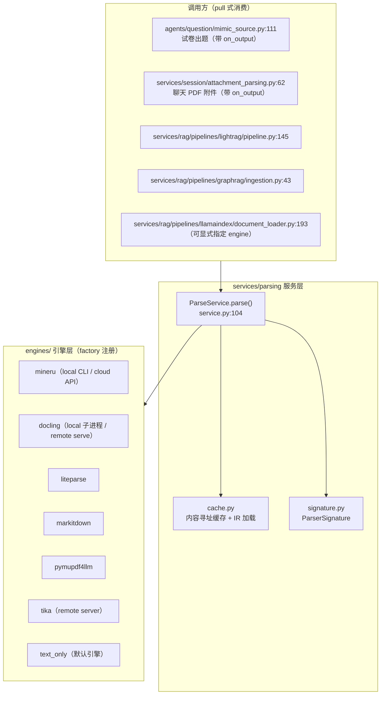
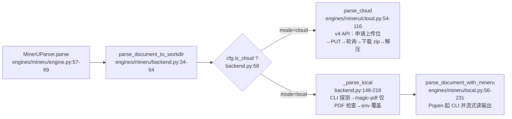
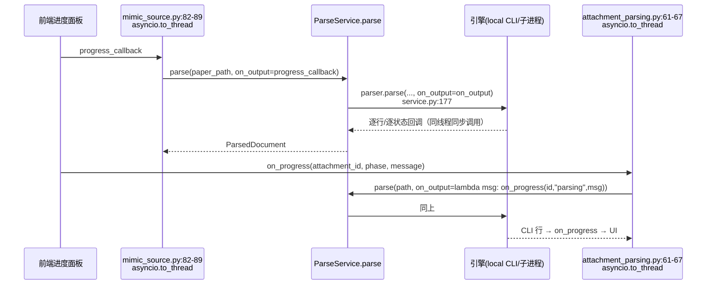

# deeptutor/services/parsing 解析引擎代码导读

- 基线：`origin/main` @ `ef2d9e5c3`（v1.6.12），只读导读，未改任何代码。
- 文中锚点均为相对仓库根的 `path:line`，行号以该 commit 为准。

## 0. 一图总览



## 1. service 入口

- 包级入口：`deeptutor/services/parsing/__init__.py:20-24` 懒导出 `get_parse_service()`，真正实现 `deeptutor/services/parsing/service.py:209-214` —— 进程级单例 `_service`，无参构造（cache 根走默认解析）。
- `ParseService`（service.py:74-203）只有一个公开方法 `parse()`（service.py:104-203）和两个辅助查询：
  - `active_engine()`（service.py:89-92）：读 `load_document_parsing_settings()`（`deeptutor/services/config/runtime_settings.py:1484`）的 `engine` 字段；缺省回退 `_DEFAULT_DOCUMENT_PARSING_ENGINE = "text_only"`（runtime_settings.py:162，常量定义于 `deeptutor/services/config/runtime_settings.py:162` 附近，取值 `DOCUMENT_PARSING_ENGINE_TEXT_ONLY`）。
  - `supports()`（service.py:94-102）：纯路由检查，不要求文件存在、不初始化模型。
- `parse()` 的固定动作顺序（service.py:104-203）：
  1. 文件存在性检查（118-120，不存在抛 `ParserError`）；
  2. 解析引擎名：参数 `engine` 优先，否则全局默认；`.strip().lower()` 归一（122）；
  3. 经 factory 取引擎实例并 `resolve_config()`（123-124）；
  4. 后缀支持检查与回退（126-150，见 §2）；
  5. 算 signature 与 source_hash、定位 cache root（152-154）；
  6. 缓存查询，命中直接返回 `ParsedDocument`（156-168）；
  7. 未命中 → readiness 门槛（170-172）→ `cache.reserve()` 建目录（174）→ `parser.parse(..., on_output=on_output)`（177）；
  8. `cache.load_ir()` 读回 IR；markdown 与 blocks 双空视为失败（178-182）；
  9. `cache.write_manifest()` 最后落盘、标记就绪（183-191）；
  10. 任何异常先 `cache.cleanup_failed(workdir)` 再 re-raise（201-203）。
- 消费方式是 pull 式：模块 docstring（service.py:1-8）与 `types.py:23-49` 的 `ParsedDocument` 说明——上层（出题、RAG 索引）需要结构化内容时才调用 `parse()`，返回值统一为 `(markdown, blocks, asset_dir)` 形态的 IR，上层不感知具体引擎。`workdir` 字段保留磁盘缓存目录供仍按目录消费的调用方（如出题提取器）使用（types.py:42-45）。

## 2. engines 分派

### 2.1 注册表与懒导入

- `deeptutor/services/parsing/engines/factory.py:70-78`：`_ENGINE_LOADERS` 把 7 个引擎名映射到零参 loader（text_only / mineru / docling / markitdown / pymupdf4llm / liteparse / tika），引擎模块的第三方依赖全部在 loader 内部 import，注册表导入本身不拉依赖（factory.py:1-7 docstring）。
- `get_parser(name)`（factory.py:153-158）：名字经 `_normalize_name`（149-150，strip/lower/`-`→`_`/空格→`_`）后查表；未知名字抛 `ParserError`。
- `is_engine_available()`（factory.py:161-168）：调引擎类方法 `is_available()`，任何异常按"不可用"处理；MinerU 恒返回 True（`engines/mineru/engine.py:26-31`，外部 CLI/云 API，无硬 import）。
- `list_engines()`（factory.py:171-184）：只读 `_ENGINE_META` 静态元数据（83-146）供设置页选择器使用，不触发引擎依赖导入。
- 引擎契约：`base.py:30-81` 的 `Parser` Protocol——`resolve_config / supported_formats / signature / is_ready / parse`；`ReadinessReport`（base.py:19-27）带机器码 reason（`ready|models_missing|cli_missing|not_configured`）与用户可读 message。解析刻意不在 RAGPipeline 协议上（base.py:1-8）。

### 2.2 后缀不匹配时的两条路（service.py:126-150）

- 调用方显式指定了 `engine` 且引擎不支持该后缀 → 直接抛 `ParserError`（128-134），错误信息提示到 Settings → Document Parsing 换引擎。
- 走全局默认引擎且不支持 → 按固定偏好链找回退引擎（135-150）：`_FALLBACK_ENGINE_PREFERENCE = ("text_only", "markitdown", "tika")`（49），顺序理由写在 43-48 注释（#1502：混合知识库不能因单个文件硬断整批；text_only 无损且无模型）。`_find_fallback_engine`（52-71）跳过安装失败的引擎（64-67），支持集为空的引擎视为"运行时自检、接受任意后缀"（69）。回退成功仅记 warning 日志（145-150）。
- 后缀匹配规则：`_matches_supported_format`（28-31）按文件名后缀大小写不敏感匹配，支持复合后缀（如 `.tar.gz`，见 base.py:48-55）。

### 2.3 MinerU 的 local / cloud 二级分派



- 配置来源：`engines/mineru/config.py:78-98` `resolve_mineru_config()` 从 `document_parsing.json`（`load_mineru_settings`，runtime_settings.py:1464）读出 `MinerUConfig`（config.py:29-64）。`mode` 取 `local`/`cloud`（runtime_settings.py:126-127）；`is_cloud` 属性（config.py:58-60）决定分派；`allow_local_model_download` 默认 False（config.py:52-56）。api_token 支持多 key 列表（config.py:73-75）。
- cloud 分支（cloud.py:54-116）：token 必需（71-75）；流程为 `POST /api/v4/file-urls/batch` 拿上传位（124-144）→ 无鉴权 `PUT` 原始字节（147-159，注释说明不能带 Content-Type 否则破坏 OSS 签名）→ 轮询 extract-results 直到 `done`/`failed` 或超时（162-208，默认 4s 间隔 / 300s 超时，cloud.py:40-44）→ 下载 zip（233-239）→ 解压到与 local CLI 相同布局的工作目录（111-114）。API 请求带 KeyPool 轮换，429 时 `mark_429` 换 key 重试（259-287）。`verify_credentials`（211-230）供设置页 Test 按钮，只申请上传位不消耗解析额度。
- local 分支（backend.py:148-218）：CLI 探测 `local_cli_probe`（94-118）——`local_cli_path` 设置优先，否则按 `("mineru", "magic-pdf")` 查 PATH（`_LOCAL_CLI_COMMANDS`，backend.py:31）；配置路径不可执行直接抛错（161-167）。遗留 `magic-pdf` 只接受 PDF（174-183）。模型下载源/HF 镜像与 Windows 渲染线程守卫通过 env 合并传入子进程（187-190，`engines/mineru/models.py:60` `model_env_overrides`、`models.py:75` `render_env_overrides`）。
- local CLI 执行（local.py:56-231）：`mineru -p <file> -o <temp>` 固定 argv、shell=False（138, 145-154）；合并 stdout/stderr 逐行读（142-158）；非零退出码清理 temp 并返回 False（173-180）；成功后把 temp 里生成的目录搬到 `output_base/<stem>`（184-216）。
- readiness 门槛（`engines/mineru/readiness.py:79-118`）：cloud 缺 token → `not_configured`（81-91）；local CLI 未找到 → `cli_missing`（96-105）；模型未下载且未显式允许 → `models_missing`（107-118）。模型存在性探测 `mineru_models_ready`（45-76）扫 HF_HOME / MODELSCOPE_CACHE 目录，fail-closed（模块 docstring 1-10：检测不到一律按缺失处理，宁可多一次点击也不允许静默拉多 GB 权重）。
- 其他引擎的分派一句话版：docling 在 `engines/docling/engine.py:156-168` 按 `DoclingConfig.mode` 分 remote（`remote.py:40-58`，HTTP 调 Docling Serve）/ local（`local_worker.py:27-93`，`python -m` 子进程隔离，规避 FAISS 与 PyTorch 的 libomp 冲突，docstring 1-8）；tika 只有 remote（`engines/tika/engine.py:61-65` → `remote.py:39-56`）；liteparse / markitdown / pymupdf4llm / text_only 都是进程内直跑（各自 `engine.py`）。

## 3. cache / signature 命中逻辑

### 3.1 缓存键

命中条件 = 以下三者同时成立：

1. **source_hash 一致**：`cache.source_hash_from_path()`（cache.py:36-43）对文件**字节**做 sha256 取前 16 位 hex——改名/换临时目录不影响命中，内容变一个字节即 miss。
2. **parser_signature 一致**：`ParserSignature.hash()`（signature.py:32-40）对 `{engine, engine_version, params}` 的 canonical JSON（sort_keys）做 sha256 取前 16 位；`build()`（42-47）把 params 排序成 tuple 保证顺序无关。每个引擎自行决定哪些配置项影响产物：MinerU 折入 `mode/model_version/language/enable_formula/enable_table/is_ocr`，**不折入** `api_token/local_cli_path`（engines/mineru/engine.py:39-52）；版本取 `package_version("mineru")`，cloud 模式取 `"cloud:<api_base_url>"`（40）。
3. **manifest.json 已存在**：`cache.lookup()` → `is_ready()`（cache.py:50-57）只检查 `manifest.json` 文件是否存在；`write_manifest` 在解析成功、IR 校验通过后**最后**写入（cache.py:73-81 docstring："written last → presence == ready"，service.py:183-191）。

目录布局（cache.py:6-13）：

```
parse_cache/<source_hash前2位>/<source_hash>/<signature>/
    manifest.json              # 最后写入 == 就绪标志
    <stem>.md
    <stem>_content_list.json   # 可选（有结构输出的引擎）
    images/                    # 可选
```

### 3.2 cache root 定位

- 构造时可显式覆盖（service.py:77-78，测试用）；否则**每次调用**懒解析 `get_path_service().get_parse_cache_root()`（service.py:80-87）= `<workspace_root>/parse_cache`（`deeptutor/services/path_service.py:124-132`），注释说明随当前用户/工作区切换（多用户隔离），出题与 RAG 索引共享同一份缓存。

### 3.3 miss 后的写入路径

- `reserve()`（cache.py:60-70）：目标目录已存在但无 manifest（上次未完成）→ 整目录删除重建；然后 `mkdir(parents=True, exist_ok=True)`。
- 引擎把产物写进该目录后，`ParseService` 用 `load_ir()`（cache.py:151-178）读回：`find_content_dir()`（93-123）优先 `auto/`、`hybrid_auto/` 子目录（MinerU 布局），再退化为任意含 `.md` 的子目录；markdown 取第一个 `.md`，blocks 取第一个 `*_content_list.json`，`asset_dir` 取 `images/`。
- `load_ir` 读 blocks 时做 `_absolutize_img_paths`（126-148）：把相对 `img_path` 锚定到 content 目录（issue #624），`..` 成分的路径跳过并 warning（144-146）；缓存里的 JSON 保持相对路径，目录可整体搬移。
- IR 双空 → `ParserError`（service.py:179-182）；通过后写 manifest（183-191），返回 `ParsedDocument`。

## 4. 进度回调 on_output 链



- 协议：`parse(source_path, *, engine=None, on_output: Callable[[str], None] | None)`（service.py:104-110）。callback 是**同步函数，在执行解析的线程里被调用**；`None` 表示不关心进度。
- 引擎侧实现差异（现状罗列）：
  - **mineru local**（local.py:155-172）：合并 stdout/stderr 逐行回调；`_ON_OUTPUT_MIN_INTERVAL = 0.5` 秒节流（local.py:19，防 tqdm 刷屏）；每行截断 300 字符（168）；callback 抛异常则置 `on_output = None` 停止上报但继续解析（169-172）。
  - **mineru cloud**（cloud.py:85-91, 183-194）：`report()` 包装——callback 异常仅记 debug 日志；轮询期间状态/页数变化才上报（`"MinerU cloud: {state} (x/y pages)"`，186-189），重复内容去重（189-190），callback 失败后置 None（194）。
  - **docling local**（local_worker.py:65-74）：子进程逐行转发，无节流；docling remote / tika remote（docling/remote.py:54-58、tika/remote.py:52-56）：状态消息回调，异常吞掉记 debug。
  - **text_only / markitdown / liteparse / pymupdf4llm**：只在开始时发一行（"Converting/Extracting …"，如 liteparse/engine.py:100-101），过程中无增量输出。
- 上层消费：
  - 出题链：`deeptutor/agents/question/mimic_source.py:111` 把 `progress_callback` 直传 `parse()`；整个解析经 `asyncio.to_thread` 跑在 worker 线程（82-89），所以 callback 天然在工作线程执行。
  - 聊天附件链：`deeptutor/services/session/attachment_parsing.py:61-67` 用 lambda 把 on_output 翻译成 `on_progress(attachment_id, "parsing", message)` 三元组状态上报；解析失败时保留原生 PDF 文本兜底并把 parser_error 记录在 record 上（100-112）。
  - RAG 索引链（lightrag/pipeline.py:145、graphrag/ingestion.py:43、llamaindex/document_loader.py:193）不传 on_output——索引进度由各 pipeline 自己的阶段日志负责。
- 注意：on_output 只在**缓存 miss** 时才会被调用；缓存命中路径（service.py:156-168）不经过引擎，没有任何进度输出。

## 5. 输出与临时目录处理

- 缓存根：`<workspace_root>/parse_cache`（path_service.py:124-132），由 `PathService` 按当前 workspace 解析；`reserve()` 建三层目录（cache.py:46-47, 66-70）。
- **MinerU local** 的两段式落盘（local.py:132-216）：先写 `output_base/temp_mineru_output/`（已存在则先 rmtree，133-136），CLI 退出码 0 后把生成内容搬到最终目录 `output_base/<stem>/`（已存在同名目录直接整删替换，124-126），最后删除 temp（215-216）；非零退出也删 temp（178-180）。backend 层若 `<base>/<stem>` 不存在则回退取 mtime 最新的子目录（backend.py:206-217）。workspace 缓存目录里最终留下的是 `<cache>/<hash2>/<hash>/<sig>/<stem>/...` 布局（engine.py:67-68 注释）。
- **MinerU cloud**：zip 下载到内存后解压，解压前 `_reset_dir` 清掉同名工作目录（cloud.py:111-114 → `_reset_dir` 318-323）；解压防 Zip Slip 与 zip 炸弹（`_extract_archive` 326-356：拒绝绝对路径/`..` 成员、条目数 ≤5000、累计字节 ≤500MB）。
- **docling local**：直接在 workdir 写 `<stem>.md`（local_worker.py:130-131），无中间 temp。
- 失败清理：`cache.cleanup_failed()`（cache.py:84-90）只删**无 manifest** 的目录，best-effort（异常只 warning）；由 `ParseService.parse` 的 except 分支统一调用（service.py:201-203）。
- 图片路径在缓存里保持相对、仅在 `load_ir` 时绝对化（cache.py:126-148 docstring），保证缓存目录可迁移/可拷贝。

## 6. 中断恢复相关代码位置（只述现状）

以下为与"进程中断/崩溃后再次解析"直接相关的代码位置，仅陈述现状：

| 现状 | 位置 |
| --- | --- |
| manifest.json 是唯一就绪标志；`is_ready`/`lookup` 只判文件存在，不校验 JSON 内容 | cache.py:50-51, cache.py:54-57 |
| `write_manifest` 直接 `open`+`json.dump` 写入（非原子替换、无 fsync） | cache.py:80-81 |
| `reserve` 对已存在但无 manifest 的目录先整体删除再重建（注释：e.g. a previous crash，重试从干净状态开始） | cache.py:60-70 |
| 解析抛异常时由 ParseService 统一 `cleanup_failed` 后 re-raise；`cleanup_failed` 同样只删无 manifest 目录，best-effort | service.py:201-203, cache.py:84-90 |
| `reserve` 只做 `mkdir(exist_ok=True)`，无锁文件/租约/抢占标记；同一 `(source_hash, signature)` 被两个调用方并发解析时的互斥不在本层实现 | cache.py:66-70 |
| MinerU local：temp 目录与最终目录在每次运行开始时若已存在即整删替换 | local.py:124-126, local.py:133-136 |
| MinerU local：非零退出码路径删除 temp；进程被外部杀掉（未走 Python 异常路径）时 temp 残留，下次运行开始时被清 | local.py:178-180, local.py:133-136 |
| MinerU cloud：解压前 `_reset_dir` 清空工作目录；轮询超时上限 300s（`DEFAULT_TIMEOUT_SECONDS`） | cloud.py:112-114, cloud.py:318-323, cloud.py:40-44 |
| docling local：父进程 `BaseException` 时 `_stop_worker`（terminate→超时 kill）回收子进程 | local_worker.py:76-78, local_worker.py:85-93 |
| 缓存命中判定不含"解析中"状态：无 manifest 即视为未完成（lookup 返回 miss），已有调用方会重新走 reserve | cache.py:50-57, service.py:156, cache.py:66-70 |

## 7. 失败路径清单

| # | 触发条件 | 结果 | 锚点 |
| --- | --- | --- | --- |
| 1 | 源文件不存在 | `ParserError("File to parse not found")` | service.py:118-120 |
| 2 | 引擎名无法识别 | `ParserError("Unknown document-parsing engine")` | factory.py:153-158 |
| 3 | 显式指定引擎不支持该后缀 | `ParserError`（提示去设置页换引擎） | service.py:128-134 |
| 4 | 默认引擎不支持且回退链找不到可用引擎 | 同上错误文案 | service.py:135-141 |
| 5 | 默认引擎不支持但回退命中 | warning 日志后切换引擎继续 | service.py:142-150 |
| 6 | 引擎未就绪（模型缺失/CLI 缺失/云未配置） | `ParserError(report.message)` | service.py:170-172; readiness.py:79-118 |
| 7 | 引擎执行异常 / local CLI 非零退出 | `cleanup_failed(workdir)` 后 re-raise；local 返回 False 再包成 `MinerUError` | service.py:201-203; local.py:175-180; backend.py:200-205 |
| 8 | 解析成功但 markdown 与 blocks 双空 | `ParserError("produced no content")` | service.py:179-182 |
| 9 | MinerU cloud：无 token / 上传失败 / 轮询超时 / state=failed / zip 下载失败 / 非法 zip / 超限 | 各自抛 `MinerUError`（`ParserError` 子类） | cloud.py:71-75, 147-159, 203-207, 200-202, 233-239, 355-356, 337-338, 350-351 |
| 10 | MinerU cloud：HTTP 429 | KeyPool 换 key 重试，轮换耗尽抛 `MinerUError` | cloud.py:259-287 |
| 11 | MinerU local：CLI 未安装 / 配置路径不可执行 / magic-pdf 处理非 PDF / 无输出目录 | 抛 `MinerUError` 或返回 False | local.py:86-94; backend.py:161-167, 174-183, 206-217 |
| 12 | 后缀匹配：`supported_formats()` 为空集的引擎（remote tika 等）视为接受任意后缀，交给运行时自检 | 直接进入后续流程 | service.py:69, base.py:48-55 |
| 13 | 聊天附件：配置解析器失败但有原生文本 | 记 `parser_error`，回退原生文本继续会话 | attachment_parsing.py:100-112 |

## 8. 缓存命中条件速查

- 同**字节内容**（sha256 前 16 位，改名不失效）+ 同**引擎签名**（引擎名 + 版本 + 输出相关参数排序哈希）+ 目标目录含 **manifest.json**。
- 任一变化（换引擎、换模式 local↔cloud、改 model_version/language/formula/table/ocr 开关、引擎包升级、内容修改）→ 新 signature 目录 → 重新解析。
- `api_token`、`local_cli_path`、`model_download_source/endpoint` 不参与签名（只影响"怎么解析"，不影响"解析出什么"）。
