# provider_registry 模块导读（services/provider_registry）

> 范围：`deeptutor/services/provider_registry.py`（899 行，origin/main @ `6cf793bd8`，v1.6.14）。讲清三件事：provider 元数据如何声明、provider 如何被选中（匹配与回退链路）、本模块与 `services/llm/` 客户端层的边界。只讲结构与语义，不改任何代码。
>
> 去重说明：`evidence/guide-llm-providers-20261004/guide.md` 覆盖 `services/llm/provider_core/` 的**客户端实现**（各 SDK 适配器如何发请求）；本文只覆盖**注册表**（谁是哪个 provider、按什么规则选中、选中后把什么元数据交给客户端层）。模型访问控制（谁能用哪些模型）也不在本文，见 test-model-access 卡的结论。所有行号以 `6cf793bd8` 为准。

## 1. 一句话定位

`provider_registry` 是 LLM 路由的**唯一元数据源**：新增一个 provider 只需往 `PROVIDERS` 元组里加一条 `ProviderSpec`，环境变量、配置匹配、状态展示全部从这里派生（模块 docstring，`provider_registry.py:1-8`）。它是纯数据 + 纯函数模块：不 import 任何 SDK、不发网络请求、无 I/O，唯一外部依赖是 `pydantic.alias_generators.to_snake`（`provider_registry.py:15`）——用于把任意写法的 provider 名规整成 snake_case。

## 2. 模块地图与依赖方向

```mermaid
graph TD
    subgraph registry["provider_registry.py（纯元数据，无 I/O）"]
        PS["ProviderSpec 契约 :18-127"]
        PV["PROVIDERS 注册表 :192-650<br/>44 条"]
        AL["PROVIDER_ALIASES + canonical_provider_name :130-172"]
        FN["查找：find_by_name / find_by_model / find_gateway :677-865"]
        AF["协议：api_format / wire_api 六函数 :687-762"]
        OV["模型覆盖：model_overrides_for :788-848"]
        SP["strip_provider_prefix :868-874"]
    end
    subgraph llm["services/llm/（客户端层，见 guide-llm-providers）"]
        CFG["config.py LLMConfig"]
        FAC["factory.py _resolve_provider_spec"]
        PF["provider_factory.py _build_runtime_provider"]
        PC["provider_core/* 各 SDK 适配器"]
        RP["reasoning_params.py thinking 参数"]
    end
    subgraph consumers["其他消费方"]
        RT["config/provider_runtime.py 绑定运行时"]
        AG["runtime/agentic/client.py 智能体客户端"]
        WEB["api/routers/settings.py + web 设置 UI"]
        RAG["graphrag / pageindex / cloud_provider"]
        CLI["deeptutor_cli 向导"]
    end
    CFG --> FN & AF
    FAC --> FN & AL & OV2[find_gateway/find_by_model] & AF2[effective_backend]
    PF --> AF2 & PC
    PC --> OV & SP & PS
    RP --> PS
    RT --> FN & AL & AF & PV
    AG --> AF & OV & PS
    WEB --> PV & PS
    RAG --> FN & AF2 & SP
    CLI --> PV & PS & FN
```

依赖方向严格单向：**registry 不 import 仓库内任何模块**；所有箭头都指向它。`services/llm/provider_registry.py` 是 3 行的兼容再导出（`services/llm/provider_registry.py:1-3`），仓库内已无 import 方，仅为旧导入路径保留。

## 3. ProviderSpec：一条注册项的契约

`ProviderSpec` 是 frozen dataclass（`provider_registry.py:18-127`），字段按职责分五组：

| 分组 | 字段（行号） | 语义 |
| --- | --- | --- |
| 身份 | `name` / `keywords` / `env_key` / `display_name`（27-30） | 规范名；模型名关键词；API key 环境变量；展示名 |
| 传输 | `backend`（32-34） | 六选一：`openai_compat`（默认）/ `anthropic` / `azure_openai` / `openai_codex` / `github_copilot` / `codebuddy` |
| 凭据注入 | `env_extras`（36） | 额外环境变量，值里的 `{api_key}`/`{api_base}` 占位符在 `openai_compat_provider.py:262-265` 展开（zhipu 用它镜像 `ZHIPUAI_API_KEY`，`provider_registry.py:478`） |
| 分类与探测 | `is_gateway` / `is_local` / `is_oauth` / `is_direct`（37-38,50-51）；`detect_by_key_prefix` / `detect_by_base_keyword`（39-40） | 分类决定 `mode` 与匹配优先级；探测字段让 `find_gateway` 能从 key 前缀（如 `sk-or-`，:227）或 base_url 关键词识别网关 |
| 协议 | `api_base_by_format` / `default_api_base`（41,65） | 同一厂商在不同协议下的端点（如 minimax 的 `/v1` 与 `/anthropic`，:526） |
| 模型规则 | `model_overrides` / `model_id_families` / `reasoning_model_patterns` / `native_web_search_models`（46-61） | 见 §6.4；语义是"模型固有"而非"路由固有" |
| 行为开关 | `strip_model_prefix` / `supports_max_completion_tokens` / `supports_prompt_caching` / `supports_stream_options` / `thinking_style`（42-45,52） | 由 `openai_compat_provider.py` 消费：前缀剥离（:421-422）、`max_completion_tokens` vs `max_tokens`（:436-439）、prompt caching（:421-424, anthropic_provider.py:46-51）、`stream_options` 省略（:1195）、thinking 风格（reasoning_params.py:157） |
| 兼容 | `legacy_of`（66-69） | 该条目只是历史目录的别名，`(provider, api_format)` 二元组是今天的等价表达 |

派生属性（全部无副作用，行号 71-127）：

- `mode`（71-81）：`oauth` > `direct` > `gateway` > `local` > `standard`，按此优先级取第一个命中的分类。
- `auth_mode`（83-85）：oauth 条目返回 `"oauth"`，其余 `"api_key"`。
- `supports_wire_api_selection`（87-90）：仅 `openai_compat` 且非 OAuth 可显式选 OpenAI 线协议。
- `is_legacy`（92-94）：`legacy_of` 非空。
- `api_formats`（96-115）：profile 可选的协议集合。OAuth/Azure/Codex/Copilot 返回空（协议由后端定死）；`anthropic` 后端只有 `("anthropic",)`；`openai_compat` 得到 OpenAI 三元组，`custom` 或声明了 anthropic 端点的厂商追加 `"anthropic"`。
- `default_api_format`（117-119）、`default_api_base_for(api_format)`（121-123，按协议查端点、回退默认）、`label`（125-127，展示名兜底 `name.title()`）。

## 4. 注册表本体：PROVIDERS 的顺序即优先级

`PROVIDERS`（`provider_registry.py:192-650`）共 **44 条**，文件内按四段注释分组，但分组注释只是阅读辅助——**真正的分类看每条 Spec 的 flag**（例如 `nvidia_nim` 写在"Auxiliary"段下却是 `is_gateway=True`，:622-633）。元组顺序有双重语义：

1. **`find_by_model` 的匹配顺序**（先前缀、后家族、后关键词，见 §5）；
2. **`find_gateway` 的探测顺序**（:860-864，第一条探测命中的 spec 获胜）。

| 段（行号） | 条目 | flag |
| --- | --- | --- |
| Direct（193-218） | `custom`、`custom_anthropic`ᴸ、`azure_openai` | `is_direct=True`，不参与自动探测 |
| Gateway（219-398） | openrouter、edenai、aihubmix、siliconflow、novita、atlascloud、unifically、cheaperinference、api_route、requesty、futureinfra、opper、y_api、volcengine、volcengine_coding_plan、byteplus、byteplus_coding_plan（17 条） | `is_gateway=True`，靠 key 前缀/base 关键词/绑定名识别 |
| Standard（399-561） | anthropic、openai、openai_codex、github_copilot、codebuddy、deepseek、gemini、zhipu、dashscope、moonshot、minimax、minimax_anthropicᴸ、mistral、stepfun、xiaomi_mimo（15 条） | 含三个 OAuth 条目（codex/copilot/codebuddy） |
| Local（562-620） | vllm、ollama、lm_studio、llama_cpp、lemonade、ovms（6 条） | `is_local=True`；本地条目大多靠端口关键词探测（`:578` 11434、`:588` 1234、`:598` 8080、`:608` 13305） |
| Auxiliary（621-650） | nvidia_nim（实际 gateway）、groq、qianfan | — |

ᴸ = `legacy_of` 非空的兼容条目（`custom_anthropic` 是 `("custom","anthropic")` 的旧写法，:209；`minimax_anthropic` 同理，:536）。它们保持可解析（旧目录文件里的 `binding` 永不改写，:66-68），但设置 UI 标 `status:"legacy"` 不再推荐（`api/routers/settings.py:646-647`）。

别名表 `PROVIDER_ALIASES`（:130-161）把历史/变体写法映射到规范名（`azure`→`azure_openai`、`claude`→`anthropic`、`workbuddy`→`codebuddy` 等 31 条）；`canonical_provider_name`（:164-172）先 `to_snake` 规整再查表，是所有入口名字规整的统一入口。

`ANTHROPIC_EFFORT_BASED_FAMILIES`（:178-185）：六个"effort-based thinking"的 Claude 家族，拒绝显式 temperature。它同时服务两条路：anthropic 条目的 `model_overrides`（:410-412）和 `provider_core/anthropic_provider.py:19` 的直接 import——保证 Claude 经直连或任意网关时规则一致。

派生常量：`NANOBOT_LLM_PROVIDERS = tuple(spec.name for spec in PROVIDERS)`（:653），仅经 `services/config` 再导出（`provider_runtime.py:15,1595` → `config/__init__.py:73`），是面向旧 nanobot 集成的名字清单。

## 5. 入口函数表（公开 API 全量）

`__all__` 共 21 个名字：9 个常量/类型 + 12 个函数；另有 1 个按名公开但未列入 `__all__` 的常量。全表如下：

| 入口 | 行号 | 语义 | 关键细节 |
| --- | --- | --- | --- |
| `canonical_provider_name(name)` | 164-172 | 任意写法 → 规范名 | `None`/空串返回 `None`；`to_snake` 后查别名表 |
| `find_by_name(name)` | 677-684 | 按规范名精确查 spec | 名字不存在返回 `None`，不做模糊匹配 |
| `find_by_model(model)` | 765-785 | 按模型名猜厂商 | **三级匹配，只扫非 gateway 非 local 条目**（:772）：① 模型 `vendor/model` 前缀 == spec.name（:774-776）；② `model_id_families` 裸 id 家族（:777-779）；③ keywords 子串（`kw in model` 或 snake 变体，:780-784）。全不中返回 `None` |
| `_matches_model_family(family, model)` | 788-799 | 家族匹配规则 | `model == family` 或 `model.startswith(family + "-")`——覆盖未来发布的兄弟型号（#1227 的教训：`k3` 有规则而 `k3-256k` 没有），同时短 id 不会误吞 `sk3`/`k30`/`k3x` |
| `find_gateway(name, api_key, api_base)` | 851-865 | 网关识别 | 先按名字直查（gateway/local 即中，:856-858）；再全表扫描：key 前缀命中或 base 关键词命中即返回（:860-864） |
| `normalize_wire_api(value)` | 687-690 | 不可信目录值 → WireAPI | 非法值一律落回 `"auto"` |
| `wire_api_for_provider(value, provider)` | 693-701 | 线协议钳制 | 只有 `supports_wire_api_selection` 的 spec 才尊重显式值，否则 `"auto"` |
| `normalize_api_format(value)` | 704-707 | 不可信目录值 → ApiFormat | 非法值落回 `"auto"` |
| `api_format_for_provider(value, provider)` | 710-727 | 协议钳制 | 请求格式不在 `spec.api_formats` 内时回落 `default_api_format`——手改文件里的野值不能把 anthropic key 路由给 OpenAI SDK（:714-719 docstring） |
| `api_format_from_legacy(provider, wire_api)` | 730-743 | 旧字段 → 协议 | anthropic 后端恒 `"anthropic"`（含 legacy 条目）；其余查 `_FORMAT_BY_WIRE_API` |
| `wire_api_from_api_format(api_format)` | 746-748 | 协议 → OpenAI 线协议 | 只有显式 openai_chat/openai_responses 有映射，其余 `"auto"` |
| `effective_backend(spec, api_format)` | 751-762 | 最终用哪个客户端类 | 唯一会改变 backend 的组合是"openai_compat 厂商 + anthropic 协议"→ `"anthropic"`（:760-761）；OpenAI 三种格式只改 `wire_api` 不改 backend |
| `model_overrides_for(model, spec)` | 816-848 | 模型固有参数覆盖 | 见 §6.4 |
| `_matching_overrides(spec, model)` | 802-813 | 覆盖规则匹配 | `^name` 前缀按裸 id 家族匹配，其余按子串；返回首个命中的 dict |
| `strip_provider_prefix(model, spec)` | 868-874 | 剥离 `vendor/` 前缀 | 仅当 `spec.strip_model_prefix` 且含 `/` |
| `PROVIDERS` | 192-650 | 注册表本体 | 44 条，顺序即优先级 |
| `PROVIDER_ALIASES` | 130-161 | 别名表 | 31 条 |
| `ANTHROPIC_EFFORT_BASED_FAMILIES` | 178-185 | Claude effort 家族 | 公开但不在 `__all__`；anthropic_provider 直接 import |
| `NANOBOT_LLM_PROVIDERS` | 653 | 全部规范名元组 | 旧集成名 |
| `WireAPI` / `WIRE_API_VALUES` | 655-656 | `"auto"|"responses"|"chat_completions"` | |
| `ApiFormat` / `API_FORMAT_VALUES` | 662-665 | `"auto"|"openai_chat"|"openai_responses"|"anthropic"` | 用户可见概念；`backend` 与 `wire_api` 都由它派生（:658-661 注释） |
| `OPENAI_API_FORMATS` | 666 | `("auto","openai_chat","openai_responses")` | 组装进 `api_formats` |
| `_WIRE_API_BY_FORMAT` / `_FORMAT_BY_WIRE_API` | 667-674 | 两张互逆映射表 | 支撑新旧字段互推 |

## 6. 关键调用链

### 6.1 请求期主链：factory.complete() → 客户端实例

`services/llm/factory.py:81-111` 的 `_resolve_provider_spec` 是最典型的**五级回退链**：

1. `find_by_name(binding)` — 显式绑定；
2. `find_gateway(provider_name, key, base)` — 网关探测；
3. 特例：显式绑定是 `openai` 且探测到网关时**让位给网关**（factory.py:95-96，旧配置 `binding=openai` 不应挡住 `sk-or-` key）；
4. `find_by_model(model)` — 按模型猜厂商；
5. 本地探测：`is_local_llm_server(base_url)` 时按端口选 ollama/vllm（factory.py:106-109）；
6. 兜底：`find_by_name(fallback) or find_by_name("openai")`（factory.py:111）。

选中后 `_resolve_call_config` 组装 `LLMConfig`（factory.py:185-212），`provider_mode` 取自 `spec.mode`（factory.py:197）。`LLMConfig.__post_init__`（`config.py:133-145`）用注册表函数把 `api_format`/`wire_api` 收敛成一致对：显式格式 → `api_format_for_provider` 钳制 + 反推 wire_api；只有旧 wire_api → `api_format_from_legacy` 推导。

随后 `provider_factory._build_runtime_provider`（`provider_factory.py:55-127`）：`spec = find_by_name(provider_name)`（:63）→ `backend = effective_backend(spec, api_format)`（:64）→ 按 backend 分派到 provider_core 的具体类，只延迟 import 选中的 SDK（:72 起）；anthropic 分支把 `spec.supports_prompt_caching` 传入（:114），openai_compat 分支把整个 `spec` 附到实例上（:118-126）。**注册表到此交棒：之后所有每请求决策由客户端读 spec 字段完成。**

### 6.2 启动期链：resolve_llm_runtime_config

`services/config/provider_runtime.py:835-931` 的 `resolve_llm_runtime_config` 走**七级回退**的 `_choose_resolved_provider`（:785-832）——与 6.1 前四级相同，之后追加：

5. 网关池扫描：PROVIDERS 顺序里第一个"已配置 key 或 base 的 gateway"（:817-823）；
6. 本地/标准池扫描：第一个"配了 base 的 local"或"配了 key 的非 OAuth"（:823-829）;
7. `find_by_name("openai") or PROVIDERS[0]` 终极兜底（:832）。

选完同样做协议收敛（:908-911），然后补默认值：base 用 `spec.default_api_base_for(api_format)`（:922），本地 provider 无 key 时填 `"sk-no-key-required"`（:924）。`services/llm/config.py:90-107` 的 `_setup_openai_env_vars_early()` 在模块 import 时即执行这条链，保证 OpenAI 兼容 SDK 最早就有环境变量可读。

### 6.3 智能体链：runtime/agentic/client.py

`LLMClientConfig.__post_init__`（client.py:83-99）逐行镜像 LLMConfig 的协议收敛规则（注释明说 "Same rule as LLMConfig"）。适配器构造时：anthropic 适配器取 `spec.default_api_base_for(config.api_format)` 与 `supports_prompt_caching`（:302-311）；模型前缀带 `gpt-5/o1/o3/o4` 或命中 `native_web_search_models` 时直接走 services 的 Responses 适配器（:374-392）。原始 OpenAI 客户端路径靠 `build_provider_extra_kwargs`（client.py:730-741）→ `reasoning_params.build_openai_compatible_reasoning_kwargs` 消费 `spec.thinking_style`/`reasoning_model_patterns`（reasoning_params.py:157-168，注册表缺省时回落模块内 `_PROVIDER_THINKING_STYLES` 表，并可从模型 id 反推 custom 端点的风格，:169-175）；`model_overrides_for` 最后生效且 `None` 值 = 删参（client.py:722-726）。`can_use_native_tool_calling`（client.py:752 起）综合声明能力 > backend > `spec.is_local` > 目录声明 > "云上 openai_compat 默认支持工具"。

### 6.4 每请求链：模型固有覆盖（#938 的教训）

`model_overrides_for`（provider_registry.py:816-848）解决的问题是：Kimi 模型拒绝显式 temperature，这个约束属于**模型**而不是**路由**——经 `moonshot` 绑定、通用 `openai` 绑定或任意网关到达都一样。因此解析顺序是：先查当前绑定 spec（显式绑定赢），没有命中再 `find_by_model` 找到模型**所属厂商**的 spec 查一次（:840-848；`find_by_model` 跳过 gateway/local 保证落到真正执行限制的厂商）。客户端两处消费：`openai_compat_provider.py:441-445`（chat 路径）与 `:745-748`（Responses 路径），`None` 一律表示"参数缺席"而非 JSON null。`model_id_families` + `_matches_model_family`（:788-799）确保 `k3-256k` 这类后来发布的兄弟型号被 `k3` 家族规则覆盖。

### 6.5 配置与展示面

- **设置 API**：`api/routers/settings.py:618-652` 把 `PROVIDERS` 序列化成下拉项（label/auth_mode/api_formats/各协议 base_url/is_legacy→status）；`:798-815` 生成凭据共享目标表（跳过 OAuth）。
- **目录与链接**：`model_catalog.py:226-233` 对目录里的 profile 做同样的协议收敛；`provider_links.py:96-108` 用 `find_by_name + api_format_for_provider + default_api_base_for` 解析 profile 的实际端点。
- **CLI 向导**：`init_wizard.py:34-40` 定义 `FEATURED_LLM_PROVIDERS` 展示子集，全量来自 `PROVIDERS`；`setup_config.py:112,248-259` 校验与枚举。
- **诊断**：`doctor.py:107,174` 用 `find_by_name(provider_name).is_oauth` 判断凭据/端点检查的通过口径。

### 6.6 RAG 与附属传输

- **GraphRAG**：`rag/pipelines/graphrag/provider.py:25-46` 把 backend 映射到 LiteLLM 窄传输（anthropic→`"anthropic"`、azure→`"azure"`、deepseek→`"deepseek"`、其余 openai_compat→`"openai"`），OAuth 后端直接抛 `GraphRagUnsupportedProviderError`；模型名经 `strip_provider_prefix`（:53-54）。
- **PageIndex**：`pageindex/client.py:41-58` 拒绝 OAuth-only 绑定做索引，再 `strip_provider_prefix`。
- **云端模型列表**：`cloud_provider.py:58-61` 用 `effective_backend` 决定 `/models` 的鉴权头风格（anthropic 端点恒 `x-api-key`）。

## 7. 与 llm/ 客户端层的边界

**registry 负责"是谁、走哪条协议"，provider_core 负责"怎么发请求"。** 分界线在 `_build_runtime_provider` 的构造调用（provider_factory.py:60-127）与 `OpenAICompatProvider.__init__` 拿到 `spec` 的那一刻：

- registry **不 import** 任何 SDK/HTTP 客户端；provider_core 反向 import registry（`openai_compat_provider.py:49`、`anthropic_provider.py:19` 等）——依赖方向永远指向 registry。
- registry 的字段是**声明性**的（能不能缓存、要不要剥前缀、拒绝什么参数）；怎么用这些字段是客户端的事（如 `_supports_temperature` 结合 reasoning_effort 决定是否发 temperature，openai_compat_provider.py:424-434）。
- 请求期回退（重试、Responses→Chat 降级、key 轮换）全部在 provider_core/factory 层，registry 不参与——registry 的"回退"只指**选择**时的匹配顺序。
- 协议概念（`api_format`，用户可见）与传输概念（`backend`，SDK 类；`wire_api`，OpenAI 端点）在 registry 里完成互推（§5 六个协议函数），客户端层只消费收敛后的结果，不再自行猜测。

客户端实现细节（各 SDK 适配器、重试、流式）见 `evidence/guide-llm-providers-20261004/guide.md`。

## 8. 测试地图

| 测试文件 | 覆盖 |
| --- | --- |
| `tests/services/test_provider_registry.py`（166 行） | 各网关的别名与 key/base 探测；codex/copilot 的 OAuth 语义；非内置名不误配（:160-166） |
| `tests/services/test_provider_registry_api_format.py`（73 行） | `api_formats` 随 backend 变化（:12）；`effective_backend` 只对 anthropic 换道（:27）；legacy 条目的 `legacy_of` 完整性（:37）；四个协议函数的互推与钳制（:47-73） |
| `tests/services/llm/test_model_overrides.py`（150 行） | Kimi 任意绑定不携带 temperature（:49）；可调系列保留调用方温度（:55）；Claude effort 家族跨绑定生效（:79）；配置绑定优先于厂商兜底（:109）；`k3` 家族覆盖变体不误吞短 id（:132） |
| `tests/services/test_provider_registry_workflow.py`（615 行） | 注册表驱动的设置工作流：legacy 往返、协议切换不改模型引用、凭据不复制、能力检测用元数据（:449） |

## 9. 变更手册：如何新增一个 provider

按模块 docstring（:3-5）只需两步，但根据字段语义补充检查单：

1. 在 `PROVIDERS` 里按"网关在标准厂商之前"的分组位置插入 `ProviderSpec`（顺序影响 `find_by_model`/`find_gateway` 优先级，:7 注释）。
2. 网关类必填 `env_key` + 探测字段（`detect_by_key_prefix`/`detect_by_base_keyword` 至少其一）+ `default_api_base`；标准厂商填 `keywords`。
3. 有多协议端点（如 anthropic 兼容路径）→ 填 `api_base_by_format`，`api_formats` 会自动追加 `"anthropic"`。
4. 有模型级怪癖（拒绝参数、强制 thinking）→ `model_overrides`（家族子串或 `^` 裸 id）；裸短 id 家族同时登记 `model_id_families`。
5. 旧条目改名/拆分 → 保留旧条目并填 `legacy_of`，不要删。
6. 别名 → `PROVIDER_ALIASES` 补一条，并补一个 `tests/services/test_provider_registry.py` 风格的探测测试。

常见坑：`model_overrides` 是模型固有、绑定无关（§6.4）；`None` 覆盖值 = 删参；`api_format` 非法值静默落 `"auto"`（写目录校验时要用 `normalize_api_format` 显式判）；`custom`/`custom_anthropic` 无 `env_key`，凭据检查需走 `provider_mode` 而非 env 变量（doctor.py:107-117 的处理方式）。

## 10. 结论

- **公开入口覆盖**：`__all__` 21 个名字（9 常量/类型 + 12 函数）+ 未导出的 `ANTHROPIC_EFFORT_BASED_FAMILIES` + `ProviderSpec` 全部 8 个派生属性/方法（§3、§5 两表）全部覆盖，均带行号锚点。
- **回退路径覆盖**：factory 五级链（§6.1）、runtime 七级链（§6.2）、协议钳制链（§5 api_format 组）、legacy 字段推导链（api_format_from_legacy）、模型固有覆盖的两级解析（§6.4）全部覆盖。
- 本文档不依赖运行环境，可作为新会话上手 `provider_registry` 的唯一入口材料；配合 guide-llm-providers 即可串起"选中 → 构造 → 发请求"全链路。
