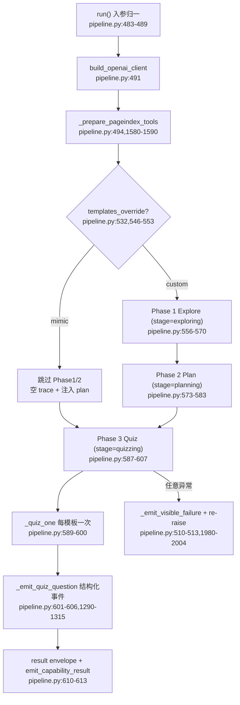

# deep_question 链路导读：ideation→generation（QuestionPipeline 两阶段编排 + Router 出口）

基线：`origin/main` @ `ef2d9e5c3`（v1.6.12）。覆盖数字来自 `audit/coverage-gaps-20261003` 的 `evidence/coverage-2026-10-02/backend/coverage.json.gz`：
`deeptutor/agents/question/pipeline.py` **283 缺失 / 65.6%**，`deeptutor/api/routers/question.py` **225 缺失 / 30.8%**（top15-gaps.md §15）。
本文只读源码整理，未改任何产品代码。

## 1. 链路总览：三条入口，一个执行核

"两阶段"是能力清单视角（`stages=["ideation","generation"]`，`deeptutor/agents/question/capability.py:33`）；
执行核内部是三阶段循环编排（模块 docstring，`deeptutor/agents/question/pipeline.py:3-19`）：
ideation = Phase 1 Explore + Phase 2 Plan，generation = Phase 3 Quiz（逐题）。

```
聊天主链（能力路径）    capability.py:39 run()
  ├─ followup  → FollowupAgent（单次应答）        capability.py:74-108
  ├─ custom    → QuestionPipeline.run()          capability.py:124-167（:155）
  └─ mimic     → parse_exam_paper_to_templates → pipeline.run(templates_override) capability.py:172-181, 183-353
遗留 WS 路由 /ws/questions/generate   api/routers/question.py:359
  └─ AgentCoordinator.generate_from_topic      coordinator.py:66-92（:82 调 pipeline.run）
遗留 WS 路由 /ws/questions/mimic      api/routers/question.py:49（挂载点 api/main.py:630）
  └─ mimic_exam_questions 兼容缝                question.py:34-39 → tools/question/exam_mimic.py:18-70
      └─ AgentCoordinator.generate_from_exam    coordinator.py:94-149（:136 调 pipeline.run + templates_override）
```

- `AgentCoordinator` 是兼容外壳：旧名字保留，真实工作全部委托 `QuestionPipeline`（`deeptutor/agents/question/coordinator.py:1-7,31-37,162-167`）。
- Coordinator 把 pipeline 的事件流转发为 ws_callback 字典流：自建 `StreamBus` → `_forward_stream` 订阅 → `_emit_callback`（`coordinator.py:172-194`），终局再做 legacy 摘要 `_legacy_summary`（`coordinator.py:220-239`）。
- 能力路径 custom 分支入参来自 `context.config_overrides`（mode/topic/num_questions/difficulty/question_types/per_type_counts，`capability.py:110-121`），会话历史取自 notebook_entries（`deeptutor/agents/question/history.py:14-16,34-100`）。

## 2. 阶段图



| 阶段 | Label 协议 | 预算键 | 迭代上限 | 关键行 |
|---|---|---|---|---|
| Explore | THINK/TOOL/FINISH（`_PROTOCOL_EXPLORE` `pipeline.py:110-116`） | `answering`（:686） | 8（:139；runtime 覆盖 :390-399） | `_explore` :619-703；FINISH 直播进气泡 `stream_body_live=True` :695 |
| Plan | 仅 PLAN，无工具（:117-123） | `planning`（:748） | 单步 | `_plan` :708-806；`_parse_plan` :808-871 |
| Quiz/题 | THINK/TOOL/FINISH（:124-130） | `quiz_finish`（:928） | 5/题（:140） | `_quiz_one` :876-967；FINISH 不直播（`_QuizLoopHost.emit_final` 空操作 :2281-2283） |
| Repair | 仅 FINISH（:131-137） | `repair`（:1011） | 触发一次 | `_repair_quiz_payload` :969-1040 |
| 强制收尾 | 仅 FINISH | `answering`（:1559） | `FINALIZATION_REPAIR_ATTEMPTS=2`（:147） | `_force_finish` :1513-1575 |

- 预算统读 `get_capability_params("question")`（`pipeline.py:406`），summarizer 专属 :407-416；迭代/summarizer 开关来自 `build_question_runtime_config`（`deeptutor/agents/question/request_config.py:39-74`）。
- Explore 的 Tool Summarizer：每条 tool_result 一次主模型压缩（temp 0.2，`pipeline.py:153`），失败返回 None 保留原文（:1142-1159）；宿主在 `dispatch_tools` 后仅当摘要非空才替换缓冲区（`_ExploreLoopHost.dispatch_tools` :2137-2180，替换守卫 :2168-2169）。
- 探索 trace 序列化：`_render_exploration_trace` :1176-1275 把 loop 后置消息拼成 markdown（工具结果已替换为摘要），FINISH 文末附"preface"块 :1269-1273；`_strip_protocol_label` :1277-1285 去协议前缀。

## 3. 产物字段契约

### 3.1 模板 → 成品

| 产物 | 字段 | 定义/生成 | 说明 |
|---|---|---|---|
| QuizTemplate | question_id/topic/question_type/difficulty/source/reference_question/reference_answer | `pipeline.py:314-325` | `source="custom"|"mimic"`；mimic 模板带原文（`mimic_source.py:140-150`，topic 截 240 字 :38） |
| QuizPlan | analysis + templates[] | `pipeline.py:328-331` | PLAN JSON：`{analysis, templates:[{question_id,topic,question_type,difficulty}]}`；兼容 `ideas` 键 :824-825 |
| FINISH JSON（题） | question_type/question/options/correct_answer/explanation | prompt 契约 `prompts/en/pipeline.yaml` quiz_step FINISH schema（:217-238 区段） | 解析 `_parse_quiz_payload` :1384-1404：剥 fence :1390-1392，失败取首个 `{...}` raw_decode :1396-1403，非 dict → `{}` |
| QuizPair（成品） | question_id/question/question_type/correct_answer/explanation/options/topic/difficulty/metadata | `pipeline.py:346-361` | 由 `_payload_to_qa_pair` :1488-1508 产出；占位文案 `[Generation failed] {topic}` :1496-1497，N/A 兜底 :1502-1503，`metadata={"issues":[...]}` :1507 |

### 3.2 归一与校验（改 prompt 会撞上的硬契约）

- `_normalize_quiz_payload` :1406-1448：`question_type` 强制等于模板 :1411-1412；choice options 键规整为 A-D :1419-1426，correct_answer 在"键↔选项文本"间双向归一 :1427-1435；concept 把 `对/正确/yes/1` 等变体压成 `true|false` :1436-1445；其余类型 options=None :1446-1447。
- `_collect_quiz_issues` :1450-1486 的 issue 码：通用 `missing_question/missing_correct_answer/missing_explanation` :1458-1463；choice `choice_options_must_be_a_to_d` :1468、`choice_correct_answer_must_be_option_key` :1470；concept `concept_must_not_have_options` :1473、`concept_correct_answer_must_be_true_or_false` :1475；fill_in_blank 必含 `____`（:172 token；:1479-1480）；其余 `non_choice_must_not_have_options` :1483、`non_choice_correct_answer_looks_like_option_key` :1484-1485。
- 六类题型白名单 `QuestionType` :156-165（choice/concept/fill_in_blank/short_answer/written/coding）；难度三元 `easy/medium/hard` :170，非法回落 medium :859。
- 入参白名单归一：`run()` :488-489 调用的是**第二组** `_normalize_type_list`/`_normalize_per_type_counts`（:249-264/:267-292；空列表=任意类型）；**第一组同名函数（:187-246）在 import 时被遮蔽，是死代码**（见 §6 坑 1）。

### 3.3 终局 envelope（stream.result）

`_build_result_payload` :1320-1379，经 `emit_capability_result` 附 `metadata.cost_summary/usage_summary`（`deeptutor/agents/_shared/capability_result.py:21-48`）：

```
{ response,                     # custom=探索 FINISH 前言；mimic=题目汇总 markdown（:1353-1363）
  summary: { success,           # 全部题无 issues 且非空（:1351,:1367）
             source,            # "exam"|"topic"（:1368）
             requested,         # = plan.templates 数（:1369）
             template_count, completed, failed,   # :1370-1372
             templates[],       # QuizTemplate dict（:1965-1975）
             results[{qa_pair, metadata}],        # :1340-1346
             analysis },        # plan.analysis
  mode }                        # "mimic"|"custom"（:1377）
```

- 逐题实时事件：`_emit_quiz_question` :1290-1315 发 `stream.content`（trace_kind=llm_output），metadata 携带 `call_kind="quiz_question_emitted"`（:106）、`trace_role="quiz_question"`（:107）、`trace_group="quiz"`（:108）、内嵌 `qa_pair` dict :1308；前端以 `web/features/chat/trace/selectors.ts:260` 识别该 call_kind。
- 字段名陷阱：`QuizPair.topic` 序列化为 **`concentration`**（:1962），前端 `web/lib/quiz-types.ts:53,66,107` 按此名读取——改内部字段名不会同步改契约名。

## 4. Router 出口：Tee 与 WebSocket 帧协议

`/ws/questions/mimic`（`api/routers/question.py:49-356`）与 `/ws/questions/generate`（:359-578）。

### 4.1 stdout Tee（mimic）

- `StdoutInterceptor` :119-161：`write()` 先写回原终端 :130，再剥 ANSI（模式 :117，剥离 :134）后 `put_nowait` 进 log_queue :145；`QueueFull/RuntimeError` 静默 :146-147；`close()` 置 `_closed` :156-158。安装 :160-161，恢复在两层 finally :310-314 与 :326-327（外层兜底防泄漏全局 stdout）。
- 旁路队列：`emit_process_log` 经 `loop.call_soon_threadsafe` 投递 :101-102，`log_pusher` 逐条 send，send 失败即 break（:104-111，不断流后续 run）；`capture_process_logs` 作用域 :277-285。
- 生命周期：配置帧 → mode 分支（upload :172-237：base64 解码 :183-189 → `validate_upload_safety` :192-198 → batch_dir :201-204 → 写盘 :214-215 → `validate_file` 失败即 unlink :218-224；parsed :239-252；unknown :254-256）→ `ws_callback` :259-265 → 结果帧 success `{"type":"complete"}` :287-301 / 失败 error :302-308 → 清理（pusher cancel :330-337、drain :339-344、close :346-350、`reset_current_user` :352-356）。

### 4.2 /generate（legacy 面貌的 pipeline 出口）

- requirement 校验 :382-387；task_id `question_gen` + 哈希键 :390-398；`AgentCoordinator` 构造（llm 配置缺失降级 None :408-416）:418-425；`ws_callback` 写同一 log_queue :435-441。
- `generate_from_topic` :487-493 → `batch_summary` 帧（requested/completed/failed）:496-506 → sleep 轮询 drain（:513-517，0.1s+0.05s×n 启发式）→ `complete` 帧 + task 状态 :519-525。
- 错误路径：:527-558 记录 traceback 与 `batch_result.validation` 上下文、发 error 帧、`update_task_status(error)` :558；finally 取消 pusher 并 close :560-566。

## 5. 失败模式地图

| 触发 | 行为 | 位置 |
|---|---|---|
| custom 无 topic | `stream.error(topic_required)` 提前返回 | `capability.py:54-63`（二次防御 :135-143） |
| pipeline 任意异常 | error 事件 + `⚠` 文案进气泡，异常 re-raise | `pipeline.py:510-513`，`:1980-2004` |
| PLAN 整轮只有 reasoning | 低 reasoning 重试一次 | `pipeline.py:750-779`（RETRY_REASONING_EFFORT） |
| 重试后仍无模板 | `RuntimeError(plan_unusable)` → 可见失败 | `pipeline.py:786-791` |
| 计划数 < 请求数 | warning 后继续出题 | `pipeline.py:792-805` |
| FINISH JSON 违约 | issues → 一次 repair；仍坏则 warning + 带伤出货 | `pipeline.py:943-966`；repair 内 reasoning 重试 :1013-1039 |
| 迭代耗尽 | force_finish 两次尝试，全败用 fallback 文案收尾 | `pipeline.py:1513-1575`（fallback :1575） |
| summarizer 失败 | 保留原始 tool_result，不中断 | `pipeline.py:1142-1159,2168-2169` |
| ask_user 暂停 | 不支持，`resolve_pause=False` 终止 loop | `pipeline.py:2097-2100` |
| WS /mimic 输入非法 | 逐类 error 帧后 return；PDF 无效并清理 | `question.py:176-256` |
| WS 发送对端已断 | 全部 `RuntimeError/WebSocketDisconnect` 包裹，静默降级 | `question.py:298-307,382-386,461-463` 等 |
| /generate 运行异常 | error 帧 + task status=error | `question.py:527-558` |

## 6. 已知坑（读码结论）

1. **helper 双定义**：`_normalize_type_list`/`_normalize_per_type_counts`/`_format_allowed_types`/`_format_per_type_counts` 各有两份（:187/:208/:235/:241 与 :249/:267/:295/:302），后者生效，前者是 import 期被遮蔽的死代码（覆盖数据证实 :194-246 全空白）。改白名单逻辑若改到第一组不会生效；两处文案也不同（`"auto"` vs `"any (planner picks per question)"`）。
2. **契约名 `concentration`**：见 §3.3；`_qa_pair_to_dict` 与前端字典键不一致是历史包袱。
3. **success≠无占位**：占位题（`[Generation failed]`）照样进 results，只是拉低 completed/提高 failed（:1351,:1371-1372）——消费端不能只看 success。
4. **两套进度通道并存**：能力路径走 StreamBus 结构化事件；legacy 路由走 log_queue + stdout Tee + `ws_callback` 三路汇流，drain 靠 sleep 轮询（:515-517），断连不反压生成过程。
5. **`_t()` 静默兜底**：YAML key 拼错或格式化失败返回 default/原样（:2009-2022），prompt 缺失只有 warning（:450-452），线上表现为"文案回退"而非报错。
6. **guard 为空实现**：`guard_context_window` 明确不做裁剪（:2050-2053），长探索依赖迭代上限约束 buffer。

## 7. 未测分支 ↔ 现有测试卡对应

现有测试（origin/main）：`tests/agents/question/test_pipeline.py`（1368 行）+ `tests/api/test_question_router.py`（154 行，仅 /mimic parsed 一例 :123-154）。
未进 main 的测试卡分支（myfork）：`test/question-tee-stdout-write-20261003`（+`-v2`，新增 `tests/api/test_question_tee_write.py`，StdoutInterceptor 4 例）；`test/question-mimic-ws-error-paths-20261004`（+270 行 6 例：广播失败隔离/断连/死客户端 stdout 恢复/detached terminal/log_pusher 失败）。

| # | 未测分支（缺失行，coverage.json） | 现状 | 归属建议 |
|---|---|---|---|
| 1 | `_explore` 方法体 :645-703（prompt 组装、host、`run_agentic_loop` 调用） | run() 主干经 mock `_explore` 驱动（test_pipeline.py:148），方法体零覆盖 | §15 新卡 `test_pipeline_output_contract.py` ①：mock LLM 跑全链 |
| 2 | `_quiz_one` 主链 :876-967（组装→loop→parse→normalize→issues→repair 决策） | 同上（test_pipeline.py:165 mock 掉） | 同上；补 FINISH 合法/非法各一 |
| 3 | envelope 全字段 + `quiz_question_emitted` metadata | 已有单点：`_emit_quiz_question`（test_pipeline.py:359）、mimic envelope（:635）、失败计数（:1341,:1360） | §15 ①：断言 §3.3 契约逐字段 |
| 4 | `_force_finish` 全体 :1513-1575（含 fallback 文案） | 无 | §15 ③扩展：max_iter 路径 |
| 5 | `_parse_quiz_payload` 分支 :1388,:1392,:1399,:1402-1403（空串/fence/无 `{`/raw_decode 失败） | 仅有 trailing-prose 成功例（test_pipeline.py:1124） | §15 ①附带 |
| 6 | concept 答案归一 :1440-1445；concept/fill_in_blank issue 码 :1471-1480 | choice/written 已测（test_pipeline.py:297-352） | §15 ②：空知识点边界一起补 |
| 7 | 入参归一非空路径 :257-264,:280-292（+死代码 :194-246） | 仅空输入覆盖 | 建议：非空白名单用例 + 删死代码（勿补测死代码） |
| 8 | 占位 qa_pair `[Generation failed]` :1495-1508 | 无 | §15 ③：与 issues 元数据断言绑定 |
| 9 | summarizer 细节 :1124-1132,:1159（usage 帧、空 choices/delta）；宿主替换 :2143-2172（`_ExploreLoopHost.dispatch_tools` 整段） | happy/empty 已测（test_pipeline.py:957-1063）；宿主替换零覆盖 | 低优先（宿主段可并入 #1 全链） |
| 10 | trace 渲染分支 :1223-1224,:1233,:1242 | 顺序遍历已测（test_pipeline.py:810-877） | 低优先 |
| 11 | 工具挂载细节：rag/read_source schema :1632-1648、`_augment_tool_kwargs` :1671-1688、`_kb_system_note` :1737-1755、pageindex 再广播 :2090-2095 | 挂载白名单已测（test_pipeline.py:504-600） | 链路视图不阻塞；后续补 |
| 12 | 渲染类 :1857-1950（attachments/quiz history/plan summary/previous questions/题目 markdown options） | reference block 已测（test_pipeline.py:607） | 低优先 |
| 13 | `/generate` 全线 :359-578（task_id、batch_summary、error、清理） | 无（main 仅测 /mimic 一例） | fix-question-ws 卡后续（router 层） |
| 14 | `/mimic` upload 模式 :172-237 与 unknown mode :254-256 | parsed 模式已测；error-path 卡覆盖失败广播 | fix-question-ws 卡后续 |
| 15 | `_BaseLoopHost` 杂项 :2050-2053,:2061-2063,:2100-2116 | 无 | 低优先（多为单行桩） |

对应关系说明：#1-#8 正是 §15 建议卡 `tests/agents/question/test_pipeline_output_contract.py` 的三条验收（两阶段产物契约 mock LLM / 空知识点边界 / 生成失败错误事件）的落点；#13-#14 属于 `fix-question-ws` 已开方向的延续； Tee 写路径已由 `test/question-tee-stdout-write-20261003-v2` 覆盖，无需重复。

## 8. 延伸阅读

- 能力注册与 request schema：`deeptutor/agents/question/capability.py:30-37`；`deeptutor/runtime/request_contracts.py`（`get_capability_request_schema`）
- agentic 引擎原语：`run_agentic_loop`/`run_labeled_step`/`dispatch_tool_calls`（`deeptutor/runtime/agentic/`，pipeline.py:58-76 导入面）
- prompt 全文：`deeptutor/agents/question/prompts/{en,zh}/pipeline.yaml`（explore/tool_summarizer/plan/quiz_step/repair/protocol/notices）
- mimic 解析：`deeptutor/agents/question/mimic_source.py:58-157`（MinerU→extractor→QuizTemplate）
- 同构参照（research 链路导读）：`docs/guides/deep-research.md`（分支 docs/guides/deep-research）
