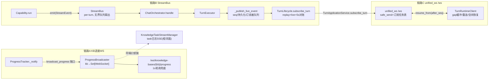

# 实时推送面导读：progress_broadcaster / stream_bus / unified_ws

- 卡片：AGEN-1124（推送链路轴）。前端状态轴见 guide/web-state 卡，测试轴见 test/progress-broadcaster、test/websocket-progress 卡；本卡只画"谁在什么时机向哪个面推什么"。
- 基线：origin/main @ `f07029cfc`（v1.6.13，2026-10-07 fetch）。只读分析，未改任何代码。
- 锚点格式 `path:line`，均相对仓库根，基于上述 commit 可复核。

## 0. 总览

三条互相独立的推送链路 + 一条相邻的 SSE 面：



## 1. 链路 A：KB 进度 WebSocket（ProgressBroadcaster）

### 1.1 推什么、谁推

- 生产者是知识库索引管线里的 `ProgressTracker`：`update()` 落盘进度后调用 `_notify()`（`deeptutor/knowledge/progress_tracker.py:92-112`），在事件循环内以 fire-and-forget 的 `loop.create_task(broadcast_progress(...))`（`progress_tracker.py:101-102`）发出；消息体是进度字典，线上形状为 `{"type":"progress","data":<progress>}`（由广播器统一包壳，`deeptutor/api/utils/progress_broadcaster.py:58`）。
- 领域层不认识 FastAPI：`deeptutor/knowledge/progress_events.py:21-33` 定义 `install_progress_ports` / `broadcast_progress` 端口；API 侧在应用启动时装入两个端口——`ProgressBroadcaster.broadcast` 和任务日志流 `emit`（`deeptutor/api/main.py:127-134`）。CLI/SDK 用默认 no-op。
- 同一次 `update()` 还会走 `emit_task_progress`（`progress_tracker.py:273-279`）把同一进度喂给 SSE 任务日志面（见 1.5）。

### 1.2 传输面

- `ProgressBroadcaster` 是单例（`progress_broadcaster.py:14-27`），连接表是类级 `_connections: kb_name -> Set[WebSocket]`（`:18`），所有操作共享一把类级 `asyncio.Lock`（`:19`）。
- `broadcast()`（`:47-69`）：持锁遍历该 KB 的全部连接，逐个 `await websocket.send_json(...)`（`:58`）；发送抛异常的连接记入 `to_remove`，循环后剔除，空表删除 KB 键（`:64-69`）。

### 1.3 消费端点与时序

端点 `/ws/knowledge-bases/{kb_name}/progress`（`deeptutor/api/routers/knowledge.py:4255`），时序：

1. 鉴权（`:4261-4263`，`ws_require_auth` 见 `deeptutor/api/routers/auth.py:535`）→ `accept`（`:4265`）。
2. `broadcaster.connect(subscription_key, ws)`（`:4281`）；限定目录的 KB 用 `f"{base_dir}/{kb_name}"` 作为订阅键，避开旧的不带目录通道（`:4271-4278`）。
3. 快照先行：读 `ProgressTracker` 现状（`:4282-4283`）。带 `task_id` 的重连按确定性规则结算——终态快照直接重放（`:4298-4302`）；任务元数据不存在（服务重启/任务被逐）则合成可重试的 `knowledge_task_interrupted` 终态（`:4304-4347`）；任务已终态则合成终态帧（`:4349-4376`）。
4. 快路径：无活动任务且无 `task_id` 期望 → 发一帧现状（ready 或需重建）后立刻 `return` 关连接，防无限轮询（`:4378-4417`）。
5. 长轮询循环（`:4446-4505`）：`asyncio.wait_for(websocket.receive_text(), timeout=1.0)` 以 1s 超时兼做心跳与退出检测；超时后比对进度文件 `timestamp`，变化才发（`:4460-4465`）；到 `completed/error` 终态再停留 3s 发最后一帧后 `break`（`:4467-4469`）；带期望 `task_id` 时同时核对任务元数据终态（`:4470-4504`）。
6. 收尾（`finally`，`:4518-4528`）：`broadcaster.disconnect` + 主动 `close` + `reset_current_user`。

### 1.4 背压 / 慢客户端

- **单把全局锁 + 串行 await**：`broadcast` 持类级锁逐个 `await send_json`。任何一个慢客户端（TCP 缓冲堆积但不报错）都会把所有 KB 的广播卡在同一条关键路径上——这是本链路最主要的队头阻塞风险（`progress_broadcaster.py:19,49-58`）。
- **只有"报错才清理"**：剔除条件是 send 抛异常（`:59-62`）；"慢但没死"的连接不会被识别。
- 无队列、无丢弃策略、无 per-连接超时；背压直接传导回事件循环。
- 消费端兜底反而是健全的：1s 轮询比对 timestamp 意味着即使广播丢帧，客户端下一秒也能从进度文件追上（`knowledge.py:4446-4465`）——广播是"加速器"，轮询是"正确性来源"。

### 1.5 相邻面：任务日志 SSE（同一端口装入）

- `KnowledgeTaskStreamManager`（`deeptutor/api/utils/task_log_stream.py:25-43`）：单例；环形缓冲每任务 500 条 / 2MB，最多保留 32 个任务（`:27-29`），终态墓碑 1h / tombstone 24h（`:30-32`），15s 心跳（`:26`）。
- `emit`（`:66-83`）持 `threading.Lock` 追加缓冲后经 `loop.call_soon_threadsafe` 投递到订阅者队列；`subscribe`（`:121-138`）先回放 backlog 再走 live；订阅队列 `maxsize=200`（`:124`），满时 `put_nowait` 静默丢帧（`:276-281`）——**丢弃但不断流**，终态事件靠 backlog 回放保证可见。
- SSE 端点 `stream_task_logs`（`deeptutor/api/routers/knowledge.py:3300`）；前端 `useKnowledgeProgress.ts:296` 用 `EventSource`（浏览器自动重连），`useKnowledgeProgress.ts:440` 注释明确"EventSource 自动重连，进度 WS 是主通道"。

## 2. 链路 B：StreamBus（服务层 per-turn 事件总线）

### 2.1 推什么、谁推

- 每个回合一把新 `StreamBus`（`deeptutor/runtime/orchestrator.py:128`）；capability 在后台任务里 `run(context, bus)`，把 `StreamEvent`（content/thinking/tool_call/progress/...）emit 进总线，`finally` 里补发 `DONE` 并 `close()`（`orchestrator.py:133-183`）。
- 总线同时注册进 turn 级注册表供 `user_input` 反向路由：`register_bus(turn_id, bus)`（`orchestrator.py:131`；注册表 `deeptutor/runtime/stream_bus.py:358-375`）。WS 收到的 `user_input` 经 coordinator 命令队列回到 `get_bus(turn_id).submit_input(...)`（`deeptutor/services/session/turns/lifecycle.py:279-283`），解除 `wait_for_input` 的挂起（`stream_bus.py:312-348`）。

### 2.2 总线语义（`stream_bus.py`）

- `emit`（`:62-77`）：先追加 `_history`（`max_history=None` 时全量保留——turn 作用域总线随回合生死；长寿命总线才传上限，`:48-54`），再扇出到每个订阅者的**无界** `asyncio.Queue`；跨事件循环用 `call_soon_threadsafe` 投递（`:72-77`），兼容桌面/TestClient 多 loop。
- `subscribe(after_seq)`（`:79-103`）：同一同步步内完成"队列注册 + 重放快照"，先重放历史（按 `seq` 过滤）再吃 live 队列，`finally` 自摘除（`:101-103`）。
- `mark_closed`/`close`（`:105-124`）：投 `None` 哨兵结束所有消费者；同步安全（无界队列不阻塞）。

### 2.3 从总线到推送面

- `TurnEngine.execute` 委托 `ChatOrchestrator.handle`（`deeptutor/runtime/turn_engine.py:17-30`）。
- `TurnExecutor` 消费该流：`async for event in self.turn_engine.execute(context)`（`deeptutor/services/session/turns/executor.py:1001`）；`SESSION` 跳过、`DONE` 扣下（`:1002-1014`），其余事件逐条 `_publish_live_event`（`:1015`）。
- `_publish_live_event`（`deeptutor/services/session/turns/lifecycle.py:655-691`）是本链路的推送核心：
  1. 补 `status` 元数据、绑定 session/turn id（`:660-663`）；
  2. 有 lease 时先经 `coordinator.publish_event` 进 Redis 日志（`:665-666`）；
  3. 持锁分配单调 `seq`、追加进程内 `execution.events`（`:667-681`，锁/执行体见 `_TurnExecution`，`deeptutor/services/session/_turn_runtime_shared.py:1553-1574`）；
  4. `DONE` 先触发 `_flush_buffered_events` 把全部事件刷到持久层，再放行（`:683-687`）——**终态事件以"完整前缀已落盘"为前提**；
  5. 对每个 `_LiveSubscriber` `put_nowait` 并 `suppress(asyncio.QueueFull)`（`:688-690`）。

### 2.4 订阅/重放/对账：`TurnLifecycle.subscribe_turn`（`lifecycle.py:354-517`）

1. 先重放持久 backlog（`:359-381`）；持锁追 live backlog 防重放窗口双发（`:383-400`）；执行体不存在再补一次持久 catch-up（`:402-410`）。
2. live 循环每 5s（`_SUBSCRIPTION_POLL_SECONDS = 5.0`，`:30`）超时对账：生产者死后（哨兵永远不会来），从持久层追增量（`:444-457`），终态则合成 `DONE` 收尾（`:458-480`）。
3. 拿不到 DONE 的兜底合成：队列排空后若终态确凿，合成 `_synthesize_done_event`（`:509-517`；构造 `:519-561`），失败回合先合成 terminal ERROR（`:563-590`）——避免前端 `isStreaming` 卡死等 45s 心跳超时（注释 `:361-366`）。
4. 订阅者清理在 `finally` 摘除（`:489-495`）；进程级 `close()` 统一发哨兵、取消任务、清表（`:71-100`）。

### 2.5 背压 / 慢客户端

- 订阅者队列**无界**（`lifecycle.py:383`；`_LiveSubscriber` `_turn_runtime_shared.py:1548-1550`）：慢消费者不丢帧但内存无界增长。
- 唯一丢帧点：`suppress(QueueFull)` 只对无界队列有理论意义，实际是防御性写法；真正风险是消费者停止读取时 `execution.events` 内存累积。
- `DONE` 扣住等落盘（`:683-687`）：持久层卡顿会连带延迟 live 终态帧——是刻意的正确性换延迟。
- 生产者侧无界：capability emit 速度 > 消费速度时全部堆在内存。

## 3. 链路 C：unified_ws `/ws`（turn 协议 + 断连重连）

### 3.1 服务端（`deeptutor/api/routers/unified_ws.py`）

- 单一 `/ws` 端点（`:43`），鉴权后 `accept`（`:49-53`）；每 socket 一张订阅任务表 `subscription_tasks`（`:55`）。
- `safe_send`（`:65-73`）：加 `protocol_version` 后 `send_text`，**任何发送异常静默置 `closed=True`**（socket 视为死，不再写）。
- 命令面：`start_turn`/`message` → `turns.start_turn` 后自动 `subscribe_turn`（`:220-238`）；`ping`→`pong`（`:240-242`）；`subscribe_turn`/`resume_from` 带 `after_seq` 断点续传（`:244-253`）；`subscribe_session` 以 `session:{id}` 为键（`:159-177,255-261`）；`check_active_turn` 只读（`:263-277`）；`unsubscribe`（`:279-286`）；`cancel_turn`/`submit_user_reply`/`user_input`/`regenerate`（`:288-368`）。
- 转发任务（`:140-177`）：`async for event in turns.subscribe_turn(...)` → `safe_send`；异常转 `subscription_failed` 可重试 error 帧。
- 断连清理：`WebSocketDisconnect` 静默、其他异常回 `internal_error`；`finally` 置 `closed`、**逐个 cancel 并 await 所有订阅任务**、`reset_current_user`（`:374-384`）。

### 3.2 外层适配器：`TurnApplicationService.subscribe_turn`（`deeptutor/app/service.py:145-235`）

- 先持久重放（`:159-167`）；已见 DONE 且终态确凿直接返回（`:168-176`）。
- 轮询循环 `coordinator.read_events(turn_id, last_seq)`，0.1s 空转（`:179-206,234-235`）；**"lease 消失"是诚实的流结束信号**（回合任务在自己 finally 里最后一步才释放 lease），DONE 后最多再等 `_POST_DONE_MAX_SECONDS=30.0` 兜底泄漏 lease（`:135,195-207`）。
- 终态行无 DONE 的 legacy 数据合成兼容 DONE（`:208-233`）。

### 3.3 客户端（`web/features/chat/transport/`）

- `TurnRuntimeClient`（`TurnRuntimeClient.ts`）连 `scopedUrl("/ws")`（`:133`）：
  - **resume 游标**：`setResumeCursor(turnId, afterSeq)`（`:171-191`，永不回退防 React 陈旧快照重放 DONE）；重连打开即发 `resume_from`（`:295-306`）。
  - **seq 间隙处理**：gap ≤ `maxBufferedGap=32` 时缓冲乱序帧并排 250ms 快探针（`:137-138,359-377`）；gap 超限直接 `resume_from` 请求重放（`:372-377`）；每收到非终态事件排 5s 重放探针，DONE 到达即清（`:390-402,452-472`）。
  - **重连策略**（`reconnect-policy.ts:1-24`）：指数退避 250ms→8s 带 0.8-1.2 抖动；有活动 turn 永远重连，空闲 socket 最多 5 次；页面隐藏且无活动 turn 不重连，`setPageVisible(true)` 立即唤醒（`TurnRuntimeClient.ts:193-196`）。
  - **命令可靠性**：`cancel_turn`/`submit_user_reply`/`user_input` 要求 ACK，30s 超时抛 `CommandDeliveryError`（`:62-66,217-240`）；断线重连后按 generation 重发未确认命令（`:297,432-439`）。
- **空闲恢复**（React 层）：`ChatStateAdapter.tsx:2635-2650` 每 10s 检查，默认 180s（设置可调，`web/lib/chat-idle-recovery.ts:27`）无事件即 `decideIdleTurnRecovery` → 用 `lastSeq` 重订阅（`ChatStateAdapter.tsx:2186,2235`）——"安静的流不是终态"。
- 非 turn 面的通用重连壳 `ReconnectingWebSocket`（`web/lib/reconnecting-websocket.ts:50-205`，250ms→8s 退避 `:4-14`，`wake()` `:91-106`）被 mastery-ws / partners / book / quiz-judge 复用；KB 进度 WS 由 `web/hooks/useKnowledgeProgress.ts:173-175` 直连。

## 4. 时机矩阵：谁在什么时机向哪个面推什么

| 时机 | 生产者 | 内容 | 面/通道 | 兜底 |
| --- | --- | --- | --- | --- |
| 索引进度每次 `update()` | `ProgressTracker._notify`（fire-and-forget task） | `{"type":"progress","data":进度}` | 链路A 广播（KB 通道） | 消费端 1s 轮询比对进度文件 |
| 进度落盘（同一时刻） | `ProgressTracker.update` | 进度事件 | 链路A' SSE 任务日志（500条/2MB 环形缓冲） | EventSource 自动重连 + backlog 回放 |
| 索引任务进程重启 | 端点对账逻辑 | 合成 `knowledge_task_interrupted` 终态 | 链路A 重连快照 | 无（确定性结算） |
| capability 每个事件 | capability → `bus.emit` | StreamEvent（content/tool_call/...） | 链路B 总线扇出 | `_history` 重放 + 5s 对账 |
| 事件进入推送层 | `_publish_live_event` | 带 `seq` 的 payload；DONE 扣至落盘后 | 链路B 订阅者队列 | Redis 日志 + 持久 backlog |
| 回合终态 | orchestrator finally / 合成器 | `DONE`（含 status/usage） | 链路B/C | 三层合成兜底（live sentinel、5s 对账、外层 lease 消失） |
| WS 重连打开 | 客户端 `resume_from(after_seq)` | 断点后的持久+live 增量 | 链路C `/ws` | gap>32 或 5s 探针强制重放 |
| 用户输入/ask_user | WS `user_input` → registry → `submit_input` | 输入文本反向进入 `wait_for_input` | 链路C→B 反向 | ACK 超时 30s；拒绝时前端重开卡片 |
| 流长时间安静 | React 空闲恢复 | 用 `lastSeq` 重订阅 | 链路C 客户端 | 180s 默认，10s 检查间隔 |
| socket 死亡（服务端） | `WebSocketDisconnect`/`safe_send` 失败 | 取消订阅任务、清上下文 | 链路C | `finally` 全量清理 |
| socket 死亡（链路A） | 1s `receive_text` 抛出 | `break` → `broadcaster.disconnect` | 链路A | 发送失败侧的 `to_remove` 剔除 |

## 5. 关键观察（非缺陷判定，供后续卡复核）

1. 链路A 的类级单锁 + 内联 `await send_json` 是全链路最集中的慢客户端风险点（`progress_broadcaster.py:19,49-58`）；任何优化都应先处理"慢而未死"的连接无法被识别这一事实。
2. 链路B 的无界订阅队列换来了"不丢帧"，但慢消费者下 `execution.events` 与队列同步膨胀；非终态帧在 `suppress(QueueFull)` 下可静默丢失（`lifecycle.py:688-690`），正确性完全依赖订阅端的 seq 对账。
3. 链路B 的 DONE-扣至落盘语义（`:683-687`）与链路C 的 lease-消失结束信号（`app/service.py:201-204`）共同保证"终态前缀完整"，代价是持久层抖动会传导为前端终态延迟（有三层合成兜底）。
4. 链路A 消费端点的正确性来自轮询而非广播；广播只做加速。删除广播不会丢正确性，但删除轮询会。
5. 客户端两条重连路径并存：turn 面用自研 `TurnRuntimeClient`（resume+seq），其余面用通用 `ReconnectingWebSocket`（无 seq 语义）——两者参数一致（250ms→8s）但语义不同，改动重连策略时需分别评估。

## 6. 复核方式

```bash
git fetch --multiple origin myfork
git worktree add /tmp/dt-agena1124-verify origin/main   # 或任意只读位置
cd /tmp/dt-agena1124-verify
# 抽查锚点，例如：
sed -n '14,73p' deeptutor/api/utils/progress_broadcaster.py
sed -n '354,517p' deeptutor/services/session/turns/lifecycle.py
sed -n '145,235p' deeptutor/app/service.py
sed -n '4255,4528p' deeptutor/api/routers/knowledge.py
```

本报告未修改任何代码；`SHA256SUMS` 覆盖本目录全部文件。
