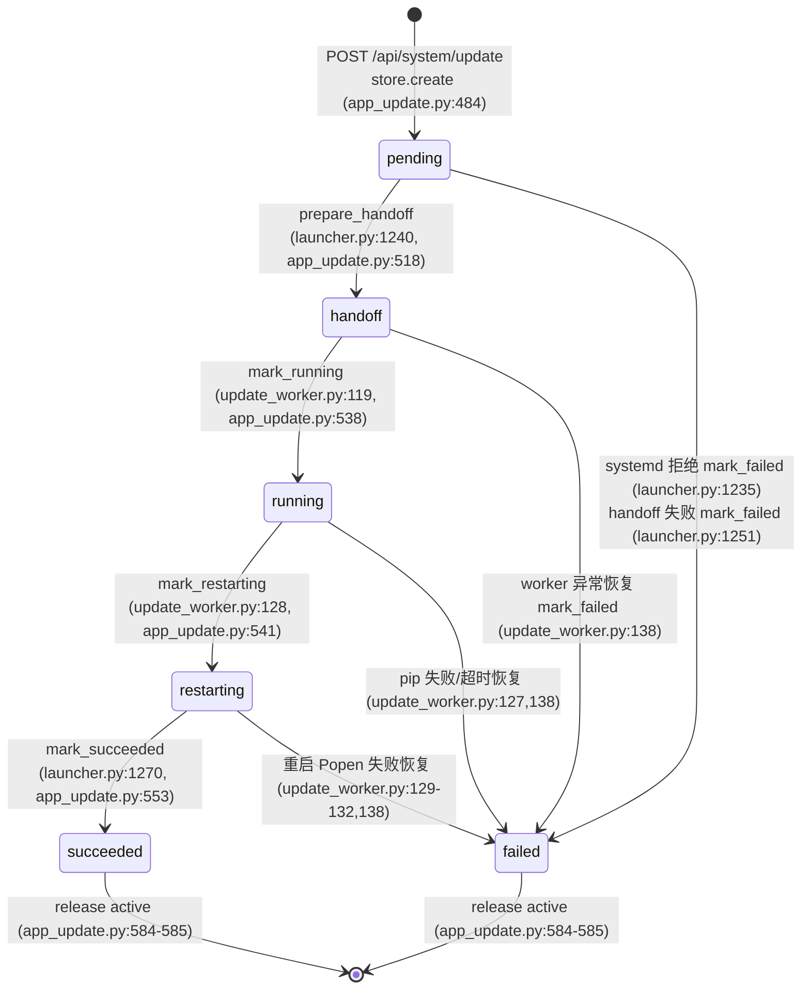

# Runtime 更新链路导读（launcher handoff / update_worker / job store）

- 基线：origin/main `ef2d9e5c3`（v1.6.12），2026-10-04 读取。
- 输入证据：分支 `agent/dt22-todo-scan` `evidence/todo-scan-2026-10-03/report.md` §7 中两条 HIGH：
  `deeptutor/runtime/launcher.py:1252`、`deeptutor/runtime/update_worker.py:144`。
- 本文只读导读，不改任何代码。所有结论均附 `path:line`（基于上述基线）。

## 1. 参与者与文件

| 角色 | 文件 | 关键符号 |
| --- | --- | --- |
| 触发方（后端 API） | `deeptutor/api/routers/system.py:268-315` | `request_managed_update` |
| 空闲门控 | `deeptutor/services/session/turns/lifecycle.py:130-149` | `reserve_managed_update` |
| 持久层（job store） | `deeptutor/services/app_update.py:475-597` | `UpdateJobStore` |
| 原子写工具 | `deeptutor/services/file_io.py:37-60` | `atomic_write_json` |
| 调度方（launcher） | `deeptutor/runtime/launcher.py:1207-1271` | `_handoff_pending_update` / `_complete_restarted_update` |
| 独立执行器（worker） | `deeptutor/runtime/update_worker.py:103-146` | `run_update_worker` |

数据文件（`update_store_root` = `<home>/data/user/update`，`deeptutor/services/app_update.py:471-472`）：

- `state.json`：唯一任务状态（`app_update.py:480`），原子写（`app_update.py:596-597`）。
- `active`：单飞槽位锁，`O_CREAT|O_EXCL` 创建（`app_update.py:498`），`succeeded/failed` 时释放（`app_update.py:584-585`）。
- `worker.log`：pip 与 worker 输出重定向（`app_update.py:636,650-651`；`update_worker.py:66-78`）。

## 2. 状态机

`JobStatus` 全集：`pending / handoff / running / restarting / succeeded / failed`（`app_update.py:38`）。



守卫：`_transition` 校验 `job_id` 与期望状态集合，不匹配抛 `RuntimeError("Update job changed while it was running")`（`app_update.py:564-574`）。`mark_failed` 接受 `{pending, handoff, running, restarting}` 四种来源（`app_update.py:556-562`）。

### 触发侧要点

1. API 前置检查：版本检查开启、非 systemd、launcher 存活（`DEEPTUTOR_LAUNCHER_PID`，launcher 在 `launcher.py:1415` 写入；`app_update.py:614-620`）、安装模式为可自动更新的 pypi（`system.py:272-286`）。
2. `reserve_managed_update` 在同一把锁内检查"无存活 turn"才创建任务，并置 `_accepting_turns = False` 冻结后续请求（`lifecycle.py:141-149`）。
3. `create` 用 `active` 文件 `O_EXCL` 保证单飞；写 `state.json` 失败会回滚释放槽位（`app_update.py:497-509`）。

### handoff 侧要点（launcher）

- 主循环每 ~1s 轮询 `_handoff_pending_update`（`launcher.py:1567-1577`）；返回 True 时置 `shutdown_requested` 并退出（`launcher.py:1568-1570`），由 detached worker 接管。
- `_handoff_pending_update`（`launcher.py:1207-1255`）：
  1. `store.load()`；`OSError/ValueError/KeyError/TypeError/JSONDecodeError` → 静默 `return False`（`launcher.py:1225-1228`）。
  2. `status != "pending"` → `return False`（`launcher.py:1229-1230`）。
  3. systemd 环境拒绝：`mark_failed(job.id, SYSTEMD_UPDATE_REASON)` 后保持服务存活；mark_failed 失败仅 `_log` 一行（`launcher.py:1233-1238`）。
  4. `prepare_handoff`（pending→handoff，写入 `restart_home`/`restart_argv`）后启动 detached worker（`launcher.py:1240-1248`；worker 启动参数见 `app_update.py:623-651`，`start_new_session` 脱离父进程组）。
  5. 任一步异常 → `mark_failed(job.id, "Launcher handoff failed: ...")`；若 mark_failed 再失败 → `except Exception: pass`（`launcher.py:1249-1253`，DT-22 HIGH #1）。
- `_complete_restarted_update`（`launcher.py:1258-1271`）：重启后的 launcher 在前后端均就绪后调用（`launcher.py:1554`）；要求 `status == "restarting"` 且 `restart_home` 与当前 home 一致（`launcher.py:1268`），然后 `mark_succeeded`（`launcher.py:1270`）。

### worker 侧要点（update_worker）

`run_update_worker`（`update_worker.py:103-146`）顺序：

1. `store.load()`，要求 `status == "handoff"`，否则 `RuntimeError`（`update_worker.py:115-117`）。
2. `wait_for_parent(parent_pid)`：等旧 launcher 退出，60s 超时抛 `TimeoutError`（`update_worker.py:56-63,118`）。
3. `mark_running`（handoff→running，`update_worker.py:119`）。
4. 执行唯一允许的变更命令：`pip install --upgrade deeptutor==<target>`；目标版本先经 `UpdateJob.from_dict` 校验（`update_worker.py:17-40,123-125`）。非 0 退出抛 `RuntimeError`（`update_worker.py:126-127`）。
5. `mark_restarting`（running→restarting，`restart_count += 1`，`update_worker.py:128`；`app_update.py:541-551`）。
6. `_launch_restart`：以受信任向量 `[python, -m deeptutor_cli.main, start --home <home> [--dev]]` 重启 launcher（`update_worker.py:43-49,81-100,129-132`；argv 白名单校验 `app_update.py:600-611`）。成功则 worker 返回 0（`update_worker.py:133`）。
7. 兜底恢复（`update_worker.py:134-146`）：任何异常 → 重新 `store.load()`，状态不在 `{succeeded, failed}` 则 `mark_failed`，再尝试用已记录的重启向量拉起应用（`update_worker.py:136-143`）。**恢复段自身再抛任何异常 → `except Exception: pass`，进程返回 1，无任何日志**（`update_worker.py:144-145`，DT-22 HIGH #2）。

## 3. job store 持久化语义

- 读：`load()` = `json.loads` + `UpdateJob.from_dict` 严格校验：`schema_version==1`、状态白名单、稳定语义化版本、`restart_argv` 只允许 `("start","--home",home[,​"--dev"])`（`app_update.py:512-516,106-126,600-611`）。
- 写：`_write` → `atomic_write_json`：同目录临时文件 + flush + 尽力 `os.fsync`（fsync 失败被忽略，`file_io.py:53-56`）+ `os.replace`，Windows 上对 `PermissionError` 做指数退避重试（`file_io.py:13-34`）。读者不会看到半写状态。
- 槽位：`release()` 只在 `active` 内容等于 `job_id` 时删除（`app_update.py:588-594`），避免误删他人槽位。
- 时间戳：`started_at` 在进入 running 时写、`finished_at` 在 succeeded/failed 时写（`app_update.py:575-582`）；`error` 截断到 1000 字符（`app_update.py:561`）。

## 4. 失败模式表

| # | 位置 | 行为 | 后果 | 状态 |
| --- | --- | --- | --- | --- |
| F1 | `launcher.py:1249-1253`（核心在 1252-1253） | handoff 异常 → `mark_failed` 再抛 → `except Exception: pass` | 双重失败（handoff + 记账）零痕迹；job 停在 `pending`，主循环每 ~1s 重新触发 handoff → 无限静默重试（`launcher.py:1567-1570`） | HIGH，已认领（AGEN-138，上游 PR #1704） |
| F2 | `update_worker.py:144-145`（触发点 136/138/140-143） | 恢复段自身抛异常（如 `state.json` 损坏使 `store.load()` 失败）→ `pass` | job 永远停在 failed 前状态；无 `worker.log` 记录；应用不被拉起；与"干净退出 1"不可区分 | HIGH，已认领（AGEN-139，上游 PR #1704） |
| F3 | `launcher.py:1225-1228` | `_handoff_pending_update` 读态失败（类型化捕获）→ `return False` | 损坏的 `state.json` 被当作"无待更新"；若 `active` 槽位仍在，所有新更新请求永久 409（`app_update.py:498-500`），需手工清理 | 未认领（类型化静默，属设计取舍，但 409 卡死无提示） |
| F4 | `launcher.py:1264-1267` | `_complete_restarted_update` 读态失败 → `return False` | 更新实际成功（pip 完成且服务就绪），但 job 停在 `restarting`、`active` 不释放 → 后续更新 409 卡死；无日志 | 未认领 |
| F5 | `launcher.py:1270` | `mark_succeeded` 内部 `_transition` 抛 `RuntimeError`（`app_update.py:572-574`）未捕获 | 穿透 `start()`（该 try 只捕 `KeyboardInterrupt`，`launcher.py:1514,1578`）→ 已成功更新的场景下 launcher 带异常退出（finally 清理子进程，`launcher.py:1580-1581`） | 未认领（边缘：双服务器就绪后状态漂移） |
| F6 | `launcher.py:1268` | `restart_home` 与重启后 home 不一致 → 不标记 | job 永久停在 `restarting`，槽位不释放；正常路径 `restart_argv` 固定 `--home`（`launcher.py:1299-1301`），仅在人工迁移 home 时触发 | 未认领（防御性检查，无观测） |
| F7 | `update_worker.py:115-117` | worker 起来时状态非 `handoff`（如重复 worker、残留旧 worker）→ `RuntimeError` 走恢复段 | `mark_failed` 允许从 pending/handoff 打失败；若 job 已是 `succeeded/failed`，`update_worker.py:137` 守卫跳过记账，恢复段仍会尝试拉起应用 | 良性（幂等设计），但依赖 F2 修好才有日志 |
| F8 | `file_io.py:53-56` | `os.fsync` 失败被忽略 | 断电时临时文件内容可能未落盘即 rename；影响极小（job 可重建） | 可接受，不建议改 |

不属于吞错：`systemd` 拒绝路径 mark_failed 失败会 `_log`（`launcher.py:1236-1237`）；API 侧读态失败返回 `job: null`（`system.py:157-161`），前端仅显示无任务。

## 5. 吞错位置清单（对照 DT-22 §7）

| DT-22 条目 | 位置 | 处理体 | 认领状态 |
| --- | --- | --- | --- |
| HIGH | `deeptutor/runtime/launcher.py:1252` | `except Exception: pass`（包裹 `store.mark_failed`，1251） | **已认领**：修复卡 AGEN-138，分支 `myfork/fix/launcher-handoff-mark-failed(-pr)`；已并入上游 PR [#1704](https://github.com/HKUDS/DeepTutor/pull/1704)（OPEN，等审） |
| HIGH | `deeptutor/runtime/update_worker.py:144` | `except Exception: pass`（包裹恢复段 136-143） | **已认领**：修复卡 AGEN-139，分支 `myfork/fix/update-worker-state-load-fail(-pr)`；已并入上游 PR [#1704](https://github.com/HKUDS/DeepTutor/pull/1704)（OPEN，等审） |

未认领的静默路径（非 bare-pass，但有观测缺口）：F3、F4、F5、F6（见表 4）。检索确认上游无其它 PR/issue 覆盖这两条 HIGH（PR #1704 描述明示"no existing upstream issue"，且 #751 `feature/web-self-update` 是功能前身，不涉及此路径）。

## 6. 修复卡对应

| 修复卡 | 分支 | 修法摘要 | 对应失败模式 |
| --- | --- | --- | --- |
| AGEN-138 launcher handoff | `myfork/fix/launcher-handoff-mark-failed(-pr)` | `except Exception: pass` → `except Exception as mark_exc` + `_log` 一行（含 job id、handoff 错误、记账错误），控制流不变 | F1 |
| AGEN-139 update worker | `myfork/fix/update-worker-state-load-fail(-pr)` | 恢复段单独捕获 `store.load()` 失败：向 `store.log_path` 追加持久记录（load 错误 + 原始失败），损坏的 state 文件原样保留，返回 1，不盲目重启 | F2 |

两卡已合并为上游 PR #1704（同一修复方向，另含 `_reset_runtime_singletons` 两处吞错，超出本导读范围）。

## 7. 建议阅读顺序

1. `deeptutor/services/app_update.py:38,88-126` —— 状态全集与 `UpdateJob` 校验契约。
2. `deeptutor/services/app_update.py:475-597` —— store 五个转移方法 + 槽位/原子写。
3. `deeptutor/api/routers/system.py:268-315` + `deeptutor/services/session/turns/lifecycle.py:130-149` —— 任务如何被安全创建（空闲 + 单飞 + launcher 存活）。
4. `deeptutor/runtime/launcher.py:1567-1577` → `1207-1255` —— 轮询发现 pending、交接、关停自己。
5. `deeptutor/runtime/update_worker.py:103-146` —— 等 parent 退出 → pip → 标记 → 重启 → 兜底恢复。
6. `deeptutor/runtime/launcher.py:1554,1258-1271` —— 新进程就绪后闭环 `succeeded`。
7. 最后对照表 4/5 看两条 HIGH 与四个未认领静默点。

## 8. 复核命令

```bash
cd /Users/Shared/DeepTutor
git fetch --multiple origin myfork
git show ef2d9e5c3:deeptutor/runtime/launcher.py      | sed -n '1207,1271p'
git show ef2d9e5c3:deeptutor/runtime/update_worker.py | sed -n '103,146'
git show ef2d9e5c3:deeptutor/services/app_update.py   | sed -n '471,597p'
```
