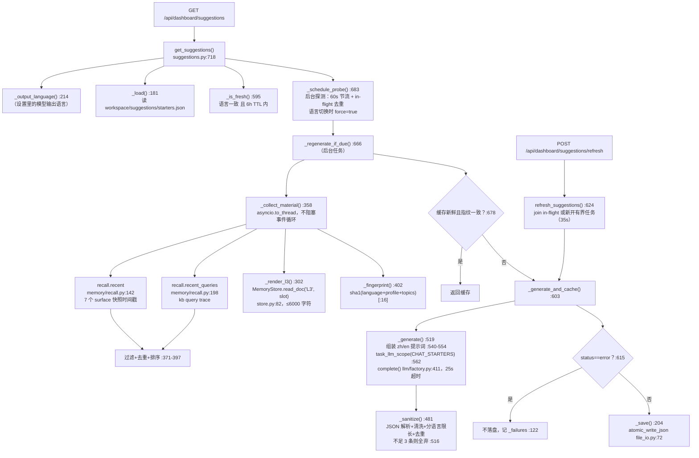

# 建议服务导读：`deeptutor/services/suggestions.py`

基线：`origin/main` @ `6cf793bd8`（v1.6.14）。本文为结构导读，只读产物，不改任何代码。行为断言见单测卡（`tests/services/test_suggestions.py`、`tests/api/test_dashboard_suggestions.py`），本文不重复。

## 1. 模块定位

首页输入框下方三条"起步建议"的生成与缓存服务（suggestions.py:1-45 模块 docstring）。核心设计：**LLM 调用绝不在请求路径上**——读接口只读一个小的 JSON 缓存文件并立即返回，重生成全部在后台任务里做（stale-while-revalidate）。

## 2. 对外暴露接口（公开入口表）

`__all__` 只有四项（suggestions.py:754-759），全部 HTTP 入口集中在 dashboard 路由：

| # | 入口 | 位置 | 类型 | 行为 |
|---|------|------|------|------|
| 1 | `get_suggestions()` | suggestions.py:718 | async 函数 | 读缓存立即返回；顺带调度后台探测。返回 `SuggestionSet.to_dict()` + `stale` + `refresh_failed` 字段 |
| 2 | `refresh_suggestions()` | suggestions.py:624 | async 函数 | 手动重掷：同步等待一次有界生成（`_REFRESH_TIMEOUT=35s`）；已有 in-flight 生成时 `asyncio.shield` 加入等待（suggestions.py:627-634） |
| 3 | `Suggestion` | suggestions.py:125 | frozen dataclass | 单条建议：`label`（学习者读到的行）+ `prompt`（点击后以其身份发出的消息） |
| 4 | `SuggestionSet` | suggestions.py:136 | frozen dataclass | 一组建议 + `language`/`generated_at`/`fingerprint`/`status` |
| 5 | `GET /api/dashboard/suggestions` | api/routers/dashboard.py:49-63 | HTTP 路由 | 直通入口 1 |
| 6 | `POST /api/dashboard/suggestions/refresh` | api/routers/dashboard.py:66-75 | HTTP 路由 | 直通入口 2，返回体固定 `stale: False` |

返回的 `status` 取三种值：`ready` / `no-material` / `error`（suggestions.py:144、197、532、588、663、750）。多用户隔离靠 path service 的每用户 workspace 目录，缓存路径字符串本身就是 scope key（suggestions.py:167-178 `_scope_key`）。

## 3. 数据流图

## 4. 素材来源与触发时机

**素材两半**（`_Material`，suggestions.py:276-291）：
- `profile`：L3 长期记忆的整合读，经 `MemoryStore` 解析器渲染，槽位顺序 `preferences → scope → profile → recent`（`_L3_ORDER` :299），未用完的字符预算向后结转（:350-352）。
- `topics`：平铺的近期活动痕迹，一条列表跨全部 7 个 surface（chat/notebook/quiz/kb/book/partner/cowriter，memory/paths.py:48-56），只按时间排序。来源两个：`recall.recent`（快照时间戳，kb 被 `recent` 刻意排除）与 `recall.recent_queries`（kb 查询 trace）。

**触发再生成的三种时机**：
1. **后台探测**（`_schedule_probe` :683）：每次 `get_suggestions` 都会调度；每用户节流 60s（`_PROBE_INTERVAL_SECONDS` :71），in-flight 去重（`_inflight` :118）。缓存语言与当前设置不符时 `force=True` 跳过节流但不跳过去重（:736）。
2. **到期的判定**（`_regenerate_if_due` :666-680）：素材指纹变化（内容该变）或缓存超过 `_TTL_SECONDS=6h`（:67，同三行不该挂一整周）。
3. **手动刷新**（`refresh_suggestions` :624）：两个条件都绕过，同步等结果，因为"人在等"。

**语言**：输出语言取自学习者的模型输出设置（`get_response_language`，settings/interface_settings.py:311），不是 UI locale；`get_suggestions` 刻意不收语言参数（:725-729）。`trace_count` 来自 starter 设置（settings/starter_settings.py:50，默认 20）。

## 5. 去重与排序（三层）

1. **素材层去重**（`_add`，:371-378）：label 长度 < `_MIN_TOPIC_CHARS=3` 丢弃（:87）；命中占位标题 `_PLACEHOLDER_LABELS`（:94-103，镜像 web/lib/session-title.ts:1 的 `DEFAULT_SESSION_TITLE`）丢弃；casefold 后同 label 去重。
2. **排序与截断**（:390-397）：两个 recall 来源的命中合并后按 `ts` 降序统一排序（无时间戳排最后，:393），再取头部 `trace_count` 条。**先超额拉取（`trace_count*3`，:382）后过滤**，占位标题吃不掉配额。
3. **模型输出层去重**（`_sanitize`，:481-516）：空白折叠+剥引号（:505-506）；按语言限长——label zh 40/en 95 字符，prompt zh 160/en 400（:113-114，`_bound` :477）；casefold 同 label 去重（:511-513）；凑不满 `_COUNT=3` 条则整组丢弃（:516）——半句话比少一条更糟。

## 6. 失败与空结果语义

- 空是合法答案：无素材时直接返回空集、不调模型、且**会落盘**（`no-material` 可安全重复，:619-620）。
- 有素材却得到空结果 = 失败：**不落盘**（否则指纹匹配会让后台任务永远看不到"该重试"，把失败钉死一个 TTL，:604-613），记入进程内 `_failures`（:122），下次访问重试；`get_suggestions` 用 `refresh_failed` 字段向调用方披露（:742）。
- 生成整体有 35s 死线（`_bounded_generation` :656-663），超时/异常都折成一个 `status="error"` 的空集，不向上抛。
- LLM 调用 25s 超时（`_LLM_TIMEOUT` :72）、`reasoning_effort="none"` 防推理模型把 500 token 花在暗处（:569-571）。

## 7. 关键常量速查

| 常量 | 值 | 行 | 用途 |
|------|-----|----|------|
| `_COUNT` | 3 | :64 | 建议条数，少一条像渲染 bug |
| `_TTL_SECONDS` | 6h | :67 | 缓存新鲜期 |
| `_PROBE_INTERVAL_SECONDS` | 60s | :71 | 后台素材检查节流 |
| `_LLM_TIMEOUT` / `_REFRESH_TIMEOUT` | 25s / 35s | :72-73 | 单次调用 / 整体死线 |
| `_LOOKBACK_DAYS` | 30 | :78 | 痕迹回溯窗口 |
| `_MAX_PROFILE_CHARS` | 6000 | :82 | L3 进提示词的字符预算 |
| `_MIN_TOPIC_CHARS` | 3 | :87 | 素材 label 最短长度 |
| `_MAX_LABEL_CHARS` / `_MAX_PROMPT_CHARS` | 分语言 | :113-114 | 输出限长 |

## 8. 与单测卡的边界

- 单测卡覆盖行为：`tests/services/test_suggestions.py`（39 个用例，sanitize/素材/缓存/节流/多用户/死线）与 `tests/api/test_dashboard_suggestions.py`（3 个路由契约用例）。
- 本卡只写结构与调用链导读，上表仅列文件位置，不复述任何断言内容。
