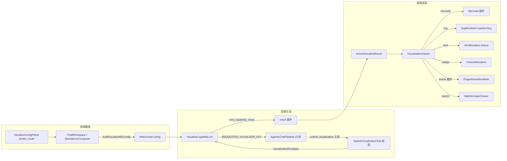

# 可视化 / Mermaid 渲染链路导读

- 代码基线：`origin/main` @ `ef2d9e5c3`（release v1.6.12，2026-10-04）
- 覆盖缺口证据：分支 `audit/coverage-gaps-20261003` 的 `evidence/coverage-2026-10-02/frontend/summary.md`
  （`web/components/visualize/VisualizationViewer.tsx` 232/236 语句未覆盖，语句覆盖 1.7%）
- 上游衔接：issue #1294（Mermaid mindmap visualizer）已有开放 PR **#1295**（`codex/feat/mindmap-visualizer`），
  本导读第 9 节即对该 PR 的中文复核结论（已实跑其验证器代码）。
- 除特别注明 "PR #1295" 外，所有 path:line 均相对上述 main 基线，路径省略仓库前缀。

## 1. 链路总览

## 2. 触发入口（用户侧）

- 模式选择：`VisualizeConfigPanel` 的 Render Mode 下拉（`web/components/visualize/VisualizeConfigPanel.tsx:100-135`）。
  目录在线时选项来自 `listVisualizers()`（`:57-73`，API 封装 `web/lib/visualizers-api.ts:32`），
  仅列 `installed && enabled`（`:70-73`）；目录加载失败时退回硬编码列表 chartjs/svg/mermaid/html/manim×2（`:118-127`）。
  同一面板还负责 bundled 可视化器安装/启用/导入 .zip（`:168-261`）。
- 配置状态：`ChatWorkspace` 持有 `visualizeConfig`，初值 `DEFAULT_VISUALIZE_CONFIG`
  （`web/features/chat/components/ChatWorkspace.tsx:470-473`；默认值 `web/lib/visualize-types.ts:15-19`）。
- 发送：visualize 模式下发 `buildVisualizeWSConfig(visualizeConfig)`（ChatWorkspace.tsx:1983；
  standalone 首页作曲器同样 `web/components/chat/home/StandaloneComposer.tsx:746`），
  即 `{render_mode, quality, style_hint}`（`web/lib/visualize-types.ts:21-29`）。
- 请求契约校验在后端：`deeptutor/runtime/request_contracts.py:69,135`，由 capability 入口调用
  （`deeptutor/agents/visualize/capability.py:103-104`）。

## 3. 后端生成链（非 manim 主路径）

1. `VisualizeCapability.run`（`deeptutor/agents/visualize/capability.py:102`）：
   - 显式 `render_mode` 未安装/未启用 → `VisualizerStoreError`，列出可用 id（capability.py:115-120）。
   - `manim_video/manim_image` 转专用子管线 `_run_manim_path`（capability.py:123-136,270+）。
2. 通用路径把请求写入上下文：`VISUALIZE_MODE_KEY` + `REQUESTED_VISUALIZER_KEY = render_mode`
   （capability.py:168-169；键定义 `deeptutor/visualizers/protocol.py:14-16`），并收窄本轮内置工具白名单
   （capability.py:171-177）。本地无原生工具调用（LM Studio/Ollama 等）会先发进度警告，
   但不中止 —— DSML 文本工具调用仍可能成功（capability.py:155-166）。
3. 共享 chat 引擎 5 轮循环：`AgenticChatPipeline(max_rounds=5, temperature/max_tokens 取 visualize 参数)`
   （capability.py:188-197）。`VisualizationLoopCapability` 把可视化器目录注入系统提示
   （`deeptutor/visualizers/loop_capability.py:30-41` → `registry.prompt_catalog`，`deeptutor/visualizers/registry.py:125`），
   并在工具 kwargs 里塞入 registry 与请求 id（loop_capability.py:79-91）。
4. 唯一提交点 `SubmitVisualizationTool.execute`（`deeptutor/visualizers/tool.py:64`）：
   - 请求固定类型与提交类型不符 → 拒绝并要求重生成（tool.py:82-89）；
   - 插件不可用/非 agentic → 拒绝并列出可用（tool.py:90-96）；
   - `plugin.validate_payload` 校验（tool.py:98-107；文本类走 `_text_validator`，`deeptutor/visualizers/builtin.py:19-56` →
     `validate_visualization`，`deeptutor/agents/visualize/utils.py:112`，mermaid 关键字检查 utils.py:166-183）；
   - 通过后组装 `VisualizationEnvelope` 写入 `context.metadata[VISUALIZATION_RESULT_KEY]`（tool.py:114-134；
     信封模型 `deeptutor/visualizers/protocol.py:112`）。
5. 信封组装为 result：capability 读回信封；缺失则 RuntimeError（本地无工具时给出专门诊断）
   （capability.py:198-208）；成功时叠加 legacy `code/analysis/review` 兼容字段
   （capability.py:220-238）并 `emit_capability_result`（capability.py:239-244；
   `deeptutor/agents/_shared/capability_result.py:21`）—— 这就是前端看到的 `result` 事件。
6. 工具抛异常会被统一兜底成失败 ToolResult 并记日志（`deeptutor/runtime/agentic/tool_dispatch.py:783-800`），
   模型仍可在剩余轮次重试 —— 但丢失具体校验错误文案（见第 9 节复核发现 B）。

核心注册表：core 插件 svg/mermaid/chartjs/html/manim_video/manim_image（`deeptutor/visualizers/builtin.py:156-292`，
mermaid 定义 :185-206，priority：svg 10 / mermaid 20 / chartjs 30），bundled geogebra（:294+）。
清单契约见 `deeptutor/visualizers/protocol.py:23-86`（native 目标必须带 `native_renderer`，:68-70）。

## 4. 前端接收与挂载

- `result` 事件：`msg.events.find(type === "result")`（`web/features/chat/messages/ChatMessageList.tsx:714-717`）。
- 仅当 `msg.capability === "visualize"` 且有 result 事件时 `extractVisualizeResult(resultEvent.metadata)`
  （ChatMessageList.tsx:760-763）。解析器把 v1 信封规范化为 `VisualizeCanvasResult`，
  `code` 是旧会话/Book 块的兼容来源（`web/lib/visualize-types.ts:137-234`，兼容注释 :158-164）；
  `render_type` 为 manim 系时分流 `VisualizeManimResult`（:144-148，判别 :116-120）。
- 挂载：`VisualizationViewer` dynamic(ssr:false)（ChatMessageList.tsx:130-133），在消息气泡分支里
  互斥替换整个正文（ChatMessageList.tsx:1081-1084）。
- Book 阅读器复用同组件：`FigureBlock`（blocks/FigureBlock.tsx:62-100）与 `InteractiveBlock`
  （blocks/InteractiveBlock.tsx:35-73）用块数据拼装 legacy 形态的 `VisualizeResult`。

## 5. VisualizationViewer 组件契约

入口 `VisualizationViewer({result})`（`web/components/visualize/VisualizationViewer.tsx:508-673`）：

- hooks 无条件先行（:515-535，全屏 Esc + 锁 body 滚动）。
- manim 早退：`isManimResult` → `MathAnimatorViewer`（:537-539）。
- 全屏按钮仅 native 且非 html（:544-546）；iframe/html 因沙箱与固定定位限制排除全屏与重挂载（:541-546 注释）。
- 渲染分发 `CanvasVisualization`（:442-493）：
  `iframe` 插件 → PluginIframeRenderer（:444-445,195-264，onLoad postMessage 下发信封 :249-261）；
  `svg` → SvgRenderer（:449-450）；`mermaid` → Mermaid（:452-453）；`html` → HtmlRenderer（:455-456）；
  `chartjs` → ChartJsRenderer（:458-459）；`geogebra` → Geogebra 动态组件（:461-484）；
  未注册 renderer → 红字 "No native renderer is registered"（:486-492）。
- 工具条：Show code / Copy（:583-609，剪贴板失败静默 :548-556）、右侧标签 `visualizationLabel`
  （:495-506）。代码面板与 markdown 代码块同款暗色样式（:611-623）。
- review 备注：`review.changed && review_notes` 才显示（:626-630）。
- 全屏 overlay 走 `createPortal(document.body)`，规避流式动画的 transform/overflow 祖先（:632-671）。

关键子渲染器：

- **SvgRenderer/SvgFigure**：`sanitizeSvg` 先消毒再内联（:274-366：DOMParser XML 解析、script/foreignObject/handler
  剥除、on* 与 javascript:/data: href 剥除、`<set attributeName=on*>` 整元素移除），随后按页自增前缀重排
  id/url(#id)/aria 引用防同页多 SVG 冲突（:323-363）；多 `<svg>` 块拆分逐个渲染（:423-440）。
  解析失败/非 svg → 红框错误（:380-393）。点击带 `data-prompt` 的节点 → 窗口事件预填作曲器（:398-406）。
- **HtmlRenderer**：`prepareIframeHtml` = KaTeX 注入 + 消毒 + 桥脚本（`web/lib/iframe-html.ts:187-189`；
  KaTeX :32-65；`sanitizeIframeHtml` 剥 `javascript:` URL、`target=_top/_parent` 改 `_self` :76-83；
  BRIDGE 提供 `sendPrompt`/高度上报 :94-171）。iframe `sandbox="allow-scripts"`（无 allow-same-origin，
  VisualizationViewer.tsx:187），高度随桥消息 240~2400px 自适应（:133-153），新标签页打开包一层
  blob 包装页（:155-172）。插件 iframe 同为 `allow-scripts`（:246），消息桥兼容新旧两类事件名
  （`deeptutor:visualization:prompt/resize` 与 `dt:visualize-prompt/height`，:201-231）；缺 `entry_url` →
  "Visualizer renderer is unavailable"（:233-239）。
- **ChartJsRenderer**：容错 JSON 解析（去围栏 `stripCodeFence` :26-32、jsonish 修复 :34-47），动态 import
  chart.js/auto，错误红框（:49-116）。

## 6. Mermaid 渲染细节

`web/components/Mermaid.tsx:79-177`：

- 单例动态加载 + 600ms 去抖（`DEBOUNCE_MS` :77，:89-98）：流式/连续更新下避免频繁重渲染；未稳定且有图时
  显示 "Rendering diagram..." 占位（:160-168）。
- 主题：每次渲染从 CSS 变量取色（`themeVariablesFromCss` :25-39），`initialize` 幂等重放（:51-64），
  订阅主题切换触发重渲染（:100-105）。
- 安全：`securityLevel: "strict"`（:55）；渲染前后清理孤儿 DOM（`cleanupMermaidOrphans` :66-73,117,124）。
- 失败降级：解析错误 → 红框 + 错误信息 + 可折叠 Show source 原文（:139-158）；错误不抛出、不冒泡。
- 依赖 `mermaid ^11.14.0`（`web/package.json:49`）—— 11.x 原生支持 `mindmap` 语法，#1294 无需新增图表依赖。

## 7. 失败与降级清单

| # | 失败点 | 行为 | 依据 |
|---|---|---|---|
| 1 | render_mode 未安装/禁用 | 后端直接 VisualizerStoreError（第 3 节 1） | capability.py:115-120 |
| 2 | 面板目录 API 失败 | 前端退回硬编码选项列表 | VisualizeConfigPanel.tsx:118-127 |
| 3 | 5 轮内无信封提交 | RuntimeError（本地无工具时带专门诊断） | capability.py:198-208 |
| 4 | 工具校验不通过 | 失败 ToolResult + 具体错误文案，模型可重试 | tool.py:98-107 |
| 5 | 工具抛异常 | 兜底为失败 ToolResult + 日志（丢具体文案） | tool_dispatch.py:783-800 |
| 6 | result 元数据缺 render_type/内容为空 | `extractVisualizeResult` 返回 null，气泡回退普通文本布局 | visualize-types.ts:141-142,164 + ChatMessageList.tsx:874-878 |
| 7 | renderer 未注册 | 红字 "No native renderer..." | VisualizationViewer.tsx:486-492 |
| 8 | Mermaid DSL 解析失败 | 红框 + 错误 + Show source | Mermaid.tsx:139-158 |
| 9 | SVG 消毒失败/非 SVG | 红框 "SVG rendering error" | VisualizationViewer.tsx:380-393 |
| 10 | HTML 缺 entry_url | "Visualizer renderer is unavailable" | VisualizationViewer.tsx:233-239 |
| 11 | Chart.js 配置坏 JSON | 红框 "Chart rendering error" | VisualizationViewer.tsx:98-109 |

## 8. 与流式消息输出的交互

- 生成期（无 result 事件）：`visualizeResult` 为 null（ChatMessageList.tsx:760-763），气泡走普通内联分段
  布局（:874-878）；用户看到进度 stage 事件与 capability 在 reviewing 阶段流出的围栏代码块
  （`stream.content`，capability.py:218）。
- result 事件落地瞬间：卡片分支互斥替换全部正文（:1081-1084），流出的代码块文本从气泡消失，
  由卡片 + Show code 面板接管（VisualizationViewer.tsx:583-623）。
- 降级一致性：第 7 条 #6 的 null 路径让正文回到流式文本，因此"卡片替换"失败时用户仍能看到原始输出。
- 自动滚动对 capability 卡片有专门处理（`web/hooks/useChatAutoScroll.ts:39,169`）。
- 回路交互：SVG 节点 `data-prompt`、HTML 桥 `sendPrompt`、插件 iframe 消息统一派发窗口事件
  `dt:visualize-prompt`（VisualizationViewer.tsx:139-149,213-219,398-406；iframe-html.ts:94-104），
  `ChatWorkspace` 监听并预填作曲器、不自动发送（ChatWorkspace.tsx:637-644）。

## 9. #1294 落点、前置条件与 PR #1295 复核结论

### 9.1 需触碰文件（main 基线行号）

| 文件 | 改动 |
|---|---|
| `deeptutor/visualizers/builtin.py` | 新增 `id="mindmap"` core 插件（mermaid 定义 :185-206 旁，`native_renderer="mermaid"`） |
| `deeptutor/agents/visualize/utils.py` | `validate_visualization`（:112）加 mindmap 结构校验分支（:166-183 mermaid 分支之后） |
| `web/lib/visualize-types.ts` | `VisualizeTextRenderType`（:4）、`VISUALIZE_RENDER_LABELS`（:31-40）、`extractVisualizeResult` 推断（:166-173）加 mindmap |
| `web/components/visualize/VisualizationViewer.tsx` | `CanvasVisualization`（:452）与 `visualizationLabel`（:495-506）识别 mindmap |
| `web/components/visualize/VisualizeConfigPanel.tsx` | 硬编码回退列表加 mindmap（:118-127） |
| `web/locales/en/app.json`、`web/locales/zh/app.json` | "Mind map" 文案 |
| 测试 | `tests/visualizers/test_registry_and_tool.py`、`tests/agents/visualize/`（新建 validator 测试）、`web/tests/visualize-types.test.ts` |

前置条件：mermaid ^11.14.0 已支持 mindmap（web/package.json:49），Mermaid 组件按原样渲染 DSL、
无图表类型白名单（Mermaid.tsx:107-137），`securityLevel: "strict"` 兼容 —— 无需新图表依赖；
注册表与目录 API 会自动带出新插件（registry.py:125 prompt_catalog）。

### 9.2 PR #1295 复核结论（中文，已实跑其代码）

范围符合 #1294：注册表插件（builtin.py +24，native_renderer=mermaid、priority=25）、
mindmap 专属 prompt + 结构校验（utils.py +18：拒围栏、首行须 `mindmap`、恰一根节点、至少一支子分支）、
UI 暴露（面板 +1、中英文案 +2）、前端识别与标签（viewer +5、types +13）、
回归测试 4 处（新增 `tests/agents/visualize/test_validate_visualization.py` 6 例等）。未引入新图表依赖。

**发现 B（已验证，建议修复合入）**：mindmap 校验分支在退化输入下抛 `ValueError`。
对 `"mindmap\n"`（仅有首行）或 `"mindmap\n%% 注释\n"`，`min(indent for _, indent in lines[1:])`
对空序列求 min 直接抛 `ValueError: min() iterable argument is empty`，而不是返回 `(False, 提示)`。
实跑验证（PR 代码，`.venv` python）：bare keyword → RAISED ValueError；keyword+comment → RAISED；
root+child → (True,'')；two roots → False（提示正确）；fenced → False（提示正确）；empty → False。
影响：`SubmitVisualizationTool.execute` 对 `validate_payload` 无 try/except（tool.py:98），
异常会被 tool_dispatch.py:783 兜底成失败 ToolResult，模型只看到笼统 "Tool failed"、
丢失具体修复提示，违背 #1294 "rootless 输出走既定校验重试路径" 的成功标准。
建议：`lines[1:]` 为空时返回 `(False, "…exactly one root node…")`，并补裸关键字/纯注释两个用例
（PR 新测试文件未覆盖该边界）。

**发现 A（轻微，观感）**：后端清单 `native_renderer="mermaid"`，且 `extractVisualizeResult` 把
mindmap 推断为 mermaid（PR 的 types diff），因此 `visualizationLabel` 新增的
`renderer === "mindmap"` 分支对新结果不可达，mindmap 会显示为 "Mermaid · diagram"。
建议标签改按 `render_type`/`analysis.requested_type` 判断。

总体：方向与结构正确，修掉发现 B（一处守卫 + 两个测试用例）后即可合入；发现 A 可随手修。

## 10. 现有测试空白（衔接 test-visualization-viewer 测试卡）

- 前端：main 仅有 `web/tests/visualize-types.test.ts`（2 例，:6-31 信封解析、:34-43 legacy SVG）。
  `VisualizationViewer` 组件本体 0 直接测试（证据分支 summary.md：1.7% 覆盖，232/236 语句未触）。
  测试卡分支 `myfork/test/visualization-viewer-20261004` 已新增
  `web/tests/visualize/VisualizationViewer.spec.tsx`（636 行）+ 证据，落地后本导读第 5/6/7 节
  即有回归网；该卡未覆盖的空白仍包括：Mermaid 组件主题/去抖路径、PluginIframeRenderer 消息桥、
  Book FigureBlock/InteractiveBlock 装配路径。
- 后端：`tests/visualizers/test_registry_and_tool.py`（注册表+提交工具）、`tests/visualizers/test_ggb_validator.py`、
  `tests/agents/visualize/`（analysis fallback / extract_code_block / llm calls / tool-calling diagnosis）。
  `validate_visualization` 在 main 无独立测试文件；mermaid 分支（utils.py:166-183）与未来 mindmap
  分支的边界（空、围栏、多根、纯注释）目前靠 #1295 新增文件补 —— 即发现 B 所在。
