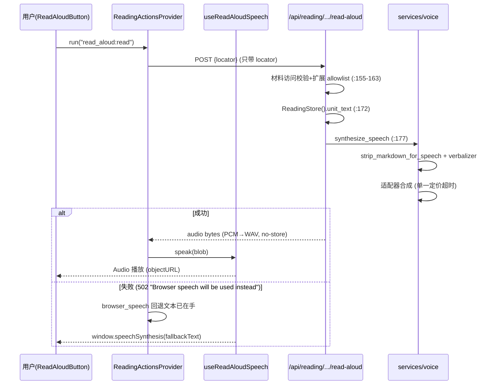
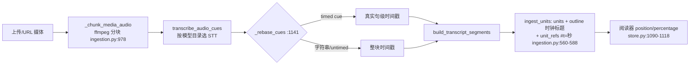

# voice 语音域代码导读（speech_text / read_aloud）

- 日期：2026-10-05
- 基线：origin/main @ `f07029cfc`（release: v1.6.13），worktree `dt-agen705-wt`、分支 `guide/voice-20261005`，全程只读，未改任何代码。
- 对照：`myfork/scan/coverage-gaps-20261005` 的 `evidence/coverage-gaps-20261005/report.md`（voice 条目）。
- 去重：reading 域主体（进度持久化、EPUB/PDF、units 结构）归 guide-reading；事件与进度上报链归 guide-events。本文只写 voice 触点及其衔接面，两侧细节不重复展开。

## 1. 域边界与模块地图

voice 域 = `deeptutor/services/voice/**`（合成/转写服务层）+ `deeptutor/reading/read_aloud.py`（浏览器朗读扩展）+ 两个 API 面（`/api/voice/*`、reading 路由里的 read-aloud/extension action）+ 前端三个消费点。

### 1.1 服务层 `deeptutor/services/voice/`

| 文件 | LOC | 角色 | 直接测试（对应 coverage_raw） |
|---|---|---|---|
| `__init__.py` | 118 | 对外门面：`synthesize_speech` / `transcribe_audio` / `transcribe_audio_cues`，从模型目录解析配置 | 8 个测试文件 |
| `config.py` | 98 | `TTSConfig`/`STTConfig` 数据类；auth 风格、请求编码常量；超时校验 | 有 |
| `base.py` | 273 | 错误类型层级、超时包装、Markdown→口语清洗、STT cue 基类降级、URL/头工具 | 有 |
| `speech_text.py` | 825 | LaTeX/数学口语化器（名字有误导性，见 §2.4） | **零直接测试**（仅经 base 间接） |
| `options.py` | 315 | 各 provider 的模型/音色/格式静态建议（纯展示数据） | 有 |
| `preview.py` | 58 | 设置页试听：快照目录上合成，不落盘 | 有 |
| `audio.py` | 115 | PCM↔WAV 封装、ffmpeg 归一化 | 有 |
| `adapters/__init__.py` | 62 | 无状态单例注册表（TTS 6 个 key、STT 3 个 key） | 有 |
| `adapters/openai_compat.py` | 477 | OpenAI 兼容 TTS/STT + OpenRouter chat-audio 回退 | 有（§4 抽样判"中等"） |
| `adapters/dashscope.py` | 466 | 阿里原生 TTS（HTTP，返回音频 URL 再下载）+ STT（WebSocket 识别） | 有（t2 经 test_voice） |
| `adapters/volcengine.py` | 207 | 火山 Doubao Speech HTTP v3：TTS SSE 流、STT base64 上传 | 有 |
| `adapters/minimax.py` | 91 | MiniMax 同步 t2a_v2，hex 音频 | 有 |
| `adapters/mimo.py` | 67 | 小米 MiMo：chat completions 音频输出 | 有 |

### 1.2 读取链路与 API 面

| 文件 | LOC | voice 相关内容 | 直接测试 |
|---|---|---|---|
| `deeptutor/reading/read_aloud.py` | 33 | `ReadAloudExtension`：返回 `browser_speech` 结果（可见文本+locale），供前端 Web Speech API | `tests/reading/test_read_aloud.py` |
| `deeptutor/reading/ingestion.py` | 1189 | 媒体导入：ffmpeg 分块 → `transcribe_audio_cues` → `_rebase_cues` → units/outline | `tests/reading/test_ingestion.py`（字符串转写替身；timed cue 回退路径见 §4） |
| `deeptutor/reading/store.py` | 1566 | `unit_text`（read-aloud 取词源）、`position/save_position`（进度，细节归 guide-reading） | 有 |
| `deeptutor/api/routers/voice.py` | 94 | `/api/voice/tts`、`/api/voice/stt` | `tests/api/test_voice_routes.py` |
| `deeptutor/api/routers/reading_extensions.py` | 498 | `read_material_aloud`（服务端朗读路由）、`run_extension_action`（通用 action 执行器，含 read_aloud 扩展） | **零静态对应**；quiz answers 子集经动态 import 有真实覆盖（§4 新发现） |
| `deeptutor/api/routers/settings.py` | — | `voice_options` 目录接线（:681-704）、autoplay/math_speak 偏好（:2048-2068）、`/voice/preview`（:2172+） | 有（test_voice_preview 经 test_runner 链） |
| 挂载 | — | voice 路由 `api/main.py:733`；reading_extensions 路由 `api/main.py:646` | — |
| 门控 | — | `multi_user/learning_access.py:108-115` `allowed_reading_extensions`；`multi_user/grants.py:129-136` 学习者默认 allowlist 含 `read_aloud` | — |

### 1.3 前端消费点

| 文件 | 角色 |
|---|---|
| `web/components/reading/use-read-aloud-speech.ts` | 朗读 hook：优先服务端音频 blob，失败回退 `window.speechSynthesis`；token 防乱序、objectURL 回收 |
| `web/components/reading/ReadingActionsProvider.tsx` | action 编排：`run` 里 `browser_speech` 结果 → `speak({fallbackText})`（:184-199）；locator/material 变更即停（:105） |
| `web/components/reading/workspace/ReadAloudButton.tsx` | 头部朗读开关按钮（:19-55）；儿童模式让位给独立工具条 |
| `web/lib/reading-api.ts` | `readReadingAloudAudio`（:396-415，**请求只带 locator，不带文本**——由服务端取词决定学习者能听到什么）；`getReadingPosition`/`saveReadingPosition`（:508-533） |
| `web/hooks/useVoiceRecorder.ts` | 聊天听写：MediaRecorder → `/api/voice/stt`（:71） |
| `web/features/chat/messages/ChatMessageList.tsx` | 消息朗读：`/api/voice/tts`（:1365），含 504 专属文案 |
| `web/tests/reading-read-aloud-speech.spec.ts` | hook 的 4 个 vitest 用例（服务端优先/回退/释放/卸载竞态） |

### 1.4 其他消费方（边界外触点）

- `capabilities/audio_overview/pipeline.py:412-420`：音频概览能力复用 `synthesize_speech` 与 `voice_model_options`。
- `services/config/test_runner.py:505-531`：设置页"测试连接"直接跑 TTS/STT 各一次。
- `services/config/provider_runtime.py:27,1208`：从模型目录解析 voice 运行时配置（与 embedding/LLM 同一套目录机制）。

## 2. 核心抽象与模块边界

### 2.1 门面与配置解析

- 门面 `services/voice/__init__.py:33-64`（synthesize）、`:67-82`（transcribe）、`:85-106`（timed cues）。每次调用都从模型目录现场解析配置（`provider_runtime.resolve_tts_runtime_config`，惰性 import 避免环），再取适配器执行；`voice`/`response_format`/`language` 是单次覆盖参数。
- Math Speak 偏好读取 `__init__.py:23-30`：设置不可用时默认开启（fail-open 到更好的朗读体验）。
- `config.py:30-43`：TTS 超时缺省 60s，可配 5–600s；非法编辑大声抛错（设置页负责呈现）。

### 2.2 错误类型层级（base.py:24-57）

`VoiceProviderError`（带可选 `public_message`，只放应用文案，绝不回传上游响应体）← `VoiceProviderTimeout`（固定可操作文案）、`VoiceProviderHTTPError`（带 status/body 供内部分支判断）。

### 2.3 超时是单一定价

`synthesize_with_timeout`（base.py:72-86）用一个 `asyncio.timeout` 罩住"合成+流+音频下载"全程；适配器内部包裹过的传输超时靠 `__cause__` 还原为 `VoiceProviderTimeout`。API 层据此映射 504（voice.py:51-52），其余 provider 错误 502、配置错误 400。

### 2.4 `speech_text.py` 名不副实：它是数学口语化器

文件名像 STT，实际是 TTS 前置清洗的第二级：`strip_markdown_for_speech`（base.py:219-258）先砍代码块/表格/链接/结构标记，再把数学岛交给 `verbalize_latex_for_speech`（speech_text.py:739-822）。流水线（`_verbalize_math` :675-693）按序：

1. `\mathbb{R}` 等数集 → "the reals"（:461-466）
2. 样式包装逐层解包，重音类转 spoken 后缀（`_unwrap_style_once` :434-458，`_ACCENT_SPEAK` :299-310）
3. 分数→"A over B"（:469-488）、根号（:491-525）、二项式→"choose"（:528-548）、极限/积分上下限→"as x to 0"/"from 0 to 1"（:551-588）
4. 希腊字母/运算符/函数词典替换（:426-431，词典 :26-350）
5. 上下标：`^2`→"squared"、`^{-1}`→"inverse"、`_i`→"sub i"（`_verbalize_scripts` :612-633，`_speak_sup` :591-609）
6. 未知命令丢弃（保参数内文本，:636-668）、花括号清空
7. 岛外散文：`_verbalize_loose_commands`（:706-732）只处理含已知 TeX 命令的散文段，且 **Windows 路径整段豁免**（`_WINDOWS_PATH` :350）；裸 `_`/`^`（如 `file_name`）永不触碰；Unicode 数学符号表 :236-267；残留 `$` 删除（:821）。

顺序敏感点：数学先于 emphasis（`$x_i$` 的下划线不能被斜体正则配对，base.py:241-248）；`math_speak=False` 时仅去 `$` 定界符、保留内部 TeX，emphasis 清洗只作用于散文段（`prose_transform` 注入 :747-750）。

### 2.5 适配器协议速览

| 适配器 | 端点/协议 | 关键分支 |
|---|---|---|
| openai_compat TTS（:113-167） | POST `{base}/audio/speech` | content-type 含 json 但实为音频时信任格式表（:164-166）；OpenRouter Gemini 模型配 OpenAI 音色给专门提示（:96-110） |
| openrouter TTS（:170-296） | 先 speech 端点，401/403/429 直接抛，其余回退 chat/completions 流式音频（:182-192），SSE 收集 base64（:265-295） | 两段错误信息合并（:246-249） |
| openai_compat STT（:298-443） | multipart 默认；OpenRouter 走 base64_json（:407-424） | `transcribe_cues` 请求 `verbose_json` 拿分段时间戳，被拒/无 segments 回退单条 untimed cue（:333-384）；`_parse_cues` 过滤非法时间（:446-474） |
| dashscope TTS（:145-237） | 原生 multimodal-generation；Qwen-Audio TTS 走 SpeechSynthesizer 且**仅北京区**（:83-92） | 返回音频 URL 再下载（:170-178），下载失败有专属 public 文案；compatible-mode 路径自动翻译（:95-97） |
| dashscope STT（:240-463） | WebSocket duplex：run-task → 12800B 分片 → finish-task → result-generated 拼接（:380-429） | 非标准 WAV 先 ffmpeg 归一（:279-318）；8k 模型显式拒绝（:253-257） |
| volcengine（:61-207） | TTS：`tts/unidirectional/sse` 流式 base64；STT：`auc/bigmodel/recognize/flash` | 错误码不回传响应体（:52-58，防网关回显凭据/输入）；静音音频码 20000003 视为空转写成功（:160-161）；utterances→timed cues（:184-207） |
| minimax（:14-91） | `t2a_v2`，hex 编码音频 | `base_resp.status_code != 0` 不透传 body（:68-73）；`data.status==2` 才算完成（:75-76） |
| mimo（:18-67） | chat completions 非流式音频输出 | 仅 wav/pcm16；speed 不可用（要走 instructions，:30-31） |

### 2.6 options 与 preview

- `options.py`：纯静态建议数据（音色/语言/格式/限速），`voice_model_options`（:305-315）按最长前缀匹配回退——只影响设置页展示，不构成权限。
- `preview.py`：试听在目录**深拷贝快照**上指定 profile/model（:38-44），不写运行时；`***` 占位密钥直接拒绝（:45-46）；`preview_failure_message`（:10-29）按 HTTP 状态给可操作文案。

## 3. 数据流

### 3.1 阅读朗读（音频 ← 文本 ← locator）

要点：
- 请求不带文本（reading-api.ts:390-395 注释明说）——服务端取词是被授信边界，防学习者听到越权内容。
- `browser_speech` 回退文本来自**另一个**请求：`run_extension_action` → `ReadAloudExtension.run_action`（read_aloud.py:24-30）返回 `context.visible_text`。所以朗读有两条腿：服务端 TTS（自然语音）+ 浏览器语音（兜底），先后有序、文本同源。
- 停止保证：locator/material 变更、组件卸载、手动 stop 都走 `stopSpeaking`（ReadingActionsProvider.tsx:105、use-read-aloud-speech.ts:27-38）；token 计数丢弃迟到响应（:47,54,66,74；spec 第 183 行用例锁定）。

### 3.2 STT：聊天听写

`useVoiceRecorder`：MediaRecorder 采集 → POST `/api/voice/stt`（voice.py:68-94，25MB 上限 :29,77-81）→ `transcribe_audio` → 适配器（webm/opus 的 MIME 参数被剥掉，base.py:153-162，避免 OpenAI 兼容端 400）→ `{"text": ...}` 回填输入框。

### 3.3 音频 → 文本 → 阅读进度（媒体导入）

要点：
- 真句级时间戳的价值是引用/citation 落在句上而不是十分钟块（`_rebase_cues` 注释 :1144-1147）；`unit_refs.source_href="#t={int(start)}"` 让单元与播放器秒数互相跳转——这就是 voice 域与阅读进度的衔接点（进度本体归 guide-reading）。
- 无语音不是失败：静音录音仍然 READY，塞一个 `TRANSCRIPT_UNAVAILABLE_TEXT` 单元（:557-569）。
- STT 未配置在烧 ffmpeg 之前就探测并给出具体缺失项（`_probe_stt_configuration` :962、调用 :519-529）。

### 3.4 缓存

- 服务端**不缓存音频**：两个音频出口都带 `Cache-Control: no-store`（voice.py:64、reading_extensions.py:192）。音频是一次性的（文本随材料版本变、额度随调用计），缓存收益为负。
- 复用仅发生在无状态层：适配器是模块级单例（adapters/__init__.py:25-38），配置每次调用现场解析。
- 前端"缓存"就是播放期 blob objectURL：每次朗读新建、结束/出错/卸载即 `revokeObjectURL`（use-read-aloud-speech.ts:15-25）。
- 设置页试听用目录快照合成，不落盘、不写运行时（preview.py:1,38）。

### 3.5 错误降级矩阵

| 故障 | 降级行为 | 位置 |
|---|---|---|
| TTS 超时 | 504 + "调大 Request timeout 或缩短文本" | base.py:72-86 → voice.py:51-52 |
| read-aloud provider 失败 | 502 + 固定文案 → 前端回退浏览器语音 | reading_extensions.py:180-185 → use-read-aloud-speech.ts:72-88 |
| 服务端+浏览器都不可用 | action 卡片报"No speech voice is available" | ReadingActionsProvider.tsx:192-197 |
| STT 无时间戳 | 单条 untimed cue，不丢转写 | base.py:118-135 |
| verbose_json 被拒 | 静默回退 plain json | openai_compat.py:371-378 |
| /audio/speech 不支持 | OpenRouter 回退 chat 音频 | openai_compat.py:182-192 |
| 静音音频 | 空转写=成功；材料仍可用 | volcengine.py:160-161、ingestion.py:557-569 |
| ffmpeg 缺失 | 专属安装提示文案 | audio.py:13-15,63-66 |
| 同步扩展插件卡死 | 熔断该扩展 + 503 busy_or_circuit_open；异步插件随请求取消不熔断 | reading_extensions.py:241-251,305-309 |
| 上游响应体 | 一律不回传前端（可回显凭据/输入文本），只给应用文案 | volcengine.py:52-58、minimax.py:68-73、base.py:29 |

## 4. 与 coverage 报告对照 + 补测建议

### 4.1 一致性核对

| 报告条目 | 复核结果 |
|---|---|
| §3 #4 `services/voice/speech_text.py` 825 LOC、fanin 1、零测试 | ✅ 一致。fanin=1 正确：仅 `base.py:19` 导入 `verbalize_latex_for_speech` |
| §2 "`services/` 零测试集中在 session/turns、voice/ …" | ✅ voice/ 子包内零测试仅 speech_text.py 一个文件 |
| §4 `services.voice.adapters.openai_compat` 中等断言强度 | ✅ 与 test_voice.py 的 adapter 用例规模相符 |
| Top15 #6 `api/routers/reading_extensions.py` 零测试 | ⚠️ 部分成立，见新发现① |

### 4.2 新发现（相对 coverage 报告）

1. **`reading_extensions.py` 的 quiz answers 子集并非无测试**：`tests/api/test_reading_quiz_answers.py:22` 用 `importlib.import_module("deeptutor.api.routers.reading_extensions")` 动态导入，静态 AST 的 T2 看不见。但被覆盖的只有 `submit_quiz_answers`/`list_quiz_rewards`（:363-495）；**`read_material_aloud`（:151-192）和 `run_extension_action`（:195-322）确实零测试**——报告结论对 read-aloud 部分依然成立。
2. **speech_text.py 有间接覆盖但不等于安全**：`test_voice.py` 里 10+ 个 `strip_markdown_for_speech` 用例（:142-214，分数/根号/极限/snake_case 等）都会穿过 verbalizer。零测试指的是"无直接对应"，风险集中在未触达分支：`_verbalize_loose_commands` 的散文 TeX 与 Windows 路径豁免（:706-732）、`math_speak=False` 的 prose_transform 路径、环境岛（align/cases/matrix）、Unicode 符号表、转义定界符与未闭合岛。
3. **前端 hook 已有测试**：`web/tests/reading-read-aloud-speech.spec.ts` 4 个用例覆盖服务端优先/回退/资源释放/卸载竞态；coverage 报告只统计 Python 侧，不构成缺口。
4. **命名误导**：`speech_text.py` 实为 TTS 数学口语化器，补测卡写清楚以免后人按 STT 找。

### 4.3 补测建议（按性价比排序）

1. **`read_material_aloud` 路由契约**（低成本高收益，contract 型）：403 材料越权 / 403 扩展不在 allowlist / 404 扩展缺失 / 400 locator 越界 / 502 固定文案 / PCM→WAV 转换 / `no-store` 头。参照 PR #1742 reading-progress 契约风格。
2. **`run_extension_action` 执行器分支**：sync 插件熔断与恢复（:247-251）、120s 超时 503（:257-284）、`_discard_late_worker_result` 的迟到 worker 回收（:112-121）、`browser_speech` 结果类型校验（:273-274）、quiz pending 持久化（:347-360）。
3. **`verbalize_latex_for_speech` 直接表驱动用例**（纯函数、零 mock）：上述 §4.2-2 列出的未触达分支逐条断言；顺带覆盖 `_rebase_cues` 的 timed cue 路径——现有 `test_ingestion.py` 的转写替身只返回字符串（:740,809），`TranscriptCue(timed=True)` 经 `_rebase_cues` 重定时间戳的链路只能靠 openai_compat/volcengine 的响应解析间接保障。
4. **`transcribe_audio_cues` 门面透传**：`__init__.py:85-106` 的 language 覆盖与 untimed 兜底（已由 base 测试覆盖一半，补参数透传即可）。

## 5. 边界遵守

- 未修改任何产品代码；新增文件仅 `evidence/guide-voice-20261005/`。
- 未运行测试/服务器/守护进程，无遗留子进程；全程静态阅读 + 对 myfork 证据分支的只读 `git show`。
- 推送前已核对 `gh pr list -R HKUDS/DeepTutor --author @me --state open` 的 30 个分支与 `main`/`dev`，本卡分支 `guide/voice-20261005` 不在其中。
