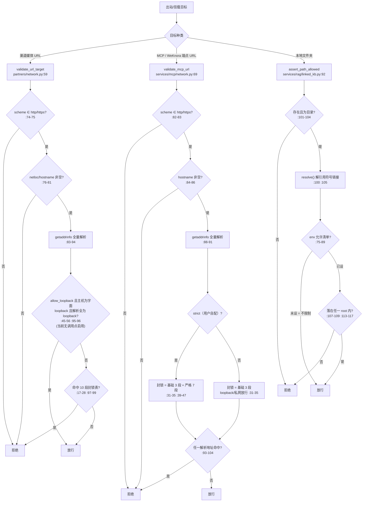

# 出站目标校验三层导读：partners.network / mcp.network / linked_kb（AGEN-941，2026-10-06）

- 基线：origin/main `f07029cfc`（release v1.6.13），只读核对，未改任何产品代码
- 目的：为后续卡统一出站/挂载目标的校验语义提供设计导读。只描述设计意图与现状口径，不含任何利用细节。
- 去重说明：MCP 全景见 guide-mcp（`guide/mcp-integration-20261005` 分支），RAG 管线全景见 guide-rag-pipelines；本文只覆盖"目标合法性校验"这一横切层，不重复两侧全景。

## 一、三层各自的定位与信任模型

| 层 | 代码锚点 | 防什么 | 信任模型 |
|---|---|---|---|
| 渠道媒体出站 | `deeptutor/partners/network.py:59` `validate_url_target` | 渠道向外抓取/推送的媒体 URL（来自外部 IM 平台，不可信） | 最严：所有私网/内网段一律拒绝（模块头声明，`partners/network.py:1-8`） |
| MCP / 远程服务端点 | `deeptutor/services/mcp/network.py:69` `validate_mcp_url` | 远程 MCP（SSE/streamableHttp）与 WeKnora 服务端 URL | 双姿态：管理员部署的服务器常在 LAN（默认宽松）；用户自配的 URL（`strict=True`）禁止指向内网（`services/mcp/network.py:1-23`） |
| 本地文件夹挂载 | `deeptutor/services/rag/linked_kb.py:92` `assert_path_allowed`（清单生成 `:75` `allowed_link_roots`） | linked KB / Obsidian vault / 子代理 cwd 指向的本地路径 | 可选路径监狱：默认（env 未设）不限制，运维可用 env 收紧（`services/rag/linked_kb.py:27-32`） |

## 二、逐条规则对照表

| 维度 | partners `validate_url_target` | mcp `validate_mcp_url` | linked_kb 路径守卫 |
|---|---|---|---|
| 边界种类 | 网络（URL→IP） | 网络（URL→IP） | 文件系统（路径→root 允许清单） |
| scheme 白名单 | 仅 http/https，`partners/network.py:74-75` | 仅 http/https，`services/mcp/network.py:82-83` | 不适用（引擎白名单替代，见下） |
| host/netloc 要求 | netloc 必须非空 `:76-77`，hostname 必须非空 `:79-81`（双保险） | 仅 hostname 必须非空 `:84-86` | 必须存在 `:101-102` 且是目录 `:103-104` |
| 名称解析/归一 | `getaddrinfo` AF_UNSPEC 全解析 `:83-86`；解析失败即拒绝；IPv6 映射地址归一为 IPv4 `:31-37` | 同左 `:88-91`；IPv6 映射归一 `:50-56` | `expanduser` + `resolve()` 先解引用符号链接再判定 `:100,:105` |
| 封锁/允许清单 | 单一封锁表 10 段：0.0.0.0/8、10/8、100.64/10（CGN）、127/8、169.254/16（link-local/云元数据）、172.16/12、192.168/16、::1、fc00::/7、fe80::/10，`partners/network.py:17-28`；任一解析地址命中即拒 `:97-99` | 基础表 3 段（0.0.0.0/8、169.254/16、fe80::/10）`services/mcp/network.py:31-35`；`strict=True` 追加 7 段（127/8、10/8、172.16/12、192.168/16、100.64/10、::1、fc00::/7）`:39-47`；判定逻辑 `:59-66`，命中即拒 `:93-104` | env `DEEPTUTOR_LINKED_FOLDER_ROOTS`（os.pathsep 分隔）`services/rag/linked_kb.py:32`；未设=不限制 `:77-79`；设置了则必须落在任一 root 内 `:107-109`（`_is_within` `:113-117`） |
| loopback 例外 | 有窄口子：`allow_loopback=True` 且主机为字面 loopback（localhost 或 loopback IP）且全部解析地址均为 loopback 才放行，`partners/network.py:45-56,:95-96`；当前所有调用点都用默认 False，无人启用 | 无显式例外；默认姿态下 127/8、::1 不在基础表，本机/LAN MCP 合法（有意设计 `:5-12`）；strict 姿态下被 `:39-47` 覆盖 | 不适用 |
| 目标种类边界 | 外部 IM 媒体 URL，全部私网段拒绝（`partners/network.py:3-5`） | stdio 仅限管理员（用户自配禁 stdio，`services/mcp/user_config.py:178-183`）；http(s) 远程端点 | 引擎白名单 `LINKABLE_PROVIDERS`（default/graphrag/lightrag，`:44`）；PageIndex 因索引在云上不可挂载（`:15-17,:131-135`） |
| 校验时机 | 每次出站使用前现解析（napcat 造图片段 `deeptutor/partners/channels/napcat.py:482`、下载图片 `:533`） | 保存时 + 连接时各验一次（保存：管理员 `deeptutor/api/routers/mcp_settings.py:50,:130`；用户 `services/mcp/user_config.py:187`；连接：`services/mcp/manager.py:784-793`，注释明言防 DNS 事后变更）；WeKnora 每次请求重验（`services/rag/pipelines/weknora/client.py:49-53`，探测 `probe.py:43-49`） | 每次注册/挂载时验（`deeptutor/api/routers/knowledge.py:2179,:2251,:2272`）；子代理 cwd 复用同一守卫（`deeptutor/api/routers/subagents.py:133`） |
| 失败语义 | 返回 `(False, err)`；napcat 侧拒绝后丢弃该媒体并记日志（`napcat.py:483-485`），不中断消息 | 返回 `(False, err)`，strict 与默认两种文案 `:99-104`；路由层转 400，manager 层抛 ValueError | 抛 `ValueError`，路由层转 400（`knowledge.py:2183-2185`） |
| 异步形态 | 无 async 封装；napcat 在事件循环内同步调用 `:482,:533`（阻塞 getaddrinfo） | 提供 `validate_mcp_url_async`（to_thread，`services/mcp/network.py:108-118`） | 同步，纯本地操作无网络调用 |
| 默认安全姿态 | 默认拒绝全部内网段（default-deny for private） | 基础表小、strict 才收紧；默认姿态对 loopback/私网放行（管理员语境） | 默认不限制（单信任域自部署语境 `:27-31`） |

## 三、决策图

## 四、差异点与统一建议

### 差异点

1. **两份封锁清单、两种组织方式**：partners 层把 10 段全部放在一张无条件表（`partners/network.py:17-28`）；mcp 层拆成"基础 3 段 + strict 追加 7 段"（`services/mcp/network.py:31-47`）。两层的 CIDR 集合本身一致（partners 表 = mcp 基础∪严格），分歧只在"哪些段无条件封"。
2. **loopback 边界不同**：partners 层默认封 127/8 与 ::1，仅留 `allow_loopback` 窄口子且当前无人启用（`partners/network.py:59,:95`，napcat 两个调用点均默认）；mcp 层默认姿态有意放行 loopback/私网（本机 MCP 服务器是合法形态，`services/mcp/network.py:5-12`），strict 才封。
3. **host 判定强度不同**：partners 层 netloc 与 hostname 双检（`:76-81`）；mcp 层只查 hostname（`:84-86`）。urlparse 语义下结果几乎等价，但双检是更明确的防御式写法。
4. **异步形态不对称**：mcp 层有 `validate_mcp_url_async` 并在连接/请求路径统一走 async（`services/mcp/network.py:108-118`、`manager.py:787`、`client.py:53`）；partners 层无 async 封装，napcat 在事件循环里同步调用（`napcat.py:482,:533`），DNS 慢时会阻塞整个循环。
5. **校验时机密度不同**：mcp/WeKnora 是"保存 + 连接/每次请求"双重校验（`manager.py:784-793`、`client.py:49-53`），partners 层只在每次出站使用前校验一次；校验与实际建立连接是两次独立解析，两层都存在这一固有间隙，差异只在重验频率。
6. **第三层是另一种边界**：linked_kb 不做网络判定，而是"先 resolve 再比允许清单"的路径监狱（`services/rag/linked_kb.py:100-109`），与网络层"先解析 DNS 再比封锁表"在思想上同构（先归一化再判定），但机制、失败语义（抛 ValueError vs 返回元组）和默认姿态（不限制 vs 默认拒内网）完全不同。
7. **默认姿态哲学相反**：网络层是"默认怀疑、按信任分级放行"；linked_kb 是"默认信任、运维显式收紧"（`:27-31` 明说单信任域自部署是目标形态，多用户共享部署必须设 env）。

### 统一建议（供后续卡讨论，非本卡改动）

1. **单一事实源**：把 CIDR 清单与 `ipv4_mapped` 归一化 helper 收敛到一个共享模块（如 `deeptutor/services/network_guards.py`），partners/mcp 两层以"姿态参数"消费（`posture="strict" | "deployment"`），消除两份重复清单与重复 `_normalize_addr`（`partners/network.py:31-37` ≈ `services/mcp/network.py:50-56`）。语义保持现状：渠道媒体永远 strict，MCP 按调用方选择。
2. **对齐 host 判定**：统一采用 partners 层的 netloc+hostname 双检写法，或明确写清为何单检足够，避免后续卡在两处复制不同强度。
3. **补齐 partners 层 async 封装**：为 `validate_url_target` 提供 to_thread 包装（对齐 `validate_mcp_url_async` 模式），napcat 调用点改走 async，消除事件循环上的阻塞解析。
4. **统一"再验一次"原则**：把"保存时校验不可信、使用前必须重验"写成两层共同注释/约定（mcp 层已有此声明 `services/mcp/network.py:20-22`，partners 层事实上做到了但未声明）；如后续要收窄解析-连接间隙，属于统一语义卡的范围。
5. **明确 loopback 语义文档化**：`allow_loopback` 是预留口子，建议要么在后续卡中给出启用场景（如本机 napcat 部署），要么移除，避免"看似有例外、实际无人用"的语义噪音。
6. **路径监狱默认值提示**：linked_kb 保持"默认不限制"合理，但建议在多用户部署文档/启动检查中提示必须设置 `DEEPTUTOR_LINKED_FOLDER_ROOTS`（docstring 已写，可上提到运维文档），并注明子代理 cwd 复用同一 env（`subagents.py:133`），一次配置同时约束两处。

## 五、核对方式与范围

- 逐文件通读三层源码并核对全部调用点（napcat、mcp_settings、user_config、manager、weknora probe/client、knowledge、subagents），行号均基于 `f07029cfc`。
- 未运行任何服务、未改动任何产品代码；本目录仅含本报告与 SHA256SUMS。
