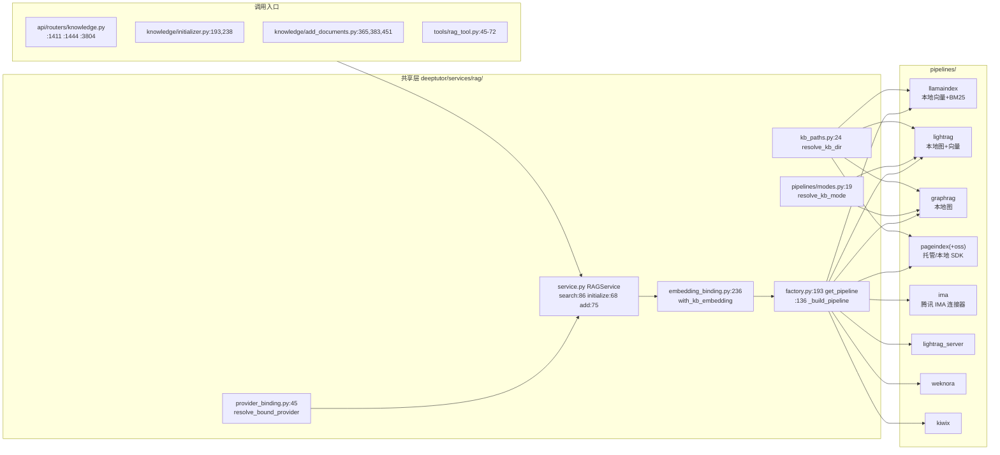

# RAG pipelines 五条管线结构导读与差异地图

- 基线：`origin/main` @ `f07029cfc`（release: v1.6.13），只读复核，未改任何产品代码。
- 工作分支：`guide/rag-pipelines-20261006`。
- 范围：`deeptutor/services/rag/pipelines/` 下 lightrag / graphrag / pageindex / llamaindex / ima 五条线，外加共享 binding 与目录 8 个子包的全景图。

## 0. 去重边界（与他卡的分工）

本卡只讲 pipelines 族本身。以下内容归相邻卡，本文只在必要处引用：

| 相邻卡 | 覆盖范围 | 本文边界 |
| --- | --- | --- |
| guide-embedding | `deeptutor/services/embedding/*` 配置/目录层 | 本文只写 `embedding_binding.py` 这一层接缝，不展开 embedding 配置解析 |
| guide-knowledge | `deeptutor/knowledge/*`、KB 生命周期与路由 | 本文只列调用入口 file:line，不展开 KB 管理器 |
| scan-lightrag-params | lightrag `config.py` 参数轴（重试、模式、预算等） | 本文只记"参数经 `indexing_kwargs_from_settings` 等注入"，参数明细不重复 |
| test-rag-degrade | 降级路径补测 | 本文的差异表即其输入之一，不写测试本身 |
| `guide/ima-pipeline-20261005`（已有分支） | IMA client/media/notes/transport 内部 | 本文只写 `ImaPipeline` 编排层与降级，IMA 传输细节看该导读 |

## 1. 全景图

`pipelines/` 目录实际有 8 个子包 + 3 个共享文件。任务点名的 5 条为本地/托管主力；其余 3 条（lightrag_server / weknora / kiwix）是纯"检索-only 连接器"，只实现 `search`，索引完全在外部引擎。

- 协议：`pipelines/base.py:17` `RAGPipeline`（`initialize/add_documents/search/delete`，runtime_checkable duck typing；service 仍用 `hasattr` 容忍部分实现，`service.py:81`）。
- 选择：KB 创建时把 `rag_provider` 写进 `kb_config.json`；之后每次调用按 KB 解析（`provider_binding.py:45`：kb_config → 旧 `metadata.json` → 默认 llamaindex）。工厂按 provider 惰性 import 并缓存实例（`factory.py:63,193-209`，未知 provider 一律回落 llamaindex，`factory.py:67`）。

## 2. 共享组件

### 2.1 RAGService（`service.py:22`）

- `_resolve_provider`（:56）：每 KB 解析 provider；构造函数传了 `provider` 则覆盖（创建路径用）。
- `initialize/add_documents/search` 都挂 `@with_kb_embedding`（:67/:74/:85）。
- `search`（:86）三件套：① PageIndex 双 provider 在 service 层就短路，直接回 `error_type="reasoning_as_retrieval_required"`（:96-108）；② `_capture_raw_logs` 把 lightrag/graphrag/graphrag_llm 等非传播 logger 与子进程日志转成 `raw_log` 事件（:199-269）；③ 结果归一化：`query/answer/content` 互补缺省，`provider` 字段以 service 解析结果为准强制覆盖（:129-137）。`error_type` 或 `needs_reindex` 非空时补发一条 `call_state=error` 的 status 事件后原样返回（:139-153）。
- 检索之外还有 `smart_retrieve`（:286，smart_retriever.py 把一次查询拆成 ≤max_queries 次检索融合）。

### 2.2 provider_binding（`provider_binding.py`）

`resolve_bound_provider`（:45）是唯一允许读 provider 绑定的入口；`kb_config.json` 缺失/损坏一律静默回默认（:28-29 异常吞掉）。注意 `load_metadata_provider` 会把 metadata 里的旧值过一遍 `normalize_provider_name`，已删除的 provider 名会回落 llamaindex。

### 2.3 embedding_binding（`embedding_binding.py`）——最重要的共享接缝

- `EMBEDDING_PROVIDERS = {"llamaindex", "graphrag", "lightrag"}`（:18）：只有这三家需要"绑定 embedding"。`uses_bound_embedding`（:28）先排除 connected KB（`is_connected_kb`），再查 provider。
- `with_kb_embedding`（:236）装饰 RAGService 三方法，流程：
  1. 非 embedding 系（pageindex/ima/lightrag_server/weknora/kiwix）直接放行（:246-247）；
  2. `migrate_binding`（:68）用已有索引版本签名反推目录中的模型并钉住（写入 `embedding_selection/embedding_signature` 等字段）；
  3. `binding_status`（:123）四态：`legacy`（无 selection）/`missing`（目录模型被删）/`unconfigured`（模型没配全）/`changed`（签名漂移）。search 遇到 ValueError 不抛，回 `error_type="embedding_binding_unavailable"`（:293-301）；initialize/add 则直接 raise；
  4. `embedding_config_scope(config)`（:302-329）把本次操作的 embedding 配置隔离到 contextvar，结束后非 search 且非"锁定发布"路径会 `persist_binding` 回写；
  5. **LightRAG 专属锁定发布**（:304-323）：lightrag 的非 search 操作注入 `validate_embedding_binding` / `publish_embedding_binding` 两个回调，由 pipeline 在写锁内调用（见 §3.1），保证"检查绑定→建索引→发布绑定"原子。
- `bound_graph_storage_root`（:160）：读路径兜底——当默认 embedding 与 KB 绑定不一致时，回头找"签名匹配且 ready"的旧版本读；找不到且 fallback 自身记录过 embedding 签名则抛"Re-index"。lightrag 版本额外要求 `meta_is_native_published`（:177-180）。graphrag/lightrag 的 add/search 都走这个函数（graphrag/pipeline.py:127,194；lightrag/pipeline.py:512,614）。

### 2.4 pipelines/modes.py（`modes.py:19`）

lightrag 与 graphrag 共享检索模式解析：显式 `mode` kwarg → KB `search_mode` → `defaults.provider_modes[provider]` → 引擎默认。kb_config 损坏静默吞（:37-38），不认识的模式回落默认。ima 的 `SUPPORTED_MODES=()`（ima/config.py:32）表示"无模式旋钮"；llamaindex 在 `search` 里直接丢弃 `mode`（llamaindex/pipeline.py:275）。

### 2.5 版本目录与探针

- `kb_paths.resolve_kb_dir`（kb_paths.py:24）：linked KB 的 `external_path` 指到外部目录，全族统一走这里，不许手拼 `<base>/<kb>`。
- `index_versioning.py`：扁平 `version-N` 目录 + `meta.json`。llamaindex 用真实 embedding 签名做版本键；其余本地引擎写"合成签名"（signature=provider 字符串），`provider_uses_embedding_versions`（factory.py:77）保证只有 llamaindex 会被 embedding 换代判 stale。
- `index_probe.py:40` `inspect_provider_index`：按 provider 分别探测就绪度（llamaindex 看 docstore、graphrag 看 parquet、lightrag 看 doc_status/vdb、pageindex 看 manifest），`provider_failure_summary`（:111）给失败摘要。
- `preflight.engine_preflight`（preflight.py:269）：各引擎"现在能不能跑"的检查面板，全部 best-effort 不抛。

## 3. 五条管线逐条导读

以下每条按 入口 → 索引 → 检索 → 落盘 → 降级。

### 3.1 lightrag（`pipelines/lightrag/`）——本地图+向量，隔离最重

**入口**：`pipeline.py:98` `LightRagPipeline`；工厂分支 `factory.py:151`。

**索引（initialize :382 / add_documents :479）**
1. `write_ownership(kb_dir)` 写锁（write_lock.py）包住全程；锁内先调注入的 `validate_embedding_binding`（来自 §2.3 第 5 步）。
2. `indexing_snapshot`（IndexingPolicySnapshot）复验（`validate_target`/`revalidate_snapshot`，pipeline.py:391-398）；append 带 explicit snapshot 且已有已发布版本会直接拒绝（:486-492）——"显式模型不能覆盖已有索引，只能全量重建"。
3. `_initialize_owned`（:420）→ `resolve_storage_dir_for_rebuild` 新版本目录 → `cache_reuse.inherit_index_cache` 继承旧版本缓存 → `_run_indexing`（:280）。
4. `_run_indexing` 在 `run_in_worker_loop`（worker.py:173，进程级专属 worker 事件循环 + `OwnerLoopBridge` 回传 owner loop）里执行：`_stage_documents`（:124，parse_service 解析 + `ingress.freeze_document` 冻结成 bundle；无视觉能力时剥掉 "i" 选项）→ `engine.build_rag`（engine.py:205，**钉死 lightrag-hku==1.5.7**（engine.py:32,49），`DeepTutorLightRAG` 子类接管 source 解析（:83-114））→ `engine.initialize` → `engine.enqueue`（engine.py:289，返回 track_id）→ `apipeline_process_enqueue_documents` → `_reconcile`（:154）轮询 `aget_docs_by_track_id` 直到全部 terminal，600s 无进展判 nonterminal（pipeline.py:103,264-277），进度经 bridge 回调。
5. 发布：`has_output` 校验后 `_publish_new_version`（:401）`storage.write_meta` + `publish_binding()`；发布失败则撤回本次 meta.json（:412-418）。
6. 失败清理：未入队→删 staged；已入队未 accepted→`engine.confirmed_unaccepted` 精确确认后删（engine.py:317）；0 accepted 且无 doc_status → 整个候选目录删除 `_remove_zero_accepted_candidate`（:374）。批量失败抛 `LightRagBatchError`（:63，带 per-file 明细），legacy 索引上 append 抛 `LightRagNeedsReindexError`（:76）。

**检索（search :609）**
- `latest_published_root`（storage.py:228，要求 `meta_is_native_published`）+ `bound_graph_storage_root` 兜底；没有可读版本 → `needs_reindex=True` 的结果（:615-623）。
- `storage.require_compatible_embedding`（storage.py:258，比对 meta 里的 embedding_signature，不只看维度）不匹配抛 `EmbeddingMismatchError` → `error_type=其 code`。
- 模式经 `modes.resolve_kb_mode`（SUPPORTED_MODES = naive/local/global/hybrid/mix，默认 hybrid，config.py:42-43）；`engine.query_with_sources`（engine.py:475）走 `aquery_llm`，对 SDK 返回形状做严格契约校验（非 dict/非 success/流式都抛 `LightRagContractError`），并把 chunks/entities/relationships/references 映射成统一 sources。

**落盘**：version-N 即 LightRAG working_dir（storage.py 模块 docstring）：`kv_store_*.json`、`vdb_*.json`、`graph_chunk_entity_relation.graphml`、`kv_store_doc_status.json`（失败摘要来源 storage.py:113）、`deeptutor_ingress/{pending,bundles}`（ingress.py:13-15）、原生数据在 `workspace_for`（engine.py:185）命名的 `deeptutor_<hash16>` 子目录；`meta.json` 记 `provider/signature="lightrag"`、`lightrag_adapter_schema=2`、`state=published`、`workspace`、`parser_inputs`、`indexing_policy`、embedding 三字段（storage.py:272-323）。

**降级摘要**：search 永不抛（全转 error dict：`not_configured`/embedding code/`retrieval_error`）；索引端批量 per-file 容错 + 原子发布 + 失败候选清理；事件循环隔离（uvloop 兼容）与 600s 停滞窗。

### 3.2 graphrag（`pipelines/graphrag/`）——本地知识图，配置文件驱动

**入口**：`pipeline.py:39` `GraphRagPipeline`；工厂分支 `factory.py:144`。可选依赖 `deeptutor[graphrag]`（graphrag>=3,<4），未安装时 `_ensure_available`（:48）抛带安装指引的错误。

**索引（initialize :88 / add_documents :123）**
- initialize：`write_settings`（config.py:333，从 DeepTutor 运行时 LLM/embedding 配置生成最小 `settings.yaml`）→ `ingestion.prepare_input`（ingestion.py:60，共享 parse 桥 + FileTypeRouter，把所有输入转成 `input/*.txt`；0 个可提取文档 → 清目录返 False）→ `_build`（:172 → engine.build engine.py:316）→ `write_meta`。
- add_documents：已有版本先 `_preflight_settings`（:74，在临时目录里用真实 settings 快照先跑 embedding、再跑 completion 探针，坏配置不会污染在用 settings.yaml 或输入目录）；更新路径 `_build(preflight_embedding_model=False)`（预检已做，避免重复）。刷新 settings 使模型/endpoint 变更生效（:143-149）。
- `engine.build`（engine.py:316）：`build_index(IndexingMethod.Standard, is_update_run=is_update)`；逐 workflow error 分类（embed 类走 `classify_embedding_error`，其余 `classify_model_error`，errors.py），分类不出就抛汇总 RuntimeError。
- 关键隔离：`_run_isolated`（engine.py:112）——graphrag_llm import 时打 nest_asyncio 补丁、拒 uvloop，所以所有 graphrag import/驱动都放进"新建 stock asyncio loop 的线程"里跑（issue #695）。每个 graphrag import 都是函数内 lazy import。

**检索（search :189）**
- `resolve_storage_dir_for_read` + `bound_graph_storage_root`；`storage.has_output`（storage.py:55，core parquet 5 表之一存在才算建好）否则 `needs_reindex=True`。
- 模式 global/local/drift/basic（config.py:54-55，默认 local），按模式取所需 parquet 表（engine.py:62-73）后调 `graphrag.api.{global,local,drift,basic}_search`；context 经 `reformat_context_data` 归一，`_context_to_sources`（pipeline.py:254）优先 text units、退化到 reports/entities。
- 失败转 dict：`not_configured` / `retrieval_error`（:214-222）。

**落盘**：version-N 即 GraphRAG 项目根（storage.py docstring）：`settings.yaml`、`input/*.txt`、`output/*.parquet`、`cache/ logs/`、`meta.json`（signature=provider="graphrag" + `embedding_meta_fields()`，storage.py:93-113）。`indexed_input_names`（storage.py:65）用 documents/text_units parquet 反查真实入索引文件名。

**降级摘要**：与 lightrag 同为"search 永不抛"；差异是索引端没有 per-file 容错（GraphRAG 管线自身原子），靠"更新前预检 + 失败版本目录清理（无 meta.json 才删，:67-72）+ 错误分类器"保证可诊断。

### 3.3 pageindex（`pipelines/pageindex/`）——托管云 / 本地 OSS，Reasoning as Retrieval

**入口**：`pipeline.py:57` `PageIndexPipeline`（provider ∈ {pageindex, pageindex-oss}，工厂分支 `factory.py:137` 二合一）。

**索引（initialize :109 / add_documents :145）**
- `_ingest`（:178）：按扩展名过滤（Cloud 支持 pdf/md/txt/office/csv，OSS 仅 pdf，:34-47），逐文件 `client.submit_document`（client.py:126，`asyncio.to_thread` 包同步 SDK，`wait=True` 等处理完），写 manifest `pageindex_docs.json`（storage.py:23）。OSS 的模型来自**当前活跃 chat LLM**，经 `resolve_oss_sdk_config`（client.py:32）翻译，OAuth-only 后端直接拒绝（:46-59）；Cloud 用全局 API key（`_cloud_sdk_client` lru_cache，client.py:21）。
- `mode`（flash/standard）只对 OSS 生效，读 KB 的 `pageindex_mode`（:85-105）。
- 0 个支持文件 → 清候选目录返 False；单文件失败整体抛（异常 → `_cleanup_failed_version_dir`，:139-143）。

**检索（search :211）—— 故意 fail-closed**
- 永远返回 `error_type="reasoning_as_retrieval_required"`：PageIndex 的读法是 agent loop 里的 SDK 工具（`tools.py` 提供 `pageindex_cloud_*`/`pageindex_oss_*` 工具；`reasoning.py` 有一个 workflow 专用小 agent loop）。service 层（service.py:96）还有一道同样的短路，双保险。
- 辅助读取面：`document_map`（:226，文件名→doc_id 注入 system prompt）、`sdk_client_for_read`（:288）、`remove_document`（:265，删云端 doc + 更新 manifest）。

**落盘**：Cloud 本地只有 manifest + meta.json（文档在云端）；OSS 额外有 `pageindex/` Local Library（storage.py:115）。meta.json 合成签名（signature=provider，storage.py:65）。

**降级摘要**：检索层"设计性降级"（不检索，改工具）；不支持格式逐个 warn 跳过；`delete` 对 Cloud 先尽力删云端 doc（best-effort 吞异常，:249-257）再删本地；`__init__.py:19` 的 `is_pageindex_kb`/`validate_pageindex_oss_selection`（每次请求最多一个 OSS KB）在 chat 侧兜底。

### 3.4 llamaindex（`pipelines/llamaindex/`）——默认本地向量，停摆守护最完善

**入口**：`pipeline.py:164` `LlamaIndexPipeline`；工厂默认分支 `factory.py:186`。所有 provider 归一化失败都落这里。

**索引（initialize :200 / add_documents :400）**
- `_ensure_index_worker_available` / `_claim_index_worker`（:61-87）：**进程级 per-KB 写互斥**（threading.Event 表），同 KB 上一个 worker 没退出就抛 `IndexingStallError`。
- 版本目录带真实 embedding 签名：`resolve_storage_dir_for_rebuild(kb_dir, signature)`（:212）；`add` 用 `storage.resolve_add_storage_plan`（storage.py:60）决定复用现有版本（flat 版本原地 insert；legacy 布局读旧写新）。
- 文档装载走共享 parse 桥（document_loader.py docstring），图片产 `ImageNode` 走多模态 caption；先 `verify_embedding_connectivity`（:215）。
- `_run_with_stall_guard`（:89）：同步索引步骤跑在 executor，每 5s 查心跳，600s（:41）无进展抛 `IndexingStallError`；注意线程不可杀，回调静默 + 重试被 worker-key 拒绝直到线程真正退出（:105-109 docstring 明说）。
- 成功后 `VisualAssetStore.publish` + `write_version_meta(kb_dir, signature, ...)`（真实签名版 meta）。
- 失败清理：`IndexingStallError` 不清目录（executor 线程可能还在写，:262-264）；其他失败且新目录才清（:460-463）。

**检索（search :269）**
- 先试结构化习题精确查找（exercise_lookup，:280-292；失败回落普通检索）。
- `resolve_storage_dir_for_read(kb_dir, signature)`；没有匹配签名版本或缺 `docstore.json` → `needs_reindex=True`（:300-315，提示语明确"换回原 embedding 或重建"）。
- `storage.retrieve_nodes`（storage.py:293）：进程内索引缓存 `_cached_index`（:246，mtime+embedding 配置摘要做 freshness key，LRU=2，10min 过期）；装载时校验持久化向量（`_validate_persisted_embeddings` :182，坏向量直接判"重建"）。
- 检索栈（retrievers.py:120）：vector-only / hybrid（QueryFusionRetriever RRF 融合 BM25+vector）/ 退化路径；BM25 包缺失或构建失败**静默降级为纯向量**（retrievers.py:66-84，小语料 top_k 钳制 corpus size）；可选 cross-encoder 重排（rerank.py）。
- `embedding_mismatch` 只做**警告**附加在结果上（:317,329-331,343），不阻断——与 lightrag/graphrag 的硬失败不同。
- 错误归一（errors.py:8）：`invalid_embedding_provider_response` / `invalid_embedding_index`（带 `needs_reindex=True`）/ 兜底无 error_type。

**落盘**：version-N 下 `docstore.json`、`index_store.json`、`default__vector_store.json`（FAISS 二进制或 SimpleVectorStore JSON，vector_store.py docstring；FAISS 可选缺失回落）、`image__vector_store.json`、`bm25_retriever/` sidecar、`meta.json`（真实 embedding 签名）。

**降级摘要**：检索永不抛（errors.py 归一）；BM25/FAISS/重排三层可选依赖逐级静默回落；索引端有进程内互斥 + 停摆守护 + 不安全目录不清理。

### 3.5 ima（`pipelines/ima/`）——腾讯 IMA 连接器，最薄的编排层

**入口**：`pipeline.py:43` `ImaPipeline`；工厂分支 `factory.py:165`。测试注入口 `client_factory`（:50）。

**索引**：不属于本引擎。`initialize/add_documents` 直接 raise（:158-165，"在 IMA 里加文档"）；`delete` no-op 返 True（:169-172，只删 DeepTutor 指针，绝不碰用户 IMA 库）。

**检索（search :71）**
1. `resolve_kb_config(load_kb_config_entry(...))`（config.py:125）：KB 级 client_id/api_key/knowledge_base_id 优先，账号级 `settings/ima.json` 兜底（config.py docstring）；缺任一 → `error_type="not_configured"`（pipeline.py:74-75）。
2. `client.search_knowledge`（client.py:94，cursor 分页，`_MAX_SEARCH_PAGES=3` 封顶）取 ≤top_k（默认 10、上限 50，pipeline.py:39-40,62-67）条匹配，文件夹不算文档。
3. `sources.documents_to_sources`（sources.py:39）映射；`_hydrate`（pipeline.py:110）并发全文回填：预算 4 篇（sources.py:33）、无 snippet 优先于薄 snippet（<240 字符）、单篇 12000 字符封顶；单篇失败保留 snippet 只记异常类名（:126-133，签名 URL 不进日志）。
4. **全部命中只有标题没有可读文本 → `error_type="content_unavailable"`**（:89-100，#1500 回归点）；过滤后无 sources 且原本就无 matched 则正常空返回。
5. 客户端异常 → `retrieval_error`（:80-82）。

**落盘**：零本地索引。一切连接信息在 `kb_config.json` 条目里；`probe.py` 用于 connect 时校验凭据可达。

**降级摘要**：永不抛；`not_configured`（凭据缺）→ `retrieval_error`（网络/协议）→ `content_unavailable`（有标题无正文）→ 正常空结果，四级递降。

## 4. 共享点与差异表

### 4.1 共享点

| 共享组件 | 位置 | 覆盖的管线 |
| --- | --- | --- |
| `RAGPipeline` 协议 | pipelines/base.py:17 | 全部（duck typing + hasattr 容忍） |
| `get_pipeline` 工厂 + 实例缓存 | factory.py:63,193 | 全部；未知 provider → llamaindex |
| `resolve_bound_provider` | provider_binding.py:45 | 全部 |
| `with_kb_embedding` 装饰器 | embedding_binding.py:236 | 全部入口；真正生效于 llamaindex/graphrag/lightrag |
| `embedding_config_scope` 隔离 | embedding_binding.py:325 | llamaindex/graphrag/lightrag（读经 `scoped_embedding_config`） |
| `resolve_kb_dir`（linked KB） | kb_paths.py:24 | llamaindex/graphrag/lightrag/pageindex |
| `resolve_kb_mode` | pipelines/modes.py:19 | lightrag、graphrag（其余忽略 mode） |
| 扁平 `version-N` + `meta.json` 版本制 | index_versioning.py:3-22 | llamaindex（真实签名）/graphrag/pageindex/lightrag（合成签名） |
| `bound_graph_storage_root` 兜底读 | embedding_binding.py:160 | graphrag、lightrag |
| 共享 parse 桥（`get_parse_service`） | services/parsing | llamaindex(document_loader)、graphrag(ingestion)、lightrag(ingress/_stage_documents) |
| 失败版本目录清理 | llamaindex/storage.py:48、graphrag/pipeline.py:67、pageindex/pipeline.py:298、lightrag/pipeline.py:374 | 各自实现，语义一致："无 meta.json 的空候选才删" |
| `indexed_file_callback` / `progress_callback` 约定 | 各 initialize/add | 全部本地索引引擎 |
| `search` 结果形状 + `error_type`/`needs_reindex` 约定 | service.py:129-153 | 全部 |

### 4.2 差异表（关键行为）

| 维度 | llamaindex | lightrag | graphrag | pageindex | ima |
| --- | --- | --- | --- | --- | --- |
| 索引位置 | 本地 | 本地 | 本地 | Cloud 远端 / OSS 本地 | IMA 侧 |
| 版本签名 | 真实 embedding hash | 合成 `lightrag`+embedding 字段 | 合成 `graphrag`+embedding 字段 | 合成 provider 名 | 无版本 |
| embedding 换代 | 判 stale，新签名新版本 | `require_compatible_embedding` 硬拒读/append | `bound_graph_storage_root` 兜底，无匹配抛 | 不相关 | 不相关 |
| 检索模式 | 无（丢弃 mode） | naive/local/global/hybrid/mix，默认 hybrid | local/global/drift/basic，默认 local | 无（不检索） | 无 |
| search 失败形态 | error dict，mismatch 仅 warning | error dict（not_configured/embedding code/retrieval_error） | error dict（not_configured/retrieval_error） | 设计性 fail-closed `reasoning_as_retrieval_required` | error dict（not_configured/retrieval_error/content_unavailable） |
| 索引并发防护 | 进程内 per-KB Event 表 | `write_lock.write_ownership` 文件级写锁 + 单 worker loop | 无专门锁（靠上游 KB 级排队） | 无（逐文件串行 submit） | 不适用 |
| 停摆防护 | 600s stall guard（线程不可杀语义） | 600s reconcile 无进展窗 + worker loop 取消宽限 | 预检超时 25s + 依赖上游取消 | `wait=True` 阻塞在 SDK | HTTP 超时（transport DEFAULT_TIMEOUT） |
| 部分失败 | 失败抛；新目录才清 | per-file outcome（BatchOutcome）+ 0-accepted 清理 | 整体抛；无 meta 才清 | 0 支持文件返 False；单文件抛 | 不适用 |
| append 到旧索引 | plan 选择读旧写新/原地 | legacy 未发布 → `LightRagNeedsReindexError` | 复用 active 版本做 is_update | 追加 manifest | 不适用 |
| delete 语义 | 删整个 kb_dir | 删 kb_dir | 删 kb_dir | 尽力删云端 doc + 删 kb_dir | no-op（只删指针） |
| 可选依赖 | faiss / bm25 / rerank（逐级回落） | lightrag-hku==1.5.7 钉死 | `deeptutor[graphrag]`（graphrag 3.x） | pageindex SDK | 无（httpx） |

## 5. 可拆卡建议（补测/修复候选）

1. **`modes.resolve_kb_mode` 容错矩阵**（pipelines/modes.py:19）：kb_config.json 损坏/模式大小写/`defaults.provider_modes` 未知 provider 的回落顺序——纯函数，最小成本。
2. **lightrag `_reconcile` 状态机**（pipeline.py:154）：duplicate canonical basename、未知状态、600s nonterminal、missing 收敛——`BatchOutcome.complete` 语义是降级补测卡（test-rag-degrade）的直接输入。
3. **lightrag 锁定发布回滚**（pipeline.py:401-418 + embedding_binding.py:304-323）：`publish_binding()` 抛异常后 meta.json 撤回、旧版本仍可读的原子性。
4. **graphrag 更新路径预检不对称**（pipeline.py:141-158）：`_preflight_settings`（先 embedding 后 completion）与 `_build(preflight_embedding_model=False)` 的组合，验证"坏配置不污染在用 settings.yaml"。
5. **llamaindex stall guard 重试拒绝语义**（pipeline.py:89-161）：停滞抛错后线程仍存活时 `_ensure_index_worker_available` 拒绝重试、线程退出后放行。
6. **llamaindex BM25 小语料钳制与缺失回落**（retrievers.py:55-84）：`top_k>corpus` 时钳制、包缺失时静默纯向量——已有行为无显式回归测试（承接 test-rag-degrade）。
7. **ima title-only 分支**（pipeline.py:88-100）：`matched 非空但 sources 空` → `content_unavailable`（#1500）；hydration 单篇失败不影响其余。
8. **pageindex OSS `resolve_oss_sdk_config` 拒绝矩阵**（client.py:32-94）：OAuth-only/不支持 backend/无模型 时的报错文案与路径。
9. **service.search 归一化契约**（service.py:127-137）：answer/content 互补、provider 强制覆盖对五条管线的一致性——一处契约测试覆盖全族。
10. **`_remove_zero_accepted_candidate` 保守性**（lightrag/pipeline.py:374）：有 doc_status 或 ingress 残留时绝不删目录。

## 6. 复核记录

- 报告基于 `origin/main` @ f07029cfc 全新 worktree 只读产出；所有 file:line 均在该 commit 上核对。
- 未运行任何会改状态的命令；未启动服务/守护进程；未改任何产品代码（本分支唯一新增内容为 `evidence/rag-pipelines-guide-20261006/`）。
